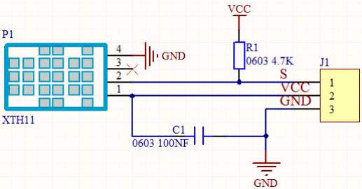
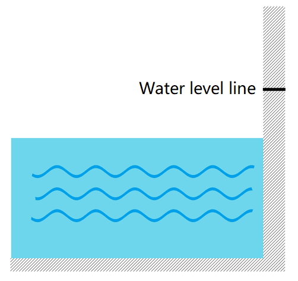
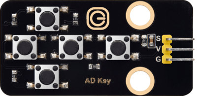
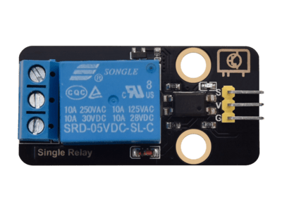

.. _Arduino-Tutorial:

Arduino Tutorial
================

.. _1.-Software-Installation:

1. Software Installation
------------------------

#. `Software
   Installation <https://getting-started-with-arduino.readthedocs.io/en/latest/Arduino%20IDE%20Tutorial.html#download-arduino-ide>`__

#. `Download
   driver <https://getting-started-with-arduino.readthedocs.io/en/latest/Arduino%20IDE%20Tutorial.html#install-driver>`__

   Please select the corresponding system tutorial according to your
   configuration and install the CP2102 driver.

3. **Please download the libraries first
   ：**\ `Libraries </api/attachment/Libraries.zip?repo=__root__C:\&path=%2FUsers%2FAdministrator%2FDesktop%2F556%2FTEMPTEST1%2Fdocs%2F1.Arduino%20Tutorial%2FLibraries.zip>`__

   `How to install
   libraries <https://getting-started-with-arduino.readthedocs.io/en/latest/Arduino%20IDE%20Tutorial.html#import-library>`__

4. `Interface
   introduction <https://getting-started-with-arduino.readthedocs.io/en/latest/Arduino%20IDE%20Tutorial.html#arduino-ide-settings>`__

5. `Upload
   Code <https://getting-started-with-arduino.readthedocs.io/en/latest/Arduino%20IDE%20Tutorial.html#upload-code-via-arduino-ied>`__

   Please select the corresponding system tutorial according to your
   configuration.

   .. image:: media/02.png
      :alt: 02

   Board please select : Arduino Uno

   .. image:: media/03.png
      :alt: 03

--------------

.. _2.-Download-code:

2. Download code
----------------

Please download the code :
:download:`Arduino Code<./ArduinoCode.7z>`

--------------

.. _3.-Single-Module-Learning:

3. Single Module Learning
-------------------------

Before learning, flip the voltage switch on the main board to 5V.

.. _3.1-SK6812-RGB-Module:

3.1 SK6812 RGB Module
~~~~~~~~~~~~~~~~~~~~~

The built-in IC of the SK6812 can display 256 \* 256 \* 256 colors in a
way that achieves multiple effects. Its control can be realized via only
one signal wire. It is an intelligent externally controlled LED light
source with the control circuit and the light-emitting circuit. Each LED
element is the same as a 5050 LED lamp bead, and each component is a
pixel. There are four lamp beads on the module, which indicates four
pixels.

.. image:: media/KS6009.png
   :alt: KS6009

.. _Three-primary-colors-principle:

Three primary colors principle
^^^^^^^^^^^^^^^^^^^^^^^^^^^^^^

The three primary colors of pigments are red, yellow and blue, and the
three primary colors of colored light are red, green and blue, which is
called RGB.

The human eyes are most sensitive to the RGB colors, and most colors can
be produced by combining the RGB colors in different proportions.
Similarly, most monochromatic light can also be decomposed into three
colors of RGB. This is the most basic principle of colorimetry(three
primary colors).

The three primary colors of RGB are added in different proportions to
form mixed colors, which is called additive color mixing. And there is
also the subtractive color mixing method. Colors can be added and
subtracted as needed. The three primary colors of pigments cannot be
adjusted to white, while the three primary colors of colored light can
realize it via optical elements, which are obtained by mixing three
equal parts of red, medium green and dark blue.

.. _Parameters:

Parameters
^^^^^^^^^^

Operating voltage : DC 5V

Maximum power : 1W

Light source : SMD 5050 RGB

IC model : 4/WS2811

Gray level : 256

Lighting angle : 180°

Light color: can be adjusted to white, red, yellow, blue and green via
the controller

Operating temperature : -10°C ~ +50°C

Dimensions : 32 x 23.8 x 7.4 mm

Dimension of positioning hole: 4.8 mm in diameter

Port: 3-pin bent pin with a spacing of 2.54 mm

.. _Schematic-Diagram:

Schematic Diagram
^^^^^^^^^^^^^^^^^

.. image:: media/2101.png
   :alt: 2101

From the schematic diagram, we can see that these four pixel lighting
beads are all connected in series. In fact, no matter how many they are,
we can use a pin to control a light and let it display any color. The
pixel point contains a data latch signal shaping amplifier drive
circuit, a high-precision internal oscillator and a 12V high-voltage
programmable constant current control part, which effectively ensures
the color of the pixel point light is highly consistent.

.. image:: media/2102.png
   :alt: 2102

The data protocol adopts the communication method of unipolar nulling
code, after the pixel point is reset, the DIN terminal accepts the data
transmitted from the controller. The first 24bit data sent over is
extracted by the first pixel point and sent to the data latch inside the
pixel point, the rest of the data is shaped and amplified by the
internal shaping processing circuit and then begins to be forwarded and
outputted to the next cascade of pixel points via the DO port, and the
signal is reduced by 24bit after the transmission of one pixel point.

The pixel point adopts the automatic shaping and forwarding technology,
so that the number of cascade of the pixel point is not subject to the
limitation of signal transmission, but only subject to the limitation of
signal transmission speed.

.. _Components:

Components
^^^^^^^^^^

.. container:: table-wrapper

   ================== ==================== ================= ============
   |KS0486|           |KS6009|             |3pin|            |USB|
   ================== ==================== ================= ============
   PLUS Main Board x1 SK6812 RGB Module x1 3Pin 20cm Wire x1 USB Cable x1
   ================== ==================== ================= ============

.. _Wiring-Diagram:

Wiring Diagram
^^^^^^^^^^^^^^

.. image:: media/2103.png
   :alt: 2103

.. _Test-Code:

Test Code
^^^^^^^^^

In this tutorial, we use Arduino IDE version 2.1.1.

The code file 3.1Light_on.ino can be downloaded in the directory
*Download Code*, please download it by yourself.

.. code:: c#

   /*  
    * Filename    : Light_on
    * Arduino IDE : Arduino IDE 2.1.1
    * Auther      : http//www.keyestudio.com
   */
   //Add the RGB6812 library file
   #include <Adafruit_NeoPixel.h>

   #define PIN 11      // Pins on the Arduino that connect to the NeoPixels.
   #define NUMPIXELS 4 // Popular NeoPixel ring size.
   Adafruit_NeoPixel  rgb_display(NUMPIXELS,PIN,NEO_GRB + NEO_KHZ800);  // Defining rgb_display functions.

   void setup() {
     rgb_display.begin();    //Start 6812RGB
     rgb_display.setBrightness(5); //Set the brightness to 5. The value ranges from 0 to 255
   }

   void loop() {
     rgb_display.setPixelColor(0, 255, 0, 0);     //The first lamp bead is bright red
     rgb_display.setPixelColor(1, 0, 255, 0);     //The second bead is bright green
     rgb_display.setPixelColor(2, 0, 0, 255);     //The third bead is bright blue
     rgb_display.setPixelColor(3, 255, 255, 255); //The fourth lamp bead is bright white
     rgb_display.show();   //Display the color of the lamp bead
   }

**The corresponding port can only be seen after the board is connected
to the computer via a USB cable.** To avoid errors when uploading code
to the board, you must select the control board and port that are
properly connected to the computer.

If the code fails to be uploaded, then it will display "
Adafruit_NeoPixel.h：No such file or directory ".

Add the library:

Find the library path and select |2109|.

.. _Code-Explanation:

Code Explanation
^^^^^^^^^^^^^^^^

.. container:: table-wrapper

   +----------------------------------+----------------------------------+
   | Code                             | Explanation                      |
   +==================================+==================================+
   | #include <Adafruit_NeoPixel.h>   | It is used to control and manage |
   |                                  | 6812 RGB LED                     |
   +----------------------------------+----------------------------------+
   | #define PIN 11                   | Pin on the Arduino that          |
   |                                  | connected to the NeoPixels       |
   +----------------------------------+----------------------------------+
   | #define NUMPIXELS 4              | NeoPixels Pixel size (number of  |
   |                                  | LEDs)                            |
   +----------------------------------+----------------------------------+
   | Adafruit_NeoPixel                | Define the rgb_display function  |
   | r                                |                                  |
   | gb_display(NUMPIXELS,PIN,NEO_GRB |                                  |
   | + NEO_KHZ800);                   |                                  |
   +----------------------------------+----------------------------------+
   | rgb_display.begin();             | Initialize the rgb_display       |
   |                                  | function                         |
   +----------------------------------+----------------------------------+
   | rgb_display.setBrightness(5);    | Set the brightness to 5 and the  |
   |                                  | range is 0 -255                  |
   +----------------------------------+----------------------------------+
   | rgb_display.setPixelColor(0,     | Set the LED and color, the first |
   | 255, 0, 0);                      | LED is red                       |
   +----------------------------------+----------------------------------+
   | rgb_display.setPixelColor(1, 0,  | Set the LED and color, the       |
   | 255, 0);                         | second LED is green              |
   +----------------------------------+----------------------------------+
   | rgb_display.setPixelColor(2, 0,  | Set the LED and color, the third |
   | 0, 255);                         | LED is blue                      |
   +----------------------------------+----------------------------------+
   | rgb_display.setPixelColor(3,     | Set the LED and color, the       |
   | 255, 255, 255);                  | fourth LED is white              |
   +----------------------------------+----------------------------------+
   | rgb_display.show();              | Output function, after each      |
   |                                  | setting we need to call it for   |
   |                                  | output, otherwise there is no    |
   |                                  | result.                          |
   +----------------------------------+----------------------------------+

.. _Test-Result:

Test Result
^^^^^^^^^^^

After uploading code successfully, we will see the four RGB LEDs show
red, green, blue and white color. Since the RGB LEDs are very bright, I
have set the brightness to 5 in the code. You can change its value as
required, the range is 0 ~ 255.

--------------

.. _3.2-PIR-Motion-Sensor:

3.2 PIR Motion Sensor
~~~~~~~~~~~~~~~~~~~~~

The PIR motion sensor mainly uses a RE200B-P sensor element. It is a
human body pyroelectric motion sensor based on pyroelectric effect,
which can detect infrared rays emitted by humans or animals, and the
Fresnel lens enables to make the sensor's detection range farther and
wider.

When using, we will determine if there is someone moving nearby by
reading the high and low levels of the S terminal on the module.

.. image:: media/KS6018.png
   :alt: KS6018

.. _Parameters:

Parameters
^^^^^^^^^^

Operating voltage : DC 3.3 ~ 5V

Operating current : 50 mA

Maximum power : 0.3 W

Quiescent current : <50 uA

Operating temperature : -10°C ~ +50°C

Control signal : digital signal

Trigger mode: L for non-repeatable trigger / H for repeatable trigger

Maximum detection distance : 7m

Sensing angle : <100°

Dimensions : 32 x 23.8 x 7.4 mm

Dimension of positioning hole: 4.8 mm in diameter

Port: 3-pin bent pin with a spacing of 2.54 mm

.. _Schematic-Diagram:

Schematic Diagram
^^^^^^^^^^^^^^^^^

.. image:: media/2201.png
   :alt: 2201

The voltage conversion part converts a 5V input voltage to a 3.3V input
voltage. The working voltage of the PIR motion sensor we use is 3.3V,
therefore we can’t use 5V directly. The voltage conversion circuit is
needed.

When no infrared signal is received, and pin 1 of the sensor outputs low
level. At this time, the LED on the module will light up and the MOS
tube Q1(Q1 is an NPN MOS tube, model is 2N7002) will be connected and
the signal terminal S will detect Low level.

When infrared signal is received, and pin 1 of the sensor outputs a high
level. Then LED on the module will go off, the MOS tube Q1 is
disconnected and the signal terminal S will detect high level that is
pulled up by a 10K pull-up resistor R5.

.. _Components:

Components
^^^^^^^^^^

.. container:: table-wrapper

   ================== ==================== ================= ============
   |KS0486|           |KS6018|             |3pin|            |USB|
   ================== ==================== ================= ============
   PLUS Main Board x1 PIR Motion Sensor x1 3Pin 25cm Wire x1 USB Cable x1
   ================== ==================== ================= ============

.. _Wiring-Diagram:

Wiring Diagram
^^^^^^^^^^^^^^

.. image:: media/2202.png
   :alt: 2202

.. _Test-Code:

Test Code
^^^^^^^^^

In this tutorial, we use Arduino IDE version 2.1.1.

The code file 3.2PIR_motion.ino can be downloaded in the directory
*Download Code*, please download it by yourself.

.. code:: c++

   /*  
    * Filename    : PIR_motion
    * Arduino IDE : Arduino IDE 2.1.1
    * Auther      : http//www.keyestudio.com
   */
   int value = 0;
   int pirPin = 10; //The pin of the PIR motion
   void setup() {
     Serial.begin(9600);     //Set baud rate
     pinMode(pirPin, INPUT); //Set input mode
   }

   void loop() {
     value = digitalRead(pirPin);  //Read the value of the sensor
     Serial.print(value);          //Print value
     if (value == 1) {  //There's someone nearby. Output high
       Serial.print("        ");
       Serial.println("Some body is in this area!");
       delay(100);
     }
     else {  //If no person is detected, the output is low
       Serial.print("        ");
       Serial.println("No one!");
       delay(100);
     }
   }

**The corresponding port can only be seen after the board is connected
to the computer via a USB cable.** To avoid errors when uploading code
to the board, you must select the control board and port that are
properly connected to the computer.

.. _Code-Explanation:

Code Explanation
^^^^^^^^^^^^^^^^

.. container:: table-wrapper

   +---------------------+-----------------------------------------------+
   | Relational operator | Description                                   |
   +=====================+===============================================+
   | ==                  | Check whether the values of the two operands  |
   |                     | are equal, and if so, the condition is true   |
   +---------------------+-----------------------------------------------+

.. container:: table-wrapper

   +--------------------+------------------------------------------------+
   | Assigning operator |                                                |
   +====================+================================================+
   | =                  | Assign the value of the right operand to the   |
   |                    | left operand                                   |
   +--------------------+------------------------------------------------+

.. container:: table-wrapper

   +-----------------------------------+-----------------------------------+
   | Code                              | Explanation                       |
   +===================================+===================================+
   | int value = 0;                    | Define an integer variable        |
   |                                   | *value* with an initial default   |
   |                                   | value of 0.                       |
   +-----------------------------------+-----------------------------------+
   | int pirPin = 10;                  | Pin of the PIR motion sensor      |
   +-----------------------------------+-----------------------------------+
   | Serial.begin(9600);               | Serial is a library, begin() is   |
   |                                   | its library function, initialize  |
   |                                   | serial communication and set the  |
   |                                   | baud rate to 9600                 |
   +-----------------------------------+-----------------------------------+
   | pinMode(button, INPUT);           | Set pin to *INPUT* mode           |
   |                                   | Set it to INPUT via pinMode( ),   |
   |                                   | it must be done via a pull-up or  |
   |                                   | pull-down resistor (we use        |
   |                                   | pull-up resistor R5).             |
   |                                   | The purpose of this resistor is   |
   |                                   | to pull the pin to a known state  |
   |                                   | when the switch is disconnected.  |
   |                                   | A 4.7K/10K ohm resistor is        |
   |                                   | usually chosen for it is low      |
   |                                   | enough to reliably prevent the    |
   |                                   | input from dangling.              |
   |                                   | The resistance should also be     |
   |                                   | high enough to not draw too much  |
   |                                   | current when the switch is        |
   |                                   | closed.                           |
   |                                   | If a pull-down resistor is used,  |
   |                                   | the input pin will be low when    |
   |                                   | the switch is open and high when  |
   |                                   | closed.                           |
   |                                   | If a pull-up resistor is used,    |
   |                                   | the input pins will be high when  |
   |                                   | the switch is disconnected and    |
   |                                   | low when closed.                  |
   +-----------------------------------+-----------------------------------+
   | digitalRead(pirPin);              | Read digital level: HIGH or LOW） |
   +-----------------------------------+-----------------------------------+
   | value = digitalRead(pirPin);      | Assigns the level value read by   |
   |                                   | the pirPin pin to value           |
   +-----------------------------------+-----------------------------------+
   | Serial.print(value);              | Serial is a library, and the      |
   |                                   | library function print( )stands   |
   |                                   | for printing data to a serial     |
   |                                   | monitor.                          |
   |                                   | Here is to print in the serial    |
   |                                   | monitor (don't wrap line)         |
   +-----------------------------------+-----------------------------------+
   | if( ){ } else{ }                  | if the expression in ( ) is true, |
   |                                   | the code in the *if { }* block is |
   |                                   | executed                          |
   |                                   | otherwise execute the code in the |
   |                                   | *else { }* block                  |
   +-----------------------------------+-----------------------------------+
   | Serial.print(" ");                | Serial is a library, and the      |
   |                                   | library function *print()* stands |
   |                                   | for printing data to serial       |
   |                                   | monitor.                          |
   |                                   | Here is the serial monitor to     |
   |                                   | print space (don't wrap line)     |
   +-----------------------------------+-----------------------------------+
   | Serial.println("No one!");        | println() means to print the      |
   |                                   | contents of the serial monitor in |
   |                                   | double quotes and wrap lines.     |
   |                                   | This code means to print No one!  |
   |                                   | on the serial monitor and wrap    |
   |                                   | lines.                            |
   +-----------------------------------+-----------------------------------+
   | delay(100);                       | delay 100ms                       |
   +-----------------------------------+-----------------------------------+

.. _Code-Block-Explanation:

Code Block Explanation
^^^^^^^^^^^^^^^^^^^^^^

if judgment statement
'''''''''''''''''''''

There are three flow control statements：

-  Sequential control

   The program is executed line by line from top to bottom, without any
   judgment or jump in between.

   .. image:: media/522.png
      :alt: 522

-  Branch control

   -  Single branch

   -  Dual branch

   -  Multiple branch

-  Cycle control

   There are for cycle control, while cycle control and do..while cycle
   control.

.. _Single-branch:

Single branch
             

.. code:: c++

   if(condition expression){
       Execute block;
   }

When the condition expression is true (not 0), the code in { } is
executed, otherwise the code in { } is not executed.

--------------

.. _Dual-branch:

Dual branch
           

.. code:: c++

   if(condition expression){
       Execute block 1;
   }
   else{
       Execute block 2;
   }

When the condition expression is true, execute block 1，otherwise
execute block 2.

--------------

.. _Multiple-branch:

Multiple branch
               

.. code:: c++

   if(condition expression 1){
       Execute block 1;
   }
   else if (condition expression 2){
       Execute block 2;
   }
   ......
   else if (condition expression n){
       Execute block n;
   }
   else{
       Execute block n+1;
   }

When the conditional expression 1 is true, code block 1 is executed.

If expression 1 is not valid, then determine whether expression 2 is
valid, if expression 2 is valid, execute code block 2, otherwise
continue to judge.

If none of the expressions hold, the code block n+1 is executed.

.. _Example:

Example
'''''''

.. code:: c++

   if (value == 1) {  //There's someone nearby. Output high
       Serial.print("        ");
       Serial.println("Some body is in this area!");
       delay(100);
   }
   else {  //If no person is detected, the output is low
     Serial.print("        ");
     Serial.println("No one!");
     delay(100);
   }

When the value is 1 (a person is detected), print out "Some body is in
this area!" , otherwise print out "No one!" .

.. _Test-Result:

Test Result
^^^^^^^^^^^

After wiring up and uploading code successfully，open the serial monitor
and set the baud rate to **9600**.

When the sensor detects someone nearby, value is 1, the LED will light
off and the monitor will show “\ **1 Somebody is in this area!**\ ”. In
contrast, the value is 0, the LED will light up and “\ **0 No one!**\ ”
will be shown.

--------------

.. _3.3-Photoresistor:

3.3 Photoresistor
~~~~~~~~~~~~~~~~~

It mainly consists of a photoresistor element and its resistance changes
with the light intensity. Also, it converts the resistance change into
voltage change via the characteristic. It is able to simulate people's
judgment of the intensity of the ambient light and facilitate the
application of friendly interaction with people.

.. image:: media/KS6026.png
   :alt: KS6026

.. _Parameters:

Parameters
^^^^^^^^^^

Operating voltage : DC 3.3 ~ 5V

Current : 20 mA

Maximum power : 0.1 W

Operating temperature : -10°C ~ +50°C

Output signal : Analog signal

Dimensions : 32 x 23.8 x 7.4 mm

Dimension of positioning hole: 4.8 mm in diameter

Port: 3-pin bent pin with a spacing of 2.54 mm

.. _Schematic-Diagram:

Schematic Diagram
^^^^^^^^^^^^^^^^^

.. image:: media/2301.png
   :alt: 2301

When there is no light, the signal end of the photoresistor detects a
voltage close to 0.When the light intensity increases, the resistance of
photoresistor will diminish, thus the detected voltage at the signal end
increases.

.. _Components:

Components
^^^^^^^^^^

.. container:: table-wrapper

   ================== ================ ================= ============
   |KS0486|           |KS6026|         |3pin|            |USB|
   ================== ================ ================= ============
   PLUS Main Board x1 Photoresistor x1 3Pin 25cm Wire x1 USB Cable x1
   ================== ================ ================= ============

.. _Wiring-Diagram:

Wiring Diagram
^^^^^^^^^^^^^^

.. image:: media/2302.png
   :alt: 2302

.. _Test-Code:

Test Code
^^^^^^^^^

In this tutorial, we use Arduino IDE version 2.1.1.

The code file 3.3Photoresistance.ino can be downloaded in the directory
*Download Code*, please download it by yourself.

.. code:: c++

   /*  
    * Filename    : Photoresistance
    * Arduino IDE : Arduino IDE 2.1.1
    * Auther      : http//www.keyestudio.com
   */
   int val = 0;
   int photoPin = A0;    //The pin of the Photoresistance
   void setup() {
     Serial.begin(9600);       //Set baud rate
     pinMode(photoPin, INPUT); //Set input mode
   }

   void loop() {
     val = analogRead(photoPin); //Read the value of the sensor
     Serial.println(val);        //Print value
     delay(100);                 //delay 100ms
   }

**The corresponding port can only be seen after the board is connected
to the computer via a USB cable.** To avoid errors when uploading code
to the board, you must select the control board and port that are
properly connected to the computer.

.. _Code-Explanation:

Code Explanation
^^^^^^^^^^^^^^^^

.. container:: table-wrapper

   +--------------------+------------------------------------------------+
   | Assigning operator | Explanation                                    |
   +====================+================================================+
   | =                  | Assign the value of the right operand to the   |
   |                    | left operand                                   |
   +--------------------+------------------------------------------------+

.. container:: table-wrapper

   +-----------------------------+---------------------------------------+
   | Code                        | Explanation                           |
   +=============================+=======================================+
   | int val = 0;                | Define an integer variable *value*    |
   |                             | with an initial default value of 0.   |
   +-----------------------------+---------------------------------------+
   | int photoPin = A0;          | Pin of the photoresistor              |
   +-----------------------------+---------------------------------------+
   | Serial.begin(9600)          | Serial is a library, begin() is its   |
   |                             | library function, initialize serial   |
   |                             | communication and set the baud rate   |
   |                             | to 9600                               |
   +-----------------------------+---------------------------------------+
   | pinMode(photoPin, INPUT);   | Set pin to *INPUT* mode               |
   +-----------------------------+---------------------------------------+
   | val = analogRead(photoPin); | Read the analog value of the photoPin |
   |                             | pin and assign it to the variable val |
   +-----------------------------+---------------------------------------+
   | Serial.println(val);        | Serial is a library, and println() is |
   |                             | its library function that outputs the |
   |                             | ASCII-encoded value of val in decimal |
   |                             | form and follows a return and a       |
   |                             | newline character                     |
   +-----------------------------+---------------------------------------+
   | delay(100);                 | delay 100ms                           |
   +-----------------------------+---------------------------------------+

.. _Test-Result:

Test Result
^^^^^^^^^^^

After uploading code successfully，open the serial monitor and set the
baud rate to **9600**. Then we can see the analog value corresponding to
the light intensity, when the light intensity gets stronger, the analog
value will be larger.

--------------

.. _3.4-XHT11-Temperature-and-Humidity-Sensor:

3.4 XHT11 Temperature and Humidity Sensor
~~~~~~~~~~~~~~~~~~~~~~~~~~~~~~~~~~~~~~~~~

XHT11 temperature and humidity sensor, a low-cost entry-level
temperature and humidity sensor, is mainly composed of a resistive
moisture-sensing element and a NTC temperature element. It uses a
single-wire serial interface with 4-pin single-row pin package, and the
signal transmission distance can reach more than 20m via an appropriate
pull-up resistor.

It features fast response, strong anti-interference ability and
cost-effective.

.. image:: media/KS6033.png
   :alt: KS6033

.. _Parameters:

Parameters
^^^^^^^^^^

Working voltage: DC 3.3 ~ 5V

Current: 50 mA

Maximum power: 0.25W

Operating temperature: -25°C ~ +60°C

Temperature range: 0 ~ 50°C ± 2 °C

Humidity range: 20% ~ 90%RH ± 5%RH

Output signal: digital bidirectional unibus

Dimensions: 32 x 23.8 x 9.7mm

Dimension of positioning hole: 4.8 mm in diameter

Port: 3-pin bent pin with a spacing of 2.54 mm

.. _Schematic-Diagram:

Schematic Diagram
^^^^^^^^^^^^^^^^^

The communication and synchronization between the single-chip
microcomputer and XHT11 adopts the single bus data format. The
communication time is about 4ms. The data is divided into fractional
part and integer part.

Operation process: A complete data transmission is 40bit, high bit first
out.

Data format: 8bit humidity integer data + 8bit humidity decimal data +
8bit temperature integer data + 8bit temperature decimal data + 8bit
checksum

8-bit checksum: 8-bit humidity integer data + 8-bit humidity decimal
data + 8-bit temperature integer data + 8-bit temperature decimal data
"Add the last 8 bits of the result.

.. _Components:

Components
^^^^^^^^^^

.. container:: table-wrapper

   +-----------------+-----------------+-----------------+-----------------+
   | |KS0486|        | |KS6033|        | |3pin|          | |USB|           |
   +=================+=================+=================+=================+
   | PLUS Main Board | XHT11           | 3Pin 20cm Wire  | USB Cable x1    |
   | x1              | Temperature     | x1              |                 |
   |                 | and Humidity    |                 |                 |
   |                 | Sensor x1       |                 |                 |
   +-----------------+-----------------+-----------------+-----------------+

.. _Wiring-Diagram:

Wiring Diagram
^^^^^^^^^^^^^^

.. image:: media/2402.png
   :alt: 2402

.. _Test-Code:

Test Code
^^^^^^^^^

In this tutorial, we use Arduino IDE version 2.1.1.

The code file 3.4XHT11.ino can be downloaded in the directory *Download
Code*, please download it by yourself.

.. code:: c++

   /*  
    * Filename    : XHT11
    * Arduino IDE : Arduino IDE 2.1.1
    * Auther      : http//www.keyestudio.com
   */
   #include "xht11.h"

   xht11 xht(9);

   unsigned char dht[4] = {0, 0, 0, 0}; //Only the first 32 bits of the data are received, not the parity bits.
   void setup() {
     Serial.begin(9600); //Open the serial monitor and set the baud rate to 9600.
   }

   void loop() {
     if (xht.receive(dht)) { //True returns true when checked correctly.
       Serial.print("RH:");
       Serial.print(dht[0]); //The integral part of humidity, DHT[1], is a fractional part series. Print (" % ");
       Serial.print("  Temp:");
       Serial.print(dht[2]); //The integral part of temperature, DHT[3], is the decimal part.
       Serial.println("C");
     } else {    //Read error
       Serial.println("sensor error");
     }
     delay(1000);  //It takes 1000ms to wait for the device to read.
   }

.. _Code-Explanation:

Code Explanation
^^^^^^^^^^^^^^^^

.. container:: table-wrapper

   +----------------------------------+----------------------------------+
   | Code                             | Explanation                      |
   +==================================+==================================+
   | unsigned char dht[4] = {0, 0, 0, | Store the read temperature and   |
   | 0}                               | humidity data into the array     |
   |                                  | dht[4]                           |
   +----------------------------------+----------------------------------+

.. _Test-Result:

Test Result
^^^^^^^^^^^

Wire up and upload the code, if the code fails to be uploaded and
“\ **xht11.h: No such file or directory**\ ” appears, then you need to
add the library.

Tap “\ **Sketch**\ ”, “\ **Include Library**\ ” and “\ **ADD .ZIP
Lirbrary...**\ ”, then open the library folder according to the path of
the library file, select "**xht11.zip**" library compression package,
and then click "**Open**".

After uploading it successfully, open the serial monitor and set baud
rate to **9600**, then the monitor will display the temperature and
humidity data of the current environment.

--------------

.. _3.5-LCD1602-Display:

3.5 LCD1602 Display
~~~~~~~~~~~~~~~~~~~

1602 Liquid Crystal Display is a dot matrix LCD module committed to
displaying letters, numbers and symbols.

Character LCD is capable of displaying (16x02)32 characters at the same
time. It is composed of a number of dot matrix character bits, each dot
matrix character bit can display a character. There is a dot interval
between every two dot matrix character bits, and an interval between
each line, which plays the role of character spacing and line spacing,
thus, it can not display graphics well.

It simplifies LCD1602 wiring and saves GPIO ports with IIC/I2C ports. It
is compatible with Arduino library files for quick development. It can
adjust the contrast via the potentiometer on the IIC expansion board.

.. image:: media/LCD1602.png
   :alt: LCD1602

.. _Parameters:

Parameters
^^^^^^^^^^

Operating voltage: 5V

Working current: < 130 mA

Operating temperature: -10°C ~ +50°C

Temperature range: 0 ~ 50°C ± 2 °C

IIC address: 0x27

Dimension：80 x 36 x 17.2 mm

Dimension of positioning hole: 3 mm in diameter

Port: 3-pin bent pin with a spacing of 2.54 mm

.. _Schematic-Diagram:

Schematic Diagram
^^^^^^^^^^^^^^^^^

Pins of the LCD1602 Display：

.. container:: table-wrapper

   +-----------------------+-----------------------+-----------------------+
   | Pin                   | Symbol                | Pin Explanation       |
   +=======================+=======================+=======================+
   | 1                     | VSS                   | Ground                |
   +-----------------------+-----------------------+-----------------------+
   | 2                     | VDD                   | Positive pole of      |
   |                       |                       | power                 |
   +-----------------------+-----------------------+-----------------------+
   | 3                     | V0                    | V0 is the LCD         |
   |                       |                       | contrast adjustment   |
   |                       |                       | terminal,             |
   |                       |                       | the contrast is       |
   |                       |                       | weakest when          |
   |                       |                       | connected to the      |
   |                       |                       | positive power,       |
   |                       |                       | and highest when      |
   |                       |                       | connected to ground   |
   |                       |                       | power.                |
   |                       |                       | (If the contrast is   |
   |                       |                       | too high, it will     |
   |                       |                       | produce "shadow",     |
   |                       |                       | which can be adjusted |
   |                       |                       | via a 10K             |
   |                       |                       | potentiometer when    |
   |                       |                       | using.)               |
   +-----------------------+-----------------------+-----------------------+
   | 4                     | RS                    | RS is the register    |
   |                       |                       | selection,            |
   |                       |                       | the data register is  |
   |                       |                       | selected for high     |
   |                       |                       | level 1,              |
   |                       |                       | and the instruction   |
   |                       |                       | register is selected  |
   |                       |                       | for low level 0.      |
   +-----------------------+-----------------------+-----------------------+
   | 5                     | RW                    | RW is a read and      |
   |                       |                       | write signal wire.    |
   |                       |                       | The read operation is |
   |                       |                       | performed at high (1) |
   |                       |                       | level and             |
   |                       |                       | the write operation   |
   |                       |                       | is performed at low   |
   |                       |                       | (0) level.            |
   +-----------------------+-----------------------+-----------------------+
   | 6                     | E                     | E(EN) is (enable)end, |
   |                       |                       | the information will  |
   |                       |                       | be read when the      |
   |                       |                       | level is high (1),    |
   |                       |                       | and the instruction   |
   |                       |                       | is executed when the  |
   |                       |                       | level is negative.    |
   +-----------------------+-----------------------+-----------------------+
   | 7 ~ 14                | D0 ~ D14              | D0 ～D7 are 8-bit     |
   |                       |                       | bidirectional data    |
   |                       |                       | terminals.            |
   |                       |                       | 15 ~ 16pins: empty or |
   |                       |                       | backlight power       |
   +-----------------------+-----------------------+-----------------------+
   | 15                    | BLA                   | Positive pole of      |
   |                       |                       | backlight             |
   +-----------------------+-----------------------+-----------------------+
   | 16                    | BLK                   | Negative pole of      |
   |                       |                       | backlight             |
   +-----------------------+-----------------------+-----------------------+

The LCD1602 display requires at least seven IO ports to drive up,
occupying too many IO ports. However, it simplifies the wiring and saves
IO ports via an adapter board.

.. _Components:

Components
^^^^^^^^^^

.. container:: table-wrapper

   ================= ===================== ================= ============
   |KS0486|          |LCD1602|             |4pin|            |USB|
   ================= ===================== ================= ============
   PLUS Main Boardx1 I2C LCD1602 Displayx1 4Pin 20cm Wire x1 USB Cable x1
   ================= ===================== ================= ============

.. _Wiring-Diagram:

Wiring Diagram
^^^^^^^^^^^^^^

.. _Test-Code:

Test Code
^^^^^^^^^

In this tutorial, we use Arduino IDE version 2.1.1.

The code file 3.5LCD.ino can be downloaded in the directory *Download
Code*, please download it by yourself.

.. code:: c++

   /*  
    * Filename    : LCD
    * Arduino IDE : Arduino IDE 2.1.1
    * Auther      : http//www.keyestudio.com
   */
   #include<LiquidCrystal_I2C.h>
   LiquidCrystal_I2C lcd(0x27,16,2);

   void setup()
   {
     lcd.init();
     lcd.backlight();
     lcd.clear();
   }

   void loop()
   {
     lcd.setCursor(2,0);
     lcd.print("Hello World!");
     lcd.setCursor(2,1);
     lcd.print("Hello Keyes!");  
   }

.. _Code-Explanation:

Code Explanation
^^^^^^^^^^^^^^^^

.. container:: table-wrapper

   +----------------------------------+----------------------------------+
   | Code                             | Explanation                      |
   +==================================+==================================+
   | LiquidCrystal_I2C                | Initialize object name lcd,      |
   | lcd(0x27,16,2);                  | address is 0x27, 16 columns, 2   |
   |                                  | rows                             |
   +----------------------------------+----------------------------------+
   | lcd.init();                      | Initialize LCD                   |
   +----------------------------------+----------------------------------+
   | lcd.backlight();                 | Backlight                        |
   +----------------------------------+----------------------------------+
   | lcd.clear();                     | Clear the display                |
   +----------------------------------+----------------------------------+
   | lcd.setCursor(2,0);              | Set starting coordinates on the  |
   |                                  | display, third column, first row |
   +----------------------------------+----------------------------------+
   | lcd.print("Hello World!");       | Print "Hello World!" from the    |
   |                                  | starting coordinates set on the  |
   |                                  | display                          |
   +----------------------------------+----------------------------------+

.. _Test-Result:

Test Result
^^^^^^^^^^^

After the code is uploaded successfully, the first line of the LCD1602
display prints "**Hello World!** ", the second line prints "**Hello
Keyes!** ".

.. image:: media/LCD1602.png
   :alt: LCD1602

--------------

.. _3.6-Five-AD-Key-Module:

3.6 Five AD Key Module
~~~~~~~~~~~~~~~~~~~~~~

The difference between the five AD key module and the single AD key
module is that the single AD key module can only read the output low
level when the key is pressed and the output high level when it is
released. The five AD key module collects analog output. When different
keys are pressed, the output voltage and analog output are different,
and only one analog port is occupied, which saves resources.

.. _Parameters:

Parameters
^^^^^^^^^^

Working voltage: DC 3.3 ~ 5V

Current: 20 mA

Maximum power: 0.1W

Data type: Analog signal

Operating temperature: -10°C ~ +50°C

Dimensions: 47.6 x 23.8 x 9.3mm

Dimension of positioning hole: 4.8 mm in diameter

Port: 3-pin bent pin with a spacing of 2.54 mm

.. _Schematic-Diagram:

Schematic Diagram
^^^^^^^^^^^^^^^^^

When the key is not pressed, the OUT output to the signal end S is
pulled down by R1, then we read a low level of 0V.

When the key SW1 is pressed, the output OUT to the signal end S is
equivalent to directly connecting to VCC, at this time we read a high
level of 5V, the analog value is 1023.

When the key SW2 is pressed, the signal OUT terminal voltage we read is
the voltage between R2 and R1, that is, VCC*R1/(R2+R1), which is about
3.98V, and the analog value is about 815.

When the key SW3 is pressed, the signal OUT terminal voltage we read is
the voltage between R2+R3 and R1, that is, VCC*R1/(R3+R2+R1), which is
about 3V, and the analog value is about 614.

When the key SW4 is pressed, the signal OUT terminal voltage we read is
the voltage between R2+R3+R4 and R1, that is, VCC*R1/(R4+R3+R2+R1),
which is about 1.98V, and the analog value is about 407.

When the key SW5 is pressed, the signal OUT terminal voltage we read is
the voltage between R2+R3+R4+R5 and R1, that is,
VCC*R1/(R5+R4+R3+R2+R1), which is about 1.02V, and the analog value is
about 209.

.. _Components:

Components
^^^^^^^^^^

.. container:: table-wrapper

   ================== ==================== ================= ============
   |KS0486|           |KS6068|             |3pin|            |USB|
   ================== ==================== ================= ============
   PLUS Main Board x1 SK6812 RGB Module x1 3Pin 25cm Wire x1 USB Cable x1
   ================== ==================== ================= ============

.. _Wiring-Diagram:

Wiring Diagram
^^^^^^^^^^^^^^

.. image:: media/2603.png
   :alt: 2603

.. _Test-Code:

Test Code
^^^^^^^^^

In this tutorial, we use Arduino IDE version 2.1.1.

The code file 3.6AD_Key.ino can be downloaded in the directory *Download
Code*, please download it by yourself.

.. code:: c++

   /*  
    * Filename    : AD_Key
    * Arduino IDE : Arduino IDE 2.1.1
    * Auther      : http//www.keyestudio.com
   */
   int val = 0;
   int ADkey = A2; //Define ADkey pins
   void setup() {
     Serial.begin(9600); 
   }

   void loop() {
     val = analogRead(ADkey);  
     Serial.print(val);  
     if (val <= 100) { //Val is less than or equal to 100 when no button is pressed
       Serial.println("   No key  is pressed");
     } else if (val <= 300) { //When key 5 is pressed,val is between 100 and 300
       Serial.println("   SW5 is pressed");
     } else if (val <= 500) { //When key 4 is pressed,val is between 300 and 500
       Serial.println("   SW4 is pressed");
     } else if (val <= 700) { //When key 3 is pressed,val is between 500 and 700
       Serial.println("   SW3 is pressed");
     } else if (val <= 900) { //When key 2 is pressed,val is between 700 and 900
       Serial.println("   SW2 is pressed");
     } else {  //When key 1 is pressed,val is greater than 900
       Serial.println("   SW1 is pressed");
     }
   }

.. _Code-Explanation:

Code Explanation
^^^^^^^^^^^^^^^^

Please refer to the previous code explanation.

.. _Test-Result:

Test Result
^^^^^^^^^^^

After the code is uploaded successfully, open the serial monitor and set
the baud rate to **9600**. When a key is pressed, the monitor prints the
corresponding key information.

**Q :** What can we do if the serial monitor displays **1023 SW1 is
pressed** when SW2 is pressed?

**A :** Please flip the voltage switch on the main board to 5V and do
the experiment again.

--------------

.. _3.7-Soil-Moisture-Sensor:

3.7 Soil Moisture Sensor
~~~~~~~~~~~~~~~~~~~~~~~~

.. image:: media/KS0049.png
   :alt: KS0049

Soil moisture sensor is mainly used for measuring soil volumetric water
content and soil moisture, agricultural irrigation as well as forestry
protection. It is integrated into agricultural irrigation systems to
help arrange water supplies efficiently, helping to reduce or enhance
irrigation for optimal plant growth. Its surface is nickel-plated and
has a wider sensing area to improve electrical conductivity, preventing
rust in contact with soil and extending service life.

.. _Parameters:

Parameters
^^^^^^^^^^

Working voltage: DC 3.3 ~ 5V

Current: 44 mA (DC5V, when the soil module is shorted)

Output signal: analog signal

Operating temperature: -10°C ~ +50°C

Dimensions: 58 x 20 x 8 mm

Weight: 2.5g

Dimension of positioning hole: 4.8 mm in diameter

Port: 3-pin bent pin with a spacing of 2.54 mm

.. _Schematic-Diagram:

Schematic Diagram
^^^^^^^^^^^^^^^^^

.. image:: media/2701.png
   :alt: 2701

The soil moisture sensor uses a resistive method to measure soil
moisture. Soil moisture will be measured according to the relationship
between the conductivity of soil solution and soil moisture content.

When the soil moisture sensor probe is suspended, the triode (S8050)
base is in an open state, and the cutoff output of the triode is 0. When
it is inserted into the soil, the resistance value of the soil is
different due to the different moisture content in the soil. The base of
the triode provides a variable conduction current. The conduction
current from the collector to the emitter of the triode is controlled by
the base, and it will be converted into voltage after passing the puller
resistance of the emitter. The more water content in the soil, the
greater output voltage value will be.

Its hardware control circuit of the sensor is buried in the root of the
crop to monitor the soil moisture in the root. The detection circuit of
the sensor transmits the signals of "too high humidity" and "too low
humidity" to the main controller via the encoder, and the main
controller decides the control state.

.. _Components:

Components
^^^^^^^^^^

.. container:: table-wrapper

   ============================ ============================ ============
   |KS0486|                     |KS0049|                     
   ============================ ============================ ============
   PLUS Main Board x1           Soil Moisture Sensor x1      
   |2pin_10220035|              |1pin_10220036|              |USB|
   2Pin 20cm F-F Dupont Wire x1 1Pin 30cm M-F Dupont Wire x1 USB Cable x1
   ============================ ============================ ============

.. _Wiring-Diagram:

Wiring Diagram
^^^^^^^^^^^^^^

.. _Test-Code:

Test Code
^^^^^^^^^

In this tutorial, we use Arduino IDE version 2.1.1.

The code file 3.7Soil_Humidity_Sensor.ino can be downloaded in the
directory *Download Code*, please download it by yourself.

.. code:: c++

   /*  
    * Filename    : Soil_Humidity_Sensor
    * Arduino IDE : Arduino IDE 2.1.1
    * Auther      : http//www.keyestudio.com
   */
   #define SoilHumidityPin A6

   void setup() {
     Serial.begin(9600);
     pinMode(SoilHumidityPin,INPUT);
   }

   void loop() {
     //Define a value to save the soil moisture
     int ReadValue = analogRead(SoilHumidityPin);
     Serial.println(ReadValue);
     delay(500);
   }

.. _Code-Explanation:

Code Explanation
^^^^^^^^^^^^^^^^

Define the pin of the soil sensor as A6 and set the serial baud rate to
9600. Define an variable ReadValue, assign the analog value read by A6
pin to the ReadValue, then the value will be printed every 500ms in the
serial monitor.

.. _Test-Result:

Test Result
^^^^^^^^^^^

After the code is uploaded successfully, open the serial monitor and set
the baud rate to **9600**. Touch the sensor with a wet finger, the we
can read the humidity value.

--------------

.. _3.8-Water-Level-Sensor:

3.8 Water Level Sensor
~~~~~~~~~~~~~~~~~~~~~~

Water level sensor measures the volume of water droplets and the amount
of water by means of a trail of exposed parallel lines. Pure water
conducts electricity very weakly and is an extremely weak electrolyte.
Daily life water has more anions and cations due to the dissolution of
other electrolytes to have a more pronounced conductivity, thus please
use daily life water when doing experiments. It is not only smaller and
smarter, but cleverly equipped with the following functions:

-  Smooth conversion between water and analog values

-  Strong flexibility, this sensor outputs basic analog values

-  Low power consumption and high sensitivity

-  Suitable for multiple development boards and controllers such as
   Aduino controllers, STC single-chip microcomputers as well as AVR
   single-chip microcomputers.

.. image:: media/KS0048.png
   :alt: KS0048

.. _Parameters:

Parameters
^^^^^^^^^^

Operating voltage : DC 5V

Operating current : < 20 mA

Output Signal : analog signal

Operating humidity : 10% ~ 90

Dimensions : 63 x 20 x 8 mm

Weight : 3.8 g

Dimension of positioning hole: 3.8 mm in diameter

Port: 3-pin bent pin with a spacing of 2.54 mm

.. _Schematic-Diagram:

Schematic Diagram
^^^^^^^^^^^^^^^^^

.. image:: media/2801.png
   :alt: 2801

The water level sensor detects the amount of water through the exposed
printed parallel lines on the circuit board.

It mainly utilizes the principle of current amplification of the triode:
when the liquid level height makes the base of the triode and the
positive pole of the power supply conductive, a certain size of current
will be generated between the base of the triode and the emitter. At
this time a certain magnification of the current will be generated
between the collector and emitter of the triode, and the current will
pass through the resistor of the emitter to generate the characteristic
voltage, which will be collected by the AD converter. The more water
there is, the more wires will be connected, and as the conductive
contact area increases, the output voltage will gradually rise.

.. _Components:

Components
^^^^^^^^^^

.. container:: table-wrapper

   ============================ ============================ ============
   |KS0486|                     |KS0048|                     
   ============================ ============================ ============
   PLUS Main Board x1           Water Level Sensor x1        
   |2pin_10220035|              |1pin_10220036|              |USB|
   2Pin 20cm F-F Dupont Wire x1 1Pin 30cm M-F Dupont Wire x1 USB Cable x1
   ============================ ============================ ============

.. _Wiring-Diagram:

Wiring Diagram
^^^^^^^^^^^^^^

.. image:: media/2802.png
   :alt: 2802

.. _Test-Code:

Test Code
^^^^^^^^^

In this tutorial, we use Arduino IDE version 2.1.1.

The code file 3.8Water_Level_Sensor.ino can be downloaded in the
directory *Download Code*, please download it by yourself.

.. code:: c++

   /*  
    * Filename    : Water_Level_Sensor
    * Arduino IDE : Arduino IDE 2.1.1
    * Auther      : http//www.keyestudio.com
   */
   #define WaterLevelPin A7

   void setup() {

     Serial.begin(9600);
     pinMode(WaterLevelPin,INPUT);
   }

   void loop() {
     int ReadValue = analogRead(WaterLevelPin);
     Serial.println(ReadValue);
     delay(500);
   }

.. _Code-Explanation:

Code Explanation
^^^^^^^^^^^^^^^^

It is the same as the soil sensor.

.. _Test-Result:

Test Result
^^^^^^^^^^^

After the code is uploaded successfully, open the serial monitor and set
the baud rate to **9600**. Touch the sensor with a wet finger, the we
can read the humidity value.

--------------

.. _3.9-Single-5V-Relay-Module:

3.9 Single 5V Relay Module
~~~~~~~~~~~~~~~~~~~~~~~~~~

Relay is an electrically controlled device, when the change of the input
quantity reaches the specified requirements, the electrical output
circuit controlled quantity will change in a predetermined way.

It has a control system and a controlled system, which is usually used
in automated control circuits, and it plays a role in automatic
regulation, safety protection as well as conversion circuit in the
circuit. By the way, the relay is equivalent to a switch, which can be
connected to any wire for control.

.. _Parameters:

Parameters
^^^^^^^^^^

Operating voltage : DC 5V

Current : 50 mA

Maximum power : 0.25 W

Input signal : digital signal

Contact current : less than 3 A

Operating temperature: -10°C ~ +50°C

Control signal : digital signal

Dimensions : 47.6 x 23.8 x 19 mm

Dimension of positioning hole: 4.8 mm in diameter

Port: 3-pin bent pin with a spacing of 2.54 mm

.. _Schematic-Diagram:

Schematic Diagram
^^^^^^^^^^^^^^^^^

A relay has one moving contact and two static contacts A and B.

When switch K is disconnected, no current passes through the relay wire,
at which point the moving contact makes contact with static contact B
and the upper half of the circuit is energized. The static contact B is
called normally closed (NC). NC(normal close) is normally closed, that
is, the coil is closed without being energized.

When switch K is closed, the relay circuit is magnetized by current, at
which time the moving contact makes contact with static contact A and
the lower half of the circuit is energized. The static contact A is
called normally open contact (NO). NO (normal open) is normally
disconnected, that is, the coil is disconnected without being energized.

And the moving contact is also known as common contact (COM).

Relay is a switch, VCC means positive power, GND means negative power,
IN means signal input pin, COM means common end, NC (normal close) means
normally closed, NO (normal open) means normally open.

.. image:: media/2903.png
   :alt: 2903

The relay, compatible with multiple microcontroller control boards, is
an "automatic switch" that uses a small current to control the operation
of a large current. It allows MCU control boards to drive loads below
3A, such as LED light strips, DC motors and miniature water pumps. The
solenoid valve is a pluggable interface, which is easy to use.

.. _Components:

Components
^^^^^^^^^^

.. container:: table-wrapper

   ================= ================== ================= ============
   |KS0486|          |KS6062|           |3pin|            |USB|
   ================= ================== ================= ============
   PLUS Main Boardx1 5V Relay Module x1 3Pin 20cm Wire x1 USB Cable x1
   ================= ================== ================= ============

.. _Wiring-Diagram:

Wiring Diagram
^^^^^^^^^^^^^^

.. image:: media/2904.png
   :alt: 2904

.. _Test-Code:

Test Code
^^^^^^^^^

In this tutorial, we use Arduino IDE version 2.1.1.

The code file 3.9Relay.ino can be downloaded in the directory *Download
Code*, please download it by yourself.

.. code:: c++

   /*  
    * Filename    : Relay
    * Arduino IDE : Arduino IDE 2.1.1
    * Auther      : http//www.keyestudio.com
   */
   #define RelayPin 5

   void setup() {
     Serial.begin(9600);
     pinMode(RelayPin,OUTPUT);
   }

   void loop() {
     if(Serial.available() > 0){
       if(Serial.read() == 'd'){
         digitalWrite(RelayPin,HIGH);
         delay(500);
         digitalWrite(RelayPin,LOW);
         delay(500);
       }
     }
   }

.. _Code-Explanation:

Code Explanation
^^^^^^^^^^^^^^^^

.. container:: table-wrapper

   +-----------------------------------+-----------------------------------+
   | Code                              | Explanation                       |
   +===================================+===================================+
   | Serial.available()                | When using the serial port,       |
   |                                   | Arduino will open up a section of |
   |                                   | SRAM with a size of 64B,          |
   |                                   | and the data received by the      |
   |                                   | serial port will be temporarily   |
   |                                   | stored in this space, which is    |
   |                                   | called **buffer**.                |
   |                                   | *Serial.available()* returns the  |
   |                                   | number of characters currently    |
   |                                   | remaining in the serial buffer.   |
   |                                   | It is used to determine the if    |
   |                                   | the serial port buffer has data.  |
   |                                   | When the number of characters     |
   |                                   | remaining in the serial buffer is |
   |                                   | greater than 0,                   |
   |                                   | it means that the serial port has |
   |                                   | received data and can be read.    |
   +-----------------------------------+-----------------------------------+
   | Serial.read()                     | *Serial.read()* reads the first   |
   |                                   | byte of the serial data buffer,   |
   |                                   | then the data read position moves |
   |                                   | to the next data buffer           |
   |                                   | If you continue reading, it will  |
   |                                   | read the first byte of the next   |
   |                                   | data buffer.                      |
   |                                   | For example, if a device sends    |
   |                                   | data to the Arduino via the       |
   |                                   | serial port,                      |
   |                                   | we can use Serial.read() to read  |
   |                                   | the sent data.                    |
   +-----------------------------------+-----------------------------------+

.. _Test-Result:

Test Result
^^^^^^^^^^^

After the code is uploaded successfully, open the serial monitor and set
the baud rate to **9600**.

Enter the character "**d** " in the input box and press " **ENTER** " on
the keyboard to send, then you can see the red led on the relay blinking
for 1s with the dynamic contact suction and release of the " Tick "
sound. "

--------------

.. _3.10-Water-Pump:

3.10 Water Pump
~~~~~~~~~~~~~~~

Note: Please use water carefully, do not spill water from the pool and
soil cell. If water is spilled on other sensors, it will cause a short
circuit when energized, affecting the normal operation of the device, if
water is spilled on the battery, it will lead to danger of heat
generation and explosion.Thus，please be careful when using the device.
Children must be supervised by their parents when using the kit. To
ensure the safe operation of the device, follow the relevant user guides
and safety regulations.

.. image:: media/21001.png
   :alt: 21001

.. _Parameters:

Parameters
^^^^^^^^^^

Operating voltage : DC 3 ~ 5V

Current : 100 mA

Maximum current : 200 mA

Dimensions : 38.3 x 25.4 x 46.3 mm

Weight : 29.8 g

.. _Schematic-Diagram:

Schematic Diagram
^^^^^^^^^^^^^^^^^

.. image:: media/21002.png
   :alt: 21002

| To drive the water pump, you just need to connect the VCC terminal of
  the water pump to the power terminal and the GND to GND terminal.
| The red VCC wire of the water pump is connected to the 3V3 power port
  of the motherboard, the black GND wire of the water pump is connected
  to the COM terminal of the relay, and the NO terminal of the relay is
  connected to the GND port of the motherboard. When driving the relay,
  COM and NO are closed, at this time the GND wires are connected, and
  the water pump conducts and starts to work.

Note：

#. Water pump is a DC pump, the voltage must be DC power supply
   (batteries labeled DC power supply and transformer). Voltage can be
   used only within the specified voltage range, and don't use it over
   voltage.

#. It is prohibited to rotate without water for a long time.

#. It is prohibited to use in acidic and alkaline solution.

#. Don't use it in liquids with impurities greater than 0.35 mm and
   magnetizing particles, if the water quality is too dirty, you need to
   clean up the impurities of the water pump.

.. _Components:

Components
^^^^^^^^^^

.. container:: table-wrapper

   ===================== ========================= =============
   |KS0486|              |KS6062|                  |OR0394|
   ===================== ========================= =============
   PLUS Main Board x1    Single 5V Relay Module x1 Water Pump x1
   |1pin_10120010|       |3pin|                    |USB|
   1Pin 22cm M-M Wire x1 3Pin 20cm Wire x1         USB Cable x1
   ===================== ========================= =============

.. _Wiring-Diagram:

Wiring Diagram
^^^^^^^^^^^^^^

.. _Test-Code:

Test Code
^^^^^^^^^

The code file for this lesson is still 3.9Relay.ino.

.. code:: c++

   /*  
    * Filename    : Relay
    * Arduino IDE : Arduino IDE 2.1.1
    * Auther      : http//www.keyestudio.com
   */
   #define RelayPin 5

   void setup() {
     Serial.begin(9600);
     pinMode(RelayPin,OUTPUT);
   }

   void loop() {
     if(Serial.available() > 0){
       if(Serial.read() == 'd'){
         digitalWrite(RelayPin,HIGH);
         delay(500);
         digitalWrite(RelayPin,LOW);
         delay(500);
       }
     }
   }

.. _Test-Result:

Test Result
^^^^^^^^^^^

Note：Please use water carefully and control the direction of the water
pipe and water flow, do not spill water on the motherboard or
module,which will cause a short circuit and damage the motherboard and
the module.

After the code is uploaded successfully, open the serial monitor and set
the baud rate to **9600**.

Enter the character "**d** " in the input box and press " **ENTER** " on
the keyboard to send, then the pump will pump water once. Enter "**dd**
" and send, it will pump water twice.

--------------

.. _3.11-Passive-Buzzer:

3.11 Passive Buzzer
~~~~~~~~~~~~~~~~~~~

The "source" of active and passive buzzers is vibration source.

An active buzzer has its own internal oscillator, thus it can produce
sound once triggered, and the frequency of sound is stable. It features
convenient program control and high sound pressure. DC power input
passes through the amplifying and sampling circuit of the oscillation
system to generate sound signal under the action of the resonant device.

However, a passive buzzer is a component without internal vibration
source and it won't make sound if it passes through the DC signal.
Because the magnetic circuit is constant, the vibration diaphragm has
been in the adsorption state, and it can not vibrate and make sound.
According to different needs, we will drive it via square waves, and
then change the frequency to achieve different sound effects.

**Note： Active buzzer boasts internal vibration source, and the sound
frequency is stable. Passive buzzer doesn't boast the internal vibration
and is driven by square waves, the sound frequency can be changed.**

.. image:: media/KS6011.png
   :alt: KS6011

.. _Parameters:

Parameters
^^^^^^^^^^

Operating voltage : DC 3.3 ~ 5V

Current : 50 mA

Input signal : digital signal (square wave)

Dimensions : 32 x 23.8 x 9.7 mm

Dimension of positioning hole: 4.8 mm in diameter

Port: 3-pin bent pin with a spacing of 2.54 mm

.. _Schematic-Diagram:

Schematic Diagram
^^^^^^^^^^^^^^^^^

.. image:: media/21101.png
   :alt: 21101

The sounding principle of a buzzer consists of a vibration device and a
resonance device. Passive buzzer has no internal excitation source, and
it makes sound via a certain frequency of the square wave signal.
Different input square waves will produce different sound (the passive
buzzer can simulate the tune to achieve musical effects).

Passive buzzer sound is mainly controlled by the pin to output PWM wave,
and the frequency and duty cycle are important. The frequency of a PWM
wave with the same duty cycle maybe different, the duty cycle determines
voltage of the buzzer and loudness, while the frequency determines the
tone.

.. image:: media/21102.png
   :alt: 21102

| The level change of the pin can simulate a square wave, for example, a
  high level of the pin lasts for 500 us, and changes to a low level of
  500 us, then changes to a high level.
| To drive a passive buzzer with a square wave of 200 to 5000 Hz, the Hz
  of the square wave can be calculated by the formula f=1/T, where f is
  the frequency and T is the time used for a complete cycle (the sum of
  the duration of each of the high and low levels).

.. _Components:

Components
^^^^^^^^^^

.. container:: table-wrapper

   ================== ================= ================= ============
   |KS0486|           |KS6011|          |3pin|            |USB|
   ================== ================= ================= ============
   PLUS Main Board x1 Passive Buzzer x1 3Pin 20cm Wire x1 USB Cable x1
   ================== ================= ================= ============

.. _Wiring-Diagram:

Wiring Diagram
^^^^^^^^^^^^^^

.. image:: media/21103.png
   :alt: 21103

.. _Test-Code:

Test Code
^^^^^^^^^

In this tutorial, we use Arduino IDE version 2.1.1.

The code file 3.11Passive_buzzer.ino can be downloaded in the directory
*Download Code*, please download it by yourself.

.. code:: c++

   /*  
    * Filename    : Passive_buzzer
    * Arduino IDE : Arduino IDE 2.1.1
    * Auther      : http//www.keyestudio.com
   */
   #define BuzzerPin 6  //Define the buzzer pin

   void setup() {
     pinMode(BuzzerPin,OUTPUT);
   }

   void loop() {
     digitalWrite(BuzzerPin,HIGH);
     delayMicroseconds(500);  //delay500us
     digitalWrite(BuzzerPin,LOW);
     delayMicroseconds(500);  //delay500us
   }

.. _Code-Explanation:

Code Explanation
^^^^^^^^^^^^^^^^

.. container:: table-wrapper

   ======================= ===========
   Code                    Explanation
   ======================= ===========
   delayMicroseconds(500); delay 500us
   ======================= ===========

.. _Test-Result:

Test Result
^^^^^^^^^^^

Through f=1/T and 500us high and low level transformations, it can be
known that the frequency of such a square wave is 1000Hz (the number of
high and low level transformations per second is 1000 times).

After the code is successfully uploaded, the passive buzzer sounds at a
frequency of 1000Hz.

--------------

.. _3.12-Solar-Ultraviolet-Sensor:

3.12 Solar Ultraviolet Sensor
~~~~~~~~~~~~~~~~~~~~~~~~~~~~~

The solar ultraviolet sensor uses the GUVA-S12SD chip. The output
current of this sensor is proportional to the light intensity and the
product output has a very high consistency. It is mainly used for the
ultraviolet measurement in sunlight and UVA lamp intensity measurement,
which is especially suitable for UVI detection.

.. _Parameters:

Parameters
^^^^^^^^^^

Supply voltage : 2.5V ~ 5V

Spectral detection range : 240 ~ 370 nm

Active area : :math:`0.076mm^{2}`

Response : 0.14 A/W (λ = 300 nm, :math:`U_{R} = 0V` test condition)

Dark current : 1 nA ( :math:`U_{R} = 0.1V` test condition)

Light current : 113 nA (UVA lamp, :math:`1mW/cm^{2}` test condition)

Light current : 26 nA (1 UVI test condition)

Temperature coefficient : 0.08 %/°C

Dimensions : 32 x 23.8 x 9.7 mm

Dimension of positioning hole: 4.8 mm in diameter

Port: 3-pin bent pin with a spacing of 2.54 mm

.. _Schematic-Diagram:

Schematic Diagram
^^^^^^^^^^^^^^^^^

.. image:: media/21201.png
   :alt: 21201

The ultraviolet sensor utilizes a photosensitive element to convert the
UV signal into a measurable electrical signal through photovoltaic and
photoconductive modes, with an output current proportional to the light
intensity. The output electrical signal is output after amplification
via an operational amplifier. The SGM8521 operational amplifier converts
the current output of the sensor to voltage, and then amplifies the
output so that an analog input on the main board can read the voltage to
obtain a UV reading.

.. _Components:

Components
^^^^^^^^^^

.. container:: table-wrapper

   +----------------+----------------+----------------+--------------+
   | |KS0486|       | |KS6032|       | |3pin|         | |USB|        |
   +================+================+================+==============+
   | PLUS Main      | Solar          | 3Pin 25cm Wire | USB Cable x1 |
   | Board x1       | Ultraviolet    | x1             |              |
   |                | Sensorx1       |                |              |
   +----------------+----------------+----------------+--------------+

.. _Wiring-Diagram:

Wiring Diagram
^^^^^^^^^^^^^^

.. image:: media/21202.png
   :alt: 21202

.. _Test-Code:

Test Code
^^^^^^^^^

In this tutorial, we use Arduino IDE version 2.1.1.

The code file 3.12Ultraviolet.ino can be downloaded in the directory
*Download Code*, please download it by yourself.

.. code:: c++

   /*  
    * Filename    : Ultraviolet
    * Arduino IDE : Arduino IDE 2.1.1
    * Auther      : http//www.keyestudio.com
   */
   int sensorValue;//Packet output from the sensor
   long sum = 0;   
   int vout = 0;   //vout is the processed data, that is, the output voltage of photocurrent of ultraviolet sensor
   int uv = 0;     //UV Index

   void setup(){
   Serial.begin(9600);
   }

   void loop()
   {    
     sensorValue = 0;
     sum = 0;
     for(int i = 0 ; i < 1024 ; i++ )  //filter algorithm
     {  
         sensorValue = analogRead(A3); //Connect to pin A3
         sum = sensorValue + sum;
         delay(2);
     }
     vout = sum >> 10; //Start data processing
     vout = vout * 4980.0 / 1024;
     Serial.print("The Photocurrent value : ");
     Serial.print(vout);
     Serial.println("mV");
    
     //The resulting photocurrent value is converted into an ultraviolet rating
     if(vout < 50){  
       uv = 0;
     }
     else if(vout < 227){
       uv = 1;
     }
     else if(vout < 318){
       uv = 2;
     }
     else if(vout < 408){
       uv = 3;
     }
     else if(vout < 503){
       uv = 4;
     }
     else if(vout < 606){
       uv = 5;
     }
     else if(vout < 696){
       uv = 6;
     }
     else if(vout < 795){
       uv = 7;
     }
     else if(vout < 881){
       uv = 8;
     }
     else if(vout < 976){
       uv = 9;
     }
     else if(vout < 1079){
       uv = 10;
     }
     else{
       uv = 11;
     }
     delay(20);
     Serial.print("UV Index = ");
     Serial.println(uv);
   }

.. _Code-Explanation:

Code Explanation
^^^^^^^^^^^^^^^^

.. container:: table-wrapper

   +-----------------------------------+-----------------------------------+
   | Modifier Characters               | Description                       |
   +===================================+===================================+
   | long                              | It represents the scope of the    |
   |                                   | variable, and is larger than int. |
   |                                   | long int can be shortened to      |
   |                                   | long.                             |
   |                                   | In C language, long is a keyword  |
   |                                   | used to declare the type of an    |
   |                                   | integer.                          |
   |                                   | It can be used to extend the      |
   |                                   | range of integers so that they    |
   |                                   | can represent larger integer      |
   |                                   | values.                           |
   |                                   | The long type usually takes       |
   |                                   | either 4 bytes (32 bits) or 8     |
   |                                   | bytes (64 bits),                  |
   |                                   | depending on the compiler and     |
   |                                   | operating system implementation.  |
   +-----------------------------------+-----------------------------------+

.. container:: table-wrapper

   +-----------------------------------+-----------------------------------+
   | Operator                          | Description                       |
   +===================================+===================================+
   | >>                                | Binary right shift operator.      |
   |                                   | Move all the binary bits of a     |
   |                                   | number to the right by several    |
   |                                   | bits,                             |
   |                                   | add 0 to the left of positive     |
   |                                   | numbers,                          |
   |                                   | add 1 to the left of negative     |
   |                                   | numbers, and discard the right    |
   |                                   | one.                              |
   +-----------------------------------+-----------------------------------+
   | <<                                | Binary left shift operator.       |
   |                                   | Shift all the binary bits of an   |
   |                                   | operand to the left by a certain  |
   |                                   | number of bits                    |
   |                                   | (the left binary bits are         |
   |                                   | discarded and the right bits add  |
   |                                   | 0)                                |
   +-----------------------------------+-----------------------------------+

.. container:: table-wrapper

   +---------------------+-----------------------------------------------+
   | Arithmetic Operator | Description                                   |
   +=====================+===============================================+
   | ++                  | Self-incrementing operator, increase an       |
   |                     | integer value by 1                            |
   +---------------------+-----------------------------------------------+
   | -- --               | Self-decreasing operator, decrease an integer |
   |                     | value by 1                                    |
   +---------------------+-----------------------------------------------+

.. container:: table-wrapper

   +-----------------------------------+-----------------------------------+
   | Code                              | Description                       |
   +===================================+===================================+
   | long sum = 0;                     | Define a long int variable sum to |
   |                                   | hold the ADC sum,                 |
   |                                   | with an initial value of 0        |
   +-----------------------------------+-----------------------------------+
   | vout = sum >> 10;                 | The value of sum is shifted ten   |
   |                                   | bits to the right,                |
   |                                   | which is equivalent to dividing   |
   |                                   | the value of sum by 1024 and then |
   |                                   | assigning it to vout.             |
   +-----------------------------------+-----------------------------------+
   | vout = vout \* 4980.0 / 1024;     | ADC values are converted to       |
   |                                   | voltage values                    |
   +-----------------------------------+-----------------------------------+
   | for( ){ }                         | for loop, which executes a        |
   |                                   | sequence of statements multiple   |
   |                                   | times,                            |
   |                                   | simplifies the code for managing  |
   |                                   | loop variables                    |
   +-----------------------------------+-----------------------------------+

.. _Code-Block-Explanation:

Code Block Explanation
^^^^^^^^^^^^^^^^^^^^^^

.. _i++-and-++i:

i++ and ++i
'''''''''''

**Knowledge**

#. For ordinary independent statements, i++ and ++i are the same, both
   equal to i = i+1.

#. For assignment statements, i++ returns the original value of i, and
   ++i returns the value of i after adding 1.

#. For judging conditional expressions,

-  i++：Execute the judgment first and then add 1
-  ++i：Add 1 first and then execute the judgment

.. _i++:

i++
   

| i++:**Assignment before self-increment**\ ，that is to calculate
  i++，calculate i first，then add 1. Note that the self-incremented i
  does not participate in the beginning of the computation, which is the
  latest i when the next calculation is performed.
| As shown below(Only the calculation principle, the detailed code is
  not explained)：

.. code:: c++

   #include <iostream>
   #include <windows.h>
   using namespace std;

   int main(){
       int i=0;
       int j=i++;
       SetConsoleOutputCP(CP_UTF8);
       cout<<"The value of j is:"<<j<<endl;
       cout<<"The value of i is:"<<i<<endl;
       int k=i++;
       cout<<"The value of k is:"<<k<<endl;
       cout<<"The value of i is:"<<i<<endl;
       return 0;
   }

| Operation result：
| |21203|

analysis：

① i = 0

② j = i++，j = i，then i = i+1，so j = 0，i = 1

③ k = i++，k = i =1，then i = i+1 =2

.. _++i:

++i
   

++i: **Self-increment before assignment**, that is to calculate ++i,
calculate i+1，Then assign this value to i.

As shown below(Only the calculation principle, the detailed code is not
explained)：

.. code:: c++

   #include <iostream>
   #include <windows.h>
   using namespace std;

   int main(){
       int i=0;
       int j=++i;
       SetConsoleOutputCP(CP_UTF8);
       cout<<"The value of j is:"<<j<<endl;
       cout<<"The value of i is:"<<i<<endl;
       int k=++i;
       cout<<"The value of k is:"<<k<<endl;
       cout<<"The value of i is:"<<i<<endl;
       return 0;
   }

| Operation result：
| |21204|

analysis：

① i = 0

② j = ++i，i = i+1 = 1，then j：j = i+1 = 1，so j = 1，i = 1

③ k = ++i，i is 1，i = i+1 = 2，k = i+1 = 2，so k = 2，i = 2

for loop statement
''''''''''''''''''

.. code:: c++

   for (expression 1; expression 2; expression 3)
   {
           statement;
   }

Executive process：

Step 1: Execute expression 1.

Step 2: Execute expression 2. If its value is true, the embedded
statement specified in the for statement is executed, and then step 3 is
performed. If expression 2 is false, the loop ends and go to step 5.

Step 3: Execute expression 3.

Step 4: Execute step 2.

Step 5: At the end of the loop, execute the statement below the for
statement.

"Expression 1" is executed only once, and the loop is among the
"expression 2", expression 3 "and" embedded statement".

The simplest form of a for statement：

.. code:: c++

   for (Initial value of loop variable; loop condition; Increment of loop variable)
   {
       statement;
   }

.. _Arithmetic-average-algorithm:

Arithmetic average algorithm
''''''''''''''''''''''''''''

Arithmetic average algorithm is a kind of classical filtering algorithm.

**Method：**

**Take N samples consecutively for average operation**:When N value is
large, the signal smoothness is high, but the sensitivity is low. When N
value is small, the signal smoothness is low, but the sensitivity is
high.

**Advantage：**

It is suitable for filtering signals that generally have random
interference. The signal has an average value, and fluctuates up and
down around a certain numerical range.

**Disadvantage：**

It is not suitable for real-time control with slow measurement speed or
fast data calculation speed, and it wastes RAM.

.. _Binary-right-shift:

Binary right shift
''''''''''''''''''

Move all the binary bits of a number to the right by several bits, add 0
to the left of positive numbers, add 1 to the left of negative numbers,
and discard the right one.

**For binary values, moving n bits to the right is equal to dividing the
original value by 2 to the n.**

For example：

The binary value of 16 is 10000, and when shifted 1 bit to the right
becomes 01000, it is the decimal number 8, which is equal to 16 divided
by 2 to the first power.

The binary value of 16 is 10000, and when shifted 2 bits to the right,
it becomes 00100, which is the decimal number 4, equal to 16 divided by
2 to the second power.

The binary value of 16 is 10000, shifted 4 bits to the right becomes
00001, which is the decimal number 1, equal to 16 divided by 2 to the
fourth power.

.. _ADC-is-converted-to-a-voltage-value:

ADC is converted to a voltage value
'''''''''''''''''''''''''''''''''''

Resolution is the most basic parameter of the ADC and can be used to
represent the number of bits per analog signal value.

Generally, the ADC will indicate how many bits (bits) it is, such as
8bit, 10bit or 16bit, and the value here is resolution. For example, the
collected voltage range is 0 ~ 5V, then the minimum scale of the 8bit
ADC is :math:`5/2^{8} = 0.0195V` , the minimum scale of the 16bit ADC is
:math:`5/2^{16} = 0.000195V` , from these two values, the 16bit ADC can
collect a smaller voltage. So the resolution here represents the
smallest scale index of the ADC. Resolution is also only an indirect
measure of the accuracy of ADC sampling. The direct measure of ADC
acquisition accuracy is accuracy.

**An n-bit ADC has :math:`2^{n}` (2 to the n) outputs and
:math:`2^{n - 1}` (2 to the n minus 1) interval**, this interval is the
smallest change in the input signal that the ADC chip can recognize.

Our PLUS board has six ADC channels: A0 ~ A5, which can be used as an
analog voltage input, the six ADC have a 10-bit resolution, that is,
there are :math:`2^{10} = 1024` outputs and :math:`2^{10} - 1 = 1023`
intervals. This means that it maps the input voltage between 0 and 5V
(ideal value) to an integer value between 0 and 1023, in units of
:math:`5/1024 = 4.9mV` (ideal value).

.. _Instance-analysis:

Instance analysis
'''''''''''''''''

.. code:: c++

   sensorValue = 0;
   sum = 0;
   for(int i = 0 ; i < 1024 ; i++ )  //filter algorithm
   {  
       sensorValue = analogRead(A3); //Connect to pin A3
       sum = sensorValue + sum;
       delay(2);
   }
   vout = sum >> 10; //Start data processing
   vout = vout * 4980.0 / 1024;

This code uses the simplest filtering algorithm - arithmetic average
algorithm. The for loop is used to find the sum of the analog values
read by A3 port 1024 times, and the average value of the sum is found by
binary right shift. Finally convert it to the voltage value (mV).

Details：

Set initial value：\ ``sensorValue = 0;`` ``sum = 0;``

Enter the for loop, the purpose is to read the analog values read by A3
port 1024 times, and add them, then assign the value to *sum* :

Step1：execute ``int i = 0``

Step2：

① Execute\ ``i < 1024``

② If its value is true, the embedded statement specified in the for
statement is executed: the analog value read by port A3 is assigned to
*sensorValue*, and then calculated ``sum = sensorValue + sum;``\ ，then
execute Step3.

Step3：execute ``i++``

Step4：execute Step2，if\ ``i < 1024`` conditions is not met，execute
Step5.

Step5：Loop ends and executes the statement below the for statement.

``vout = sum >> 10;``\ ：The binary value of sum is shifted ten bits to
the right, which is equivalent to dividing the value of sum by 1024 (2
to the power of 10), which takes the average value, and then assigns the
average value to vout.

``vout = vout * 4980.0 / 1024;``\ ：The average value is converted to
the corresponding voltage value.

.. _Test-Result:

Test Result
^^^^^^^^^^^

After the code is uploaded successfully, open the serial monitor and set
the baud rate to **9600**. Then the serial monitor prints the UV level
detected at this time.

--------------

.. _4.-Product-Assembly:

4. Product Assembly
-------------------

`Product_Assembly <../Product_Assembly.md>`__

--------------

.. _5.-Projects:

5. Projects
-----------

.. _5.1-Energy-efficient-Lighting:

5.1 Energy-efficient Lighting
~~~~~~~~~~~~~~~~~~~~~~~~~~~~~

.. image:: media/4101.png
   :alt: 4101

Energy-efficient lighting helps reduce carbon emissions and electricity
consumption, which is a ideal way to tackle climate change and reduce
environmental pollution. Traditional lighting fixtures consume more
electricity, while its production is often associated with the burning
of coal or fossil fuels, which produces large amounts of carbon dioxide
emissions.

By and large, it empowers to save energy, reduce carbon emissions, light
pollution and the use of toxic substances, as well as extend resources
of life. Importantly, it contributes to sustainable development and
reduce energy consumption and environmental impact.

.. _Flow-Chart:

Flow Chart
^^^^^^^^^^

The photosensitive module detects the ambient light value and the PIR
motion sensor detects whether there is someone in the environment. The
LED will be on when insufficient light and people are detected,
otherwise it will be off.

.. _Wiring-Diagram:

Wiring Diagram
^^^^^^^^^^^^^^

.. image:: media/4103.png
   :alt: 4103

.. _Test-Code:

Test Code
^^^^^^^^^

In this tutorial, we use Arduino IDE version 2.1.1.

The code file 5.1Energy_efficient_Lighting.ino can be downloaded in the
directory *Download Code*, please download it by yourself.

.. code:: c++

   /*  
    * Filename    : Energy_efficient_Lighting
    * Arduino IDE : Arduino IDE 2.1.1
    * Auther      : http//www.keyestudio.com
   */
   //Add the RGB6812 library file
   #include <Adafruit_NeoPixel.h>

   #define PIN 11      // The pin on the Arduino is connected to the NeoPixels.
   #define NUMPIXELS 4 // Popular NeoPixel ring size.
   Adafruit_NeoPixel  rgb_display(NUMPIXELS,PIN,NEO_GRB + NEO_KHZ800);  // Defining rgb_display functions.

   int photoPin = A0; //Photoresistance
   int pirPin = 10;   //PIR motion
   int val = 0;   //The value of the Photoresistance sensor
   int value = 0; //The value of the PIR motion sensor

   void setup(){
     Serial.begin(9600);
     pinMode(pirPin,INPUT);
     pinMode(photoPin,INPUT);
     rgb_display.begin();    //Start 6812RGB
     rgb_display.setBrightness(100); //Set the brightness to 100. The value ranges from 0 to 255
   }

   void loop(){
     val = analogRead(photoPin);
     value = digitalRead(pirPin);
     Serial.print(val);
     Serial.print("  ");
     Serial.print(value);
     delay(100);
     if(val < 200 && value == 1){
       colorWipe(rgb_display.Color(255, 255, 255), 50); // On
       Serial.println("  Led on");
       delay(100);
     }else{
         colorWipe(rgb_display.Color(  0,   0,   0), 50); // Off
         Serial.println("  Led off");
         delay(100);
     }
   }
   void colorWipe(uint32_t color, int wait) {
     for(int i = 0; i < rgb_display.numPixels(); i++) { //  For each pixel in strip...
       rgb_display.setPixelColor(i, color);         //  Set pixel's color (in RAM)
       rgb_display.show();                          //  Update strip to match
       delay(wait);                                 //  Pause for a moment
     }
   }

.. _Code-Explanation:

Code Explanation
^^^^^^^^^^^^^^^^

.. container:: table-wrapper

   +-----------------------------------+-----------------------------------+
   | Relational operator               | Description                       |
   +===================================+===================================+
   | >                                 | Check whether the value of the    |
   |                                   | left operand is greater than the  |
   |                                   | value of the right operand,       |
   |                                   | if so, the condition is true.     |
   +-----------------------------------+-----------------------------------+
   | <                                 | Check whether the value of the    |
   |                                   | left operand is less than the     |
   |                                   | value of the right operand,       |
   |                                   | if so, the condition is true.     |
   +-----------------------------------+-----------------------------------+

.. container:: table-wrapper

   +------------------+--------------------------------------------------+
   | Logical operator | Description                                      |
   +==================+==================================================+
   | &&               | Logic and operators. If both operands are true,  |
   |                  | the condition is true.                           |
   +------------------+--------------------------------------------------+

.. container:: table-wrapper

   +----------------------------------+----------------------------------+
   | Code                             | Explanation                      |
   +==================================+==================================+
   | #include <Adafruit_NeoPixel.h>   | It is used to control and manage |
   |                                  | 6812 RGB LED                     |
   +----------------------------------+----------------------------------+
   | #define PIN 11                   | Pin on the Arduino that          |
   |                                  | connected to the NeoPixels       |
   +----------------------------------+----------------------------------+
   | #define NUMPIXELS 4              | NeoPixels Pixel size (number of  |
   |                                  | LEDs)                            |
   +----------------------------------+----------------------------------+
   | Adafruit_NeoPixel                | Define the rgb_display function  |
   | r                                |                                  |
   | gb_display(NUMPIXELS,PIN,NEO_GRB |                                  |
   | + NEO_KHZ800);                   |                                  |
   +----------------------------------+----------------------------------+
   | rgb_display.begin();             | Initialize the rgb_display       |
   |                                  | function                         |
   +----------------------------------+----------------------------------+
   | rgb_display.setBrightness(100);  | Set the brightness to 100 and    |
   |                                  | the range is 0 -255              |
   +----------------------------------+----------------------------------+
   | rgb_display.setPixelColor(i,     | Set the LED and color            |
   | color);                          |                                  |
   +----------------------------------+----------------------------------+
   | rgb_display.show();              | Output function, after each      |
   |                                  | setting we need to call it for   |
   |                                  | output, otherwise there is no    |
   |                                  | result.                          |
   +----------------------------------+----------------------------------+

.. _Code-Block-Explanation:

Code Block Explanation
^^^^^^^^^^^^^^^^^^^^^^

.. _Custom-Functions:

Custom Functions
''''''''''''''''

Classification of functions in C language：

-  Library functions
-  Custom functions

Library functions are functions encapsulated into libraries for users to
use. The method is to compile some commonly used functions into a file
for different people to call. Custom functions are very similar to
library functions, which contain return values, function types and
function parameters.

Structure of custom functions：

.. code:: c++

   ret_type   fun_name(variable )
   {
   statement ;
   }

ret_type is the return type of the function;

fun_name is the name of the function;

variable is the variable of the function;

statement is the body of a function with braces.

.. _Instance-analysis（1）:

Instance analysis（1）
''''''''''''''''''''''

.. code:: c++

   void colorWipe(uint32_t color, int wait) {
     for(int i = 0; i < rgb_display.numPixels(); i++) { //  For each pixel in strip...
       rgb_display.setPixelColor(i, color);         //  Set pixel's color (in RAM)
       rgb_display.show();                          //  Update strip to match
       delay(wait);                                 //  Pause for a moment
     }

The function *colorWipe* is used to set all leds to the same color via a
for loop.

Details：

The return type of the function is void, which is an untyped function.

The function name is colorWipe

The variables of the function are uint32_t color and int wait

The for loop is the body of the function

Enter the for loop to set all the leds to the same color:

Step1：execute ``int i = 0``

Step2：

① execute ``i < rgb_display.numPixels()``\ ，\ *rgb_display.numPixels()*
is the number of led

② If its value is true, the embedded statement specified in the for
statement is executed: set the color of the first i led to *color*,
output the function, delay wait seconds, and then perform step 3.

Step3：execute ``i++``

Step4：execute Step2，if ``i < rgb_display.numPixels()`` conditions is
not met，execute Step5.

Step5：loop ends.

.. _Instance-analysis（2）:

Instance analysis（2）
''''''''''''''''''''''

.. code:: c++

   if(val < 200 && value == 1){
       colorWipe(rgb_display.Color(255, 255, 255), 50); // On
       Serial.println("  Led on");
       delay(100);
     }else{
         colorWipe(rgb_display.Color(  0,   0,   0), 50); // Off
         Serial.println("  Led off");
         delay(100);
     }

This code uses a dual-branch structure to judge, the led will be on only
when ``val < 200``\ and ``value == 1`` are met.

Details：

Judge if *val < 200* and *value == 1* are met，if so,
execute\ ``colorWipe(rgb_display.Color(255, 255, 255), 50);``\ ，set RGB
value of all leds to 255，leds light up with white color，and the serial
monitor prints *Led on* and wrap line, otherwise execute
``colorWipe(rgb_display.Color(   0,  0,   0), 50);``\ ，leds light
off，and the serial monitor prints *Led off*\ ，and wrap line.

.. _Test-Result:

Test Result
^^^^^^^^^^^

After the code is uploaded successfully, open the serial monitor and set
the baud rate to **9600**. Then the serial monitor prints the analog
value corresponding to the light intensity in the environment, the
digital level value detected by the PIR motion sensor, and the LED
state.

The LED will only be on if *val < 200* (analog value corresponding to
the light intensity) and *value == 1* (a person is detected).

--------------

.. _5.2-Plant-Light-System:

5.2 Plant Light System
~~~~~~~~~~~~~~~~~~~~~~

.. image:: media/4201.png
   :alt: 4201

Photosynthesis is a prerequisite for plant growth, plants can absorb
various wavelengths of light in photosynthesis, but the most absorbed
are red light and blue-violet light. Chlorophyll mainly absorbs red and
blue-violet light, including chlorophyll a and b. Carotenoids mainly
absorb blue-violet light, including carotene and lutein. Blue light
promotes the growth of plant roots, stems, and leaves. Red and orange
light provide nutrients to chlorophyll.

In this project, we are going to make a simple plant light. Turn on the
visible light that the plant needs via a button.

.. _Flow-Chart:

Flow Chart
^^^^^^^^^^

.. _Wiring-Diagram:

Wiring Diagram
^^^^^^^^^^^^^^

.. image:: media/4203.png
   :alt: 4203

.. _Test-Code:

Test Code
^^^^^^^^^

In this tutorial, we use Arduino IDE version 2.1.1.

The code file 5.2Plant_Light.ino can be downloaded in the directory
*Download Code*, please download it by yourself.

.. code:: c++

   /*  
    * Filename    : Plant_Light
    * Arduino IDE : Arduino IDE 2.1.1
    * Auther      : http//www.keyestudio.com
   */
   #include <Adafruit_NeoPixel.h>

   #define PIN 11      // The pin on the Arduino is connected to the NeoPixels.
   #define NUMPIXELS 4 // Popular NeoPixel ring size.
   Adafruit_NeoPixel  rgb_display(NUMPIXELS,PIN,NEO_GRB + NEO_KHZ800);  // Defining rgb_display functions.

   float val = 0;
   float last_val = 0;
   int press_key_index = 0; // 0-none 5-key5 4-key4 3-key3
   int sw3_press_num  = 0;
   int sw4_press_num  = 0;
   int sw5_press_num  = 0;

   int ADkey = A2; 
   int filter_num = 100; // Sampling ADC data 100 times to determine the key value

   void setup() {
     rgb_display.begin();  
     rgb_display.setBrightness(50); 
     colorWipe(rgb_display.Color(  0,   0,   0), 5); // Initialize LED, turn off
     Serial.begin(9600); 
   }

   void loop() {
     last_val = val;       // Update the last ADC value
     val = filter_ADkey(); // Update current ADC value

     /*  
       When the current ADC value is greater than 10 (a key is pressed) 
       and the absolute value of the difference between the last and 
       current ADC value is less than 10 (the key is pressed steadily)  
     */
     if (val>10 && abs(last_val-val)<10)
     {

       if (100 < val && val <= 300) {      // Key 5
         press_key_index = 5;
         /* 
           Update the number of times that key 5, 4, and 3 are pressed continuously. 
           If the same key is pressed again, different keys are cleared. 
         */    
         sw5_press_num++;
         sw4_press_num = 0;
         sw3_press_num = 0;
         if(sw5_press_num%2==1)  // key5 is pressed
           colorWipe(rgb_display.Color(255,   0,   0), 5); // Red 
         else
           colorWipe(rgb_display.Color(0,   0,   0), 5);
       } 
       else if (300 < val && val <= 500) { // Key 4
         press_key_index = 4;
         sw4_press_num++;
         sw5_press_num = 0;
         sw3_press_num = 0;
         if(sw4_press_num%2==1)
           colorWipe(rgb_display.Color(  0,   255,   0), 5); // Green
         else
           colorWipe(rgb_display.Color(0,   0,   0), 5);
       }
       else if (500 < val && val <= 700) { // Key 3
         press_key_index = 3;
         sw3_press_num++;
         sw5_press_num = 0;
         sw4_press_num = 0;
         if(sw3_press_num%2==1)
           colorWipe(rgb_display.Color(0,   0,   255), 5); // Blue 
         else
           colorWipe(rgb_display.Color(0,   0,   0), 5);
       }

       Serial.println(val);  
       // Serial.println(press_key_index);
       // Serial.println(last_press_key_index);
       // Serial.println(led_status);
       delay(200);
     }
     else if(val < 10){
       press_key_index = 0;
     }
    
   }

   void colorWipe(uint32_t color, int wait) {
     for(int i = 0; i < rgb_display.numPixels(); i++) { //  For each pixel in strip...
       rgb_display.setPixelColor(i, color);             //  Set pixel's color (in RAM)
       delay(wait);                                     //  Pause for a moment
     }
     rgb_display.show();                                //  Update strip to match
   }

   float filter_ADkey(void)  // Define a function that returns a float.
   {
     int read_val[filter_num]; // Define an integer array with a length of 100 to store the ADC sequence.
     int read_max = 0;      // Define the maximum value of the ADC sequence
     int read_min = 1000;   // Define the minimum value of the ADC sequence
     float read_return = 0; // Define the sum of ADC sequences

     // Read the ADC value 100 times and store them in the sequence.
     for(int i = 0;i<filter_num;i++) 
     {
       read_val[i] = analogRead(ADkey); 
       delayMicroseconds(10);
     }

     // Find the maximum and minimum values in the ADC sequence and calculate the sum of the ADC values.
     for(int i = 0;i<filter_num;i++)
     {
       if(read_val[i]>read_max) 
         read_max = read_val[i];
       if(read_val[i]<read_min)
         read_min = read_val[i];
       read_return = read_return + read_val[i];
     }
     return (read_return-read_min-read_max)/(filter_num-2); // Find the average value of the ADC sequence
   }

.. _Code-Explanation:

Code Explanation
^^^^^^^^^^^^^^^^

.. container:: table-wrapper

   +-----------------------------------+-----------------------------------+
   | Data Type                         | Description                       |
   +===================================+===================================+
   | float                             | Floating point type (single       |
   |                                   | precision floating point number). |
   |                                   | float can only get the exact      |
   |                                   | number of 7 digits (including the |
   |                                   | integer part and the decimal      |
   |                                   | part).                            |
   +-----------------------------------+-----------------------------------+

.. container:: table-wrapper

   +-----------------------------------+-----------------------------------+
   | Arithmetic operator               | Description                       |
   +===================================+===================================+
   | -                                 | Subtract the second operand from  |
   |                                   | the first operand.                |
   +-----------------------------------+-----------------------------------+
   | %                                 | The complement operator, or       |
   |                                   | modulo operation, is the          |
   |                                   | remainder of an integral          |
   |                                   | division.                         |
   |                                   | Unlike division */*, both sides   |
   |                                   | of *%* are integers and cannot be |
   |                                   | decimals (floating point          |
   |                                   | numbers).                         |
   +-----------------------------------+-----------------------------------+
   | /                                 | Division. Numerator is divided by |
   |                                   | denominator.                      |
   +-----------------------------------+-----------------------------------+

.. container:: table-wrapper

   +-----------------------------------+-----------------------------------+
   | Relational operator               | Description                       |
   +===================================+===================================+
   | <=                                | Check whether the value of the    |
   |                                   | left operand is less than or      |
   |                                   | equal to the value of the right   |
   |                                   | operand,                          |
   |                                   | if so, the condition is true.     |
   +-----------------------------------+-----------------------------------+
   | >=                                | Check whether the value of the    |
   |                                   | left operand is greater than or   |
   |                                   | equal to the value of the right   |
   |                                   | operand,                          |
   |                                   | if so, the condition is true.     |
   +-----------------------------------+-----------------------------------+

.. container:: table-wrapper

   +------------------+--------------------------------------------------+
   | Logical operator | Description                                      |
   +==================+==================================================+
   | &&               | Logic and operators. If both operands are true,  |
   |                  | the condition is true.                           |
   +------------------+--------------------------------------------------+

.. container:: table-wrapper

   +-----------------------------------+-----------------------------------+
   | Code                              | Explanation                       |
   +===================================+===================================+
   | float val = 0;                    | Define a variable *val* of        |
   |                                   | *float* to hold the current ADC   |
   |                                   | value, and initial value is 0.    |
   +-----------------------------------+-----------------------------------+
   | float last_val = 0;               | Define a variable *last_val* of   |
   |                                   | *float* to hold the last ADC      |
   |                                   | value, and initial value is 0.    |
   +-----------------------------------+-----------------------------------+
   | int press_key_index = 0;          | Define a variable                 |
   |                                   | *press_key_index* of *int* to     |
   |                                   | hold the label of the currently   |
   |                                   | pressed key,                      |
   |                                   | and initial value is 0.           |
   +-----------------------------------+-----------------------------------+
   | int sw3_press_num = 0;            | Define a variable *sw3_press_num* |
   |                                   | of *int* to hold the the number   |
   |                                   | of times the key 3 has been       |
   |                                   | pressed,                          |
   |                                   | and initial value is 0.           |
   +-----------------------------------+-----------------------------------+
   | int filter_num = 100;             | Sampling ADC data 100 times to    |
   |                                   | judge key value.                  |
   +-----------------------------------+-----------------------------------+
   | last_val = val;                   | Update the last ADC value.        |
   +-----------------------------------+-----------------------------------+
   | val = filter_ADkey();             | Update the ADC value.             |
   +-----------------------------------+-----------------------------------+
   | if (val>10 &&                     | The key is pressed smoothly.      |
   | abs(last_val-val)<10)             |                                   |
   +-----------------------------------+-----------------------------------+
   | sw5_press_num%2==1                | The value of *sw5_press_num* is   |
   |                                   | divided by 2 to take the          |
   |                                   | remainder.                        |
   +-----------------------------------+-----------------------------------+
   | int read_val[filter_num]          | Declare an *read_val* array of    |
   |                                   | *int* that contains *filter_num*  |
   |                                   | elements.                         |
   +-----------------------------------+-----------------------------------+
   | delayMicroseconds(10);            | delay 10us                        |
   +-----------------------------------+-----------------------------------+

.. _Code-Block-Explanation:

Code Block Explanation
^^^^^^^^^^^^^^^^^^^^^^

.. _Nested-branches:

Nested branches
'''''''''''''''

Nesting a branch structure completely within another branch structure is
called nested branch. Nested branches are not suitable for multiple
condition expressions, usually less than three.

.. code:: c++

   if(condition expression){ 
       if(conditiona expression){ //including single branch, dual branch, or multiple branches.
           .....
       }else{
           ......
       }
   }else{
       ......
   }

.. _Instance-analysis（1）:

Instance analysis（1）
''''''''''''''''''''''

.. code:: c++

   if (100 < val && val <= 300) {      // Key 5
         press_key_index = 5;
         /* 
           Update the number of times that key 5, 4, and 3 are pressed continuously. 
           If the same key is pressed again, different keys are cleared. 
         */    
         sw5_press_num++;
         sw4_press_num = 0;
         sw3_press_num = 0;
         if(sw5_press_num%2==1)  // key5 is pressed
           colorWipe(rgb_display.Color(255,   0,   0), 5); // Red 
         else
           colorWipe(rgb_display.Color(0,   0,   0), 5);
       } 

This section uses a nested branch structure. The outer branch determines
whether the button has been pressed and updates the pressed times. The
inner branch determines whether the pressed times is an odd or even
number, and executes the corresponding code based on the result of the
judgment.

① ``if (100 < val && val <= 300)``\ When the value of val is between 100
and 300, the key 5 is pressed, then you need to update the value of
*press_key_index* to 5.

② The initial value of *sw5_press_num* is 0（led is off），press the
*sw5_press_num*, then the value is 1（led is on），press it again, it
will be 2（led is off），that is, when the value of *sw5_press_num* is
even, led is off and on when odd.

.. image:: media/4204.gif
   :alt: 4204

Use ``if(sw5_press_num%2==1)``\ to determine whether the residual value
is 1, which means that the number of times pressed at this time is odd.

Update the pressed times of the key before controlling leds：

.. code:: c++

   sw5_press_num++;
   sw4_press_num = 0;
   sw3_press_num = 0;

| The code means to update the times that keys 5, 4 and 3 are pressed.
| When the key 5 is pressed continuously, the value of *sw5_press_num*
  is increased by 1, and sw4_press_num and sw3_press_num are 0.

Zeroing means changing the next value of the other key to 0, so that
when the other key is pressed, the corresponding color of the led can be
lit smoothly.

.. image:: media/4205.gif
   :alt: 4205

.. _Instance-analysis（2）:

Instance analysis（2）
''''''''''''''''''''''

.. code:: c++

   if (100 < val && val <= 300) {      // Key 5
      ... ...
   } 
   else if (300 < val && val <= 500) { // Key 4
       ... ...
   }
   else if (500 < val && val <= 700) { // Key 3
       ... ...
   }

This section applies the multiple branch structure to judge which key is
pressed.

.. _Instance-analysis（3）:

Instance analysis（3）
''''''''''''''''''''''

.. code:: c++

   int ADkey = A2; 
   int filter_num = 100; // Sampling ADC data 100 times to determine the key value

   float filter_ADkey(void)  // Define a function that returns a float.
   {
     int read_val[filter_num]; // Define an integer array with a length of 100 to store the ADC sequence.
     int read_max = 0;      // Define the maximum value of the ADC sequence
     int read_min = 1000;   // Define the minimum value of the ADC sequence
     float read_return = 0; // Define the sum of ADC sequences

     // Read the ADC value 100 times and store them in the sequence.
     for(int i = 0;i<filter_num;i++) 
     {
       read_val[i] = analogRead(ADkey); 
       delayMicroseconds(10);
     }

     // Find the maximum and minimum values in the ADC sequence and calculate the sum of the ADC values.
     for(int i = 0;i<filter_num;i++)
     {
       if(read_val[i]>read_max) 
         read_max = read_val[i];
       if(read_val[i]<read_min)
         read_min = read_val[i];
       read_return = read_return + read_val[i];
     }
     return (read_return-read_min-read_max)/(filter_num-2); // Find the average value of the ADC sequence
   }

| Here we define a float function *filter_ADkey*, and use a for loop
  every 10us to get analog value read by the A2 port for 100 times, and
  put them into the array *read_val* in order.
| Then use the **median average filtering method** (a classical
  filtering algorithm, continuously sampling N data, remove a maximum
  value and a minimum value, and then calculate the arithmetic average
  value of N-2 data) principle. Use the for loop to filter out the
  maximum and minimum values in the array *read_val*, and remove the
  maximum and minimum values from the 100 analog values to get the
  average value.

Details：

``int read_val[filter_num];``\ Define an array *read_val* that can hold
100 numbers of int.

``int read_max = 0;``\ Defines a variable read_max\* of *int* as a
comparison value for the filter maximum value, the initial value is 0.

``int read_min = 1000;``\ Define a variable read_min\* of *int* as a
comparison value to the filter minimum, the initial value is 1000.

``float read_return = 0;``\ Define a variable *read_return* of *float*
to store the sum of the read 100 ADC values.

Enter the first for loop to read the analog value read by A2 port for
100 times and put them into the array *read_val* ：

Step1：execute ``int i = 0``

Step2：

① execute ``i<filter_num``

② If its value is true, the embedded statement specified in the for
statement is executed: the analog value will be read by the A2 port and
place them in the first i bit of the array *read_val* with a delay of
10us. Then execute step 3.

Step3：execute ``i++``

Step4：execute Step2，if ``i<filter_num`` condition is not met, go to
Step 5

Step5：loop ends.

Enter the second for loop to filter out the maximum and minimum values:

Step1：execute\ ``int i = 0``

Step2：

① execute\ ``i<filter_num``

② If its value is true, the embedded statement specified in the for
statement is executed：

-  Step①：Enter if statement to judge whether the first i value in the
   array read_val is greater than read_max (the initial value is 0). If
   so, assign the value to read_max. If not, go to step 2. With this if
   statement, we can find the maximum value in the array.

-  Step②：Enter if statement to judge whether the first i value in the
   array read_val is smaller than read_min (the initial value is 1000).
   If so, assign the value to read_min. If not, go to step 3. With this
   if statement, we can find the minimum value in the array.

-  Step③：Add *read_return* (initial value is 0) to the first i bit of
   the array *read_val* and assign it again to *read_return*. Each time
   the loop adds a single digit, it is equivalent to the sum of all the
   values of the array.

Step3：execute ``i++``

Step4：execute Step2，if ``i<filter_num`` condition is not met, go to
Step 5

Step5：loop ends.

When the maximum and minimum values are filtered through the for
loop，execute
``return (read_return-read_min-read_max)/(filter_num-2);``\ ，and remove
the maximum and minimum values from the 100 analog values to get the
average value，then return to *filter_ADkey*.

.. _Test-Result:

Test Result
^^^^^^^^^^^

After the code is uploaded successfully, all the leds are off. If you
want to light up a led you like, just press the corresponding button,
press it again will turn off it.

--------------

.. _5.3-Environment-Monitoring-System:

5.3 Environment Monitoring System
~~~~~~~~~~~~~~~~~~~~~~~~~~~~~~~~~

.. image:: media/4301.png
   :alt: 4301

Greenhouse is a frequently used production method in recent modern
agriculture, and therefore greenhouse environment monitoring system has
been developed. It is mainly used to monitor and manage temperature and
humidity, water and fertilizer irrigation, light level, gas
concentration as well as supplemental lighting.

.. _Flow-Chart:

Flow Chart
^^^^^^^^^^

.. _Wiring-Diagram:

Wiring Diagram
^^^^^^^^^^^^^^

.. image:: media/4302.png
   :alt: 4302

.. _Test-Code:

Test Code
^^^^^^^^^

In this tutorial, we use Arduino IDE version 2.1.1.

The code file 5.3Environmental_monitoring.ino can be downloaded in the
directory *Download Code*, please download it by yourself.

.. code:: c++

   /*  
    * Filename    : Environmental_monitoring
    * Arduino IDE : Arduino IDE 2.1.1
    * Auther      : http//www.keyestudio.com
   */
   #include<LiquidCrystal_I2C.h>
   LiquidCrystal_I2C lcd(0x27,16,2);
   #include "xht11.h"

   unsigned char dht[4] = {0, 0, 0, 0}; //Only the first 32 bits of the data are received, not the parity bits.
   int val = 0;
   int photoPin = A0;    //The pin of the Photoresistance
   int sensorValue;//Packet output from the sensor
   long sum = 0;   
   int vout = 0;   //vout is the processed data, that is, the output voltage of photocurrent of ultraviolet sensor
   int uv = 0;     //UV Index
   xht11 xht(9);

   void setup() {
     Serial.begin(9600); //Open the serial monitor and set the baud rate to 9600.
     pinMode(photoPin, INPUT); //Set input mode
     lcd.init();
     lcd.backlight();
     lcd.clear();
   }

   void loop() {
     val = analogRead(photoPin); //Read the value of the sensor

     xht.receive(dht);

     sensorValue = 0;
     sum = 0;
     for(int i = 0 ; i < 1024 ; i++ )  //filter algorithm
     {  
         sensorValue = analogRead(A3); //Connect to pin A3
         sum = sensorValue + sum;
         delay(2);
     }
     vout = sum >> 10; //Start data processing
     vout = vout * 4980.0 / 1024;
    
     //The resulting photocurrent value is converted into an ultraviolet rating
     if(vout < 50){  
       uv = 0;
     }
     else if(vout < 227){
       uv = 1;
     }
     else if(vout < 318){
       uv = 2;
     }
     else if(vout < 408){
       uv = 3;
     }
     else if(vout < 503){
       uv = 4;
     }
     else if(vout < 606){
       uv = 5;
     }
     else if(vout < 696){
       uv = 6;
     }
     else if(vout < 795){
       uv = 7;
     }
     else if(vout < 881){
       uv = 8;
     }
     else if(vout < 976){
       uv = 9;
     }
     else if(vout < 1079){
       uv = 10;
     }
     else{
       uv = 11;
     }

     lcd.clear();  //Clear
     lcd.display();
     lcd.setCursor(0,0);
     lcd.print("TEMP:");
     lcd.setCursor(5,0);
     lcd.print(dht[2]);
     lcd.setCursor(10,0);
     lcd.print("H:");  
     lcd.setCursor(12,0);
     lcd.print(dht[0]);
     lcd.setCursor(0,1);
     lcd.print("ILL:");
     lcd.setCursor(4,1);
     lcd.print(val);
     lcd.setCursor(10,1);
     lcd.print("UV:");
     lcd.setCursor(13,1);
     lcd.print(uv);

   }

.. _Code-Explanation:

Code Explanation
^^^^^^^^^^^^^^^^

We will read the values of the photosensitive sensor, XHT11 temperature
and humidity sensor and solar UV sensor, and set the starting
coordinates on the LCD 1602 display, then print them on it and update
them in real time.

.. _Test-Result:

Test Result
^^^^^^^^^^^

After the code is uploaded successfully, real-time temperature,
humidity, light and UV level will be displayed on the LCD 1602 display.

--------------

.. _5.4-Application-of-Solar-Energy:

5.4 Application of Solar Energy
~~~~~~~~~~~~~~~~~~~~~~~~~~~~~~~

Solar panels convert sunlight into electricity, which can be used for
multiple applications, such as powering outdoor lighting, charging
mobile devices, or even as a backup power source for a home or business.
By combining the power of the sun with the flexibility of Arduino, users
are capable of creating complex and efficient solar power systems based
on their specific needs.

The product welds a solar panel and a motor into a single unit, and
utilizes the power converted from the sun to drive the motor.

Note: This solar board needs to be used in a sunny environment,
otherwise it will not be able to show the effect.

.. image:: media/4401.png
   :alt: 4401

.. _Parameters:

Parameters
^^^^^^^^^^

Voltage: 5 V

Current: 80 mA

Power: 400 mW

Operating temperature: -10°C ~ +50°C

Dimensions: 60 x 60 mm

Weight: 2.5g

.. _Principle-of-converting-solar-energy-into-electricity:

Principle of converting solar energy into electricity
^^^^^^^^^^^^^^^^^^^^^^^^^^^^^^^^^^^^^^^^^^^^^^^^^^^^^

.. image:: media/4402.png
   :alt: 4402

Solar energy can be converted into electricity and is a renewable energy
source, which mainly uses the photovoltaic effect and the photothermal
effect.

**Photovoltaic effect**\ ：When light strikes a semiconductor material,
it creates electrons and holes to form an electric current.

**Photothermal effect**\ ：It uses solar energy to generate heat energy,
which is then converted into power or electricity.

.. _Convert-light-energy-into-electricity:

Convert light energy into electricity
^^^^^^^^^^^^^^^^^^^^^^^^^^^^^^^^^^^^^

Solar panels absorb sunlight and convert solar energy into electricity
through the photovoltaic or photochemical effect.

.. image:: media/4403.gif
   :alt: 4403

Solar panels are capable of absorbing light energy from the sun, which
is mainly composed of ultraviolet, visible and infrared light.

Typically, solar panels are capable of absorbing wavelengths in the
range of 350 ~ 1140 nm, the wavelength range covers ultraviolet, visible
and part infrared wavelengths.

The range of wavelengths absorbed by a solar panel depends on its
material and design. The active part of the solar panel cell is made of
a semiconductor material, usually silicon (Si), which effectively
absorbs wavelengths in the visible range (the absorption peak of a
silicon solar cell sheet is located in the wavelength range of 400 nm to
700 nm, which is the wavelength range of visible light).

.. image:: media/4405.png
   :alt: 4405

Semiconductor is a material whose electrical conductivity is between a
conductor and an insulator at normal temperature and generally does not
conduct electricity well.

The semiconductor inside a solar cell is usually divided into three
layers, as shown below:

.. image:: media/4406.png
   :alt: 4406

-  Red part：It contains silicon (Si) and a small amount of phosphorus
   (P), the phosphorus has more electrons than silicon, providing the
   top layer with ample electrons and conductivity. Therefore, the **top
   layer is also called negative or n-type**.

-  Gray part：It has poor conductivity.

-  Green part ：It contains silicon (Si) and boron (B), boron carries
   fewer electrons than silicon, leaving the substrate with fewer
   electrons that can move freely, and these missing electrons can be
   described as effective positive charge. Thus, the **underlayer is
   positive or P-type**.

.. image:: media/4407.gif
   :alt: 4407

The wavelength range of light absorbed by solar panels is usually 350 ~
1140nm, and only this portion of light (including visible light, the
long-wave portion of ultraviolet light, and the short-wave portion of
infrared light) can be absorbed by the solar panel's interlayer.

| 

UV wavelengths are so short that they generally stay on the surface of
solar panels.

.. image:: media/4408.gif
   :alt: 4408

| 

Infrared wavelengths are too long for solar panels to absorb this
portion of light energy, which typically passes through the entire panel
or is reflected back.

.. image:: media/4409.gif
   :alt: 4409

| 

The light energy absorbed by the solar panel knocks electrons off the
silicon atoms, leaving the electrons in a free state and creating an
empty electron hole.

This electron hole is positive charge and is also called a "hole". The
free electrons will move to the top and reach the top n-type layer, and
the hole will move to the bottom and reach the bottom P-type layer.

.. image:: media/4410.gif
   :alt: 4410

As soon as sunlight hits a solar panel, a large number of free electrons
and holes are produced, the electrons move to the top layer and the
holes move to the bottom layer, an electrode is formed, then the flow of
electrons creates an electric current.

| 

**Solar panels absorb the sun's energy and convert the electrons in the
top and bottom layers. The top layer (N-type layer) is converted to a
negative charge and is the negative pole, and the bottom layer (P-type
layer) is converted to a positive charge and is the positive pole, and
if the two layers are connected via a wire, the electricity can be
energized.**

.. image:: media/4411.gif
   :alt: 4411

.. _Test-Result:

Test Result
^^^^^^^^^^^

When the solar panel is irradiated by sufficient sunlight, the motor
drives the fan to rotate.

.. image:: media/4412.gif
   :alt: 4412

--------------

.. _5.5-Water-Level-Monitoring:

5.5 Water Level Monitoring
~~~~~~~~~~~~~~~~~~~~~~~~~~

Note: Please use water carefully, do not spill water from the pool and
soil cell. If water is spilled on other sensors, it will cause a short
circuit when energized, affecting the normal operation of the device, if
water is spilled on the battery, it will lead to danger of heat
generation and explosion.Thus，please be careful when using the device.
Children must be supervised by their parents when using the kit. To
ensure the safe operation of the device, follow the relevant user guides
and safety regulations.

Monitoring the water level in a reservoir is important in agricultural
automation. It gets real-time information about the water level,
reminding us to fill water in time when the level is insufficient and
sounding an alarm when the level is too high to prevent overflow.

.. _Flow-Chart:

Flow Chart
^^^^^^^^^^

.. _Wiring-Diagram:

Wiring Diagram
^^^^^^^^^^^^^^

.. _Test-Code:

Test Code
^^^^^^^^^

In this tutorial, we use Arduino IDE version 2.1.1.

The code file 5.5Water_level_monitoring.ino can be downloaded in the
directory *Download Code*, please download it by yourself.

.. code:: c++

   /*  
    * Filename    : Water_level_monitoring
    * Arduino IDE : Arduino IDE 2.1.1
    * Auther      : http//www.keyestudio.com
   */
   #define WaterLevelPin A7
   #define BuzzerPin 6  //Define the buzzer pin
   #include<LiquidCrystal_I2C.h>
   LiquidCrystal_I2C lcd(0x27,16,2);

   void setup() {
     Serial.begin(9600);
     pinMode(WaterLevelPin,INPUT);
     pinMode(BuzzerPin,OUTPUT);
     lcd.init();
     lcd.backlight();
     lcd.clear();
   }

   void loop() {
     int ReadValue = analogRead(WaterLevelPin);
     lcd.clear();  //Clear
     lcd.display();
     lcd.setCursor(0, 0);
     lcd.print("WaterLevel:");
     lcd.setCursor(6, 1);
     lcd.print(ReadValue);

     if( ReadValue >= 500 )
     {
       tone(BuzzerPin,1500);
       delay(300);
       tone(BuzzerPin,1000);
       delay(300);
       noTone(BuzzerPin);  
     }
     else if ( ReadValue <= 50 )
     {
       tone(BuzzerPin,659);
       delay(1000);
       tone(BuzzerPin,532);
       delay(1000);
       noTone(BuzzerPin);  
     }
     else
     {
       noTone(BuzzerPin); 
       delay(1000);
     }
     
   }

.. _Code-Explanation:

Code Explanation
^^^^^^^^^^^^^^^^

.. container:: table-wrapper

   +-----------------------------------+-----------------------------------+
   | Code                              | Explanation                       |
   +===================================+===================================+
   | tone(BuzzerPin,1500);             | *tone()* is a function used to    |
   |                                   | output a tone signal to a digital |
   |                                   | pin, which makes the Arduino      |
   |                                   | generate a certain square wave    |
   |                                   | signal according to the specified |
   |                                   | frequency and duration to drive   |
   |                                   | or control external devices or    |
   |                                   | circuits.                         |
   |                                   | The first parameter of the tone() |
   |                                   | function is the number of the     |
   |                                   | digital pin from which the tone   |
   |                                   | is to be output, which can be any |
   |                                   | one of the digital pins. The      |
   |                                   | second parameter is to output the |
   |                                   | frequency of the tone, the unit   |
   |                                   | is Hz, the range is 31 to 65535.  |
   |                                   | The function will keep outputting |
   |                                   | tones until it is stopped by      |
   |                                   | another tone() function or        |
   |                                   | noTone() function, or the Arduino |
   |                                   | is reset.                         |
   |                                   | *tone(BuzzerPin,1500);*           |
   |                                   | represents a 1500Hz tone          |
   |                                   | frequency output at the           |
   |                                   | *BuzzerPin*.                      |
   +-----------------------------------+-----------------------------------+

Read the values of the photosensitive sensor, the XHT11 temperature and
humidity sensor and the solar UV sensor, set the starting coordinates on
the LCD 1602 display, print them all on it and update them in real time.

.. _Test-Result:

Test Result
^^^^^^^^^^^

| After the code is successfully uploaded, the LCD1602 display updates
  the water level value in real time. When the water level value is less
  than or equal to 50 (this threshold can be adjusted according to the
  actual situation), a slightly slow beep is issued to remind that it is
  time to fill water.
| When the value is greater than or equal to 500, a sharp beep is issued
  to remind that the water is about to overflow.

.. image:: media/4504.png
   :alt: 4504

--------------

.. _5.6-Soil-Moisture-Monitoring:

5.6 Soil Moisture Monitoring
~~~~~~~~~~~~~~~~~~~~~~~~~~~~

The realization of soil moisture monitoring technology is crucial in the
realization of automated agriculture, which not only can realize
real-time monitoring throughout the day, but can greatly improve the
efficiency of agricultural production.

.. _Flow-Chart:

Flow Chart
^^^^^^^^^^

.. _Wiring-Diagram:

Wiring Diagram
^^^^^^^^^^^^^^

.. image:: media/4603.png
   :alt: 4603

.. _Test-Code:

Test Code
^^^^^^^^^

In this tutorial, we use Arduino IDE version 2.1.1.

The code file 5.6Soil_humidity_monitor.ino can be downloaded in the
directory *Download Code*, please download it by yourself.

.. code:: c++

   /*  
    * Filename    : Soil_humidity_monitor
    * Arduino IDE : Arduino IDE 2.1.1
    * Auther      : http//www.keyestudio.com
   */
   #define SoilHumidityPin A6
   #define BuzzerPin 6  //Define the buzzer pin
   #include<LiquidCrystal_I2C.h>
   LiquidCrystal_I2C lcd(0x27,16,2);

   void setup() {
     Serial.begin(9600);
     pinMode(SoilHumidityPin,INPUT);
     lcd.init();
     lcd.backlight();
     lcd.clear();
   }

   void loop() {
     int ReadValue = analogRead(SoilHumidityPin);
     lcd.clear();  //Clear
     lcd.display();
     lcd.setCursor(0, 0);
     lcd.print("SoilHumidityPin:");
     lcd.setCursor(6, 1);
     lcd.print(ReadValue);

     if( ReadValue >= 200 )
     {
       tone(BuzzerPin,1500);
       delay(300);
       tone(BuzzerPin,1000);
       delay(300);
       noTone(BuzzerPin);  
     }
     else if ( ReadValue <= 20 )
     {
       tone(BuzzerPin,659);
       delay(1000);
       tone(BuzzerPin,532);
       delay(1000);
       noTone(BuzzerPin);  
     }
     else
     {
       noTone(BuzzerPin); 
       delay(1000);
     }
     
   }

.. _Test-Result:

Test Result
^^^^^^^^^^^

After the code is successfully uploaded, the LCD1602 display updates the
soil moisture value in real time. When the humidity value is less than
or equal to 20 (this threshold can be adjusted according to the actual
situation), a slightly slow beep is issued to remind that it is time to
fill water. When the value is greater than or equal to 200 (this
threshold can be adjusted according to the actual situation), a sharp
beep is issued to remind that the soil is too wet and it may drown the
plant.

--------------

.. _5.7-Irrigation-System:

5.7 Irrigation System
~~~~~~~~~~~~~~~~~~~~~

Before learning, please place the water pipe.

.. image:: media/4705.png
   :alt: 4705

.. image:: media/4706.png
   :alt: 4706

Note: Please use water carefully, do not spill water from the pool and
soil cell. If water is spilled on other sensors, it will cause a short
circuit when energized, affecting the normal operation of the device, if
water is spilled on the battery, it will lead to danger of heat
generation and explosion.Thus，please be careful when using the device.
Children must be supervised by their parents when using the kit. To
ensure the safe operation of the device, follow the relevant user guides
and safety regulations.

In farmland management, rational irrigation is an important measure to
ensure crop growth. Reasonable irrigation means to scientifically
control the amount of irrigation and irrigation times according to the
water demand law of crops and soil water content in the process of crop
growth, so as to ensure crop growth and save water.

| It is able to regulate the soil temperature, creating a suitable
  growing environment for crops. In addition, it empowers to improve
  soil aeration and promote the dissolution and release of nutrients in
  the soil.
| Now, let's design a simple irrigation system!

.. _Flow-Chart:

Flow Chart
^^^^^^^^^^

.. _Wiring-Diagram:

Wiring Diagram
^^^^^^^^^^^^^^

.. image:: media/4703.png
   :alt: 4703

.. _Test-Code:

Test Code
^^^^^^^^^

In this tutorial, we use Arduino IDE version 2.1.1.

The code file 5.7Irrigation_system.ino can be downloaded in the
directory *Download Code*, please download it by yourself.

.. code:: c++

   /*  
    * Filename    : Irrigation_system
    * Arduino IDE : Arduino IDE 2.1.1
    * Auther      : http//www.keyestudio.com
   */
   #include<LiquidCrystal_I2C.h>
   #define RelayPin 5
   #define BuzzerPin 6  //Define the buzzer pin
   #define SoilHumidityPin A6
   #define WaterLevelPin A7
   LiquidCrystal_I2C lcd(0x27,16,2);

   void setup() {
     Serial.begin(9600);
     pinMode(RelayPin,OUTPUT);
     pinMode(BuzzerPin,OUTPUT);
     pinMode(SoilHumidityPin,INPUT);
     pinMode(WaterLevelPin,INPUT);
     lcd.init();
     lcd.backlight();
     lcd.clear();
   }

   void loop() {
     int Svalue = analogRead(SoilHumidityPin);
     int Wvalue = analogRead(WaterLevelPin);

     lcd.clear();  //Clear
     lcd.display();
     lcd.setCursor(0, 0);      //Display soil moisture values
     lcd.print("SoilHum:");
     lcd.setCursor(9, 0);
     lcd.print(Svalue);
     lcd.setCursor(0, 1);
     lcd.print("WaterLevel:"); //Display water level value
     lcd.setCursor(11, 1);
     lcd.print(Wvalue);

     if(Wvalue <= 50)
     {
       tone(BuzzerPin,532);
       delay(100);
       tone(BuzzerPin,659);
       delay(100);
       noTone(BuzzerPin);   
     }
     else if(Svalue <= 100 && Wvalue >= 500)
     {
       digitalWrite(RelayPin,HIGH);
       delay(400);
       digitalWrite(RelayPin,LOW);
       delay(700);
     }
     delay(500);
   }

.. _Code-Explanation:

Code Explanation
^^^^^^^^^^^^^^^^

Please refer to the previous project code.

.. _Test-Result:

Test Result
^^^^^^^^^^^

| After the code is uploaded successfully, when the pool water level
  value is lower than 50 (threshold can be modified according to the
  actual situation), the buzzer sounds an alarm to remind that water
  needs to be filled.
| And when the soil humidity value is lower than 100 and the pool water
  level value is higher than 500 (pool water is sufficient), the relay
  drives the pump to draw water for irrigation until the soil humidity
  value is higher than 100.

.. image:: media/4707.gif
   :alt: 4707

--------------

.. _5.8-Water-Wheel-System:

5.8 Water Wheel System
~~~~~~~~~~~~~~~~~~~~~~

Before learning, please place the water pipe. The water pipe mouth
should be perpendicular to the water wheel board as far as possible.

.. image:: media/4819.png
   :alt: 4819

Note: Please use water carefully, do not spill water from the pool and
soil cell. If water is spilled on other sensors, it will cause a short
circuit when energized, affecting the normal operation of the device, if
water is spilled on the battery, it will lead to danger of heat
generation and explosion.Thus，please be careful when using the device.
Children must be supervised by their parents when using the kit. To
ensure the safe operation of the device, follow the relevant user guides
and safety regulations.

Ancient Chinese laborers used the principles of water power, lever and
cam to process grain, and the machine that removes the hulls of grain
with water power is called water powered trip hammer.

.. image:: media/4801.png
   :alt: 4801

.. _About-Water-Powered-Trip-Hammer:

About Water Powered Trip Hammer
^^^^^^^^^^^^^^^^^^^^^^^^^^^^^^^

Water powered trip hammer can be set up along the banks of streams and
rivers, and multiple water powered trip hammers can be set up depending
on the size of the water. With it, grain can be processed day and night.

On the shelf next to the water wheel are four pestles for pounding
grain.

| 
The horizontal shaft of the water wheel is connected to a
  short crosspiece

| The impact of the water causes the water wheel to rotate, which make
  the horizontal shaft and the short crosspiece to rotate, then the
  short crosspiece touches the end of pestle, and presses it down, and
  the front end of the pestle is cocked up. When the short crosspiece
  turns over the end of the pestle, the upturned end falls down.

The short crosspiece will continuously hit the corresponding mortar and
pestle, pounding the rice to remove the hulls so as to make it into
white rice.

In this project, we use a relay to drive water pump to draw water and
impact water wheel, simulating the water wheel being hit by the current
on the bank of a stream or river. The water wheel turns, driving the
short crosspiece and the pestle and mortar to pound rice.

.. _Siphonage:

Siphonage
^^^^^^^^^

.. image:: media/4806.gif
   :alt: 4806

**Siphonage** is a phenomenon that utilizes the force of difference in
liquid surface heights. After the liquid is filled with an inverted
U-shaped tube, and placing the high end of the opening in a
liquid-filled container, the liquid in the container will continue to
flow out through the siphon tube to a lower position. The siphonage
appears through the liquid and the atmospheric pressure.

With only one tube, the two pools will be connected and the water from
the water wheel pool flows back to the reservoir automatically.

| Step1, fill water to the pool. Fill two-thirds of the water to the
  reservoir, and a little water to the pool of the water wheel, just a
  little bit past the bottom.
| |4807|

| Step2: Fill the tube with water. (You can either place it in a
  container filled with water or turn on the faucet and place the it
  underneath it to catch the water.)
| |4808|

| Step3: Block one end of the tube with your finger when it fills with
  water.
| |4809|

| After plugging one end and taking out the tube, you can see that the
  tube will not leak.
| |4810|

| Step4: Place the unplugged side of the tube into the reservoir with
  the mouth of the tube below the surface of the water. Note that the
  plugged end of the tube should not be loosened.
| |4811|

| Step5: Place the plugged side of the tube into the pool of the water
  wheel. Take care that the mouth of the tube sits below the surface of
  the water and then release your fingers.
| |4812|

.. image:: media/4813.png
   :alt: 4813

| Complete
| |4814|

| Water in the water wheel pool returns to the reservoir.
| |4815|

.. _Flow-Chart:

Flow Chart
^^^^^^^^^^

.. _Wiring-Diagram:

Wiring Diagram
^^^^^^^^^^^^^^

.. image:: media/image-20250411081816424.png
   :alt: image-20250411081816424

.. _Test-Code:

Test Code
^^^^^^^^^

In this tutorial, we use Arduino IDE version 2.1.1.

The code file 5.8Driving_water_wheel.ino can be downloaded in the
directory *Download Code*, please download it by yourself.

.. code:: c++

   /*  
    * Filename    : Driving_water_wheel
    * Arduino IDE : Arduino IDE 2.1.1
    * Auther      : http//www.keyestudio.com
   */
   #define RelayPin 5
   int ADkey = A2; //Define ADkey pins
   int val = 0;

   void setup() {
     Serial.begin(9600);
     pinMode(RelayPin,OUTPUT);
     pinMode(ADkey,INPUT);
   }

   void loop() {
     val = analogRead(ADkey); 
     if(700 <val && val <= 900)
     {
       digitalWrite(RelayPin,HIGH);
       delay(500);
     }    
     else
     {
       digitalWrite(RelayPin,LOW);
       delay(500);
     }
   }

.. _Code-Explanation:

Code Explanation
^^^^^^^^^^^^^^^^

This project utilizes the dual branch structure of the if statement, the
relay is energized when SW2 is pressed, otherwise it is disconnected.

.. _Test-Result:

Test Result
^^^^^^^^^^^

Assemble the water pipe of the water pump, after the code is uploaded
successfully, press the key SW2, the relay is energized to drive the
water pump to draw water. At this time, the water impacts the water
wheel to rotate.

.. image:: media/4817.gif
   :alt: 4817

The water wheel will rotate to make the pestle and mortar work, so as to
simulate pounding the rice to remove the shell.

--------------

.. _5.9-Integrated-Project:

5.9 Integrated Project
~~~~~~~~~~~~~~~~~~~~~~

.. image:: media/4901.png
   :alt: 4901

In this project, we will combine the previous projects to make an
integrated project. Press a button, then the corresponding experiment
will be executed.

.. _Flow-Chart:

Flow Chart
^^^^^^^^^^

.. _Wiring-Diagram:

Wiring Diagram
^^^^^^^^^^^^^^

.. _Test-Code:

Test Code
^^^^^^^^^

In this tutorial, we use Arduino IDE version 2.1.1.

The code file 5.9Comprehensive_experiment.ino can be downloaded in the
directory *Download Code*, please download it by yourself.

.. code:: c++

   /*  
    * Filename    : Comprehensive_experiment
    * Arduino IDE : Arduino IDE 2.1.1
    * Auther      : http//www.keyestudio.com
   */
   #include <Adafruit_NeoPixel.h>
   #define PIN 11      // Pins on the Arduino that connect to the NeoPixels.
   #define NUMPIXELS 4 // Popular NeoPixel ring size.
   Adafruit_NeoPixel  rgb_display(NUMPIXELS,PIN,NEO_GRB + NEO_KHZ800);  // Defining rgb_display functions.
   #include "xht11.h"
   xht11 xht(9);
   #include<LiquidCrystal_I2C.h>
   LiquidCrystal_I2C lcd(0x27,16,2);

   int PIRPin = 10; //The pin of the PIR motion
   int PhotoPin = A0;    //The pin of the Photoresistance
   int ADkey = A2; //Define ADkey pins
   int SoilHumidityPin = A6;
   int WaterLevelPin = A7;
   int RelayPin = 5;
   int BuzzerPin = 6;
   int UVPin = A3;

   int PIRvalue = 0;   //PIR motion
   int Photovalue = 0; //Photoresistance
   int ADvalue = 0;
   unsigned char dht[4] = {0, 0, 0, 0}; //Only the first 32 bits of the data are received, not the parity bits.
   long sum = 0;   
   int vout = 0;   //vout is the processed data, that is, the output voltage of photocurrent of ultraviolet sensor
   int uv = 0;     //UV Index
   int sensorValue = 0;
   int PushCounter = 0; //Stores the number of times a key is pressed

   float val = 0;
   float last_val = 0;
   int press_key_index = 0; // 0-none 5-key5 4-key4 3-key3 1-key1
   int sw1_press_num = 0;
   int sw3_press_num  = 0;
   int sw4_press_num  = 0;
   int sw5_press_num  = 0;
   int filter_num = 100; // Sampling ADC data 100 times to determine the key value
   int residue = 0;
   bool residue0_led_status = false; // Mission 0   led flag bit
   bool residue0_led_status_last = false; // Mission 0   Last led flag bit

   void key(){
     last_val = val;       // Update the last ADC value
     val = filter_ADkey(); // Update current ADC value
     if (val>10 && abs(last_val-val)<10)
     {
       if (900 < val) {
         press_key_index = 1;
         sw1_press_num++;
         sw5_press_num = 0;
         sw4_press_num = 0;
         sw3_press_num = 0;
       }
     }
     residue = sw1_press_num % 5;
     Serial.print("  Task");
     Serial.println(residue);
   }

   void setup() {
     Serial.begin(9600);     //Set baud rate
     rgb_display.begin();    //Start 6812RGB
     rgb_display.setBrightness(100); //Set the brightness to 5. The value ranges from 0 to 255
     colorWipe(rgb_display.Color(  0,   0,   0), 5); // Initialize LED, turn off
     pinMode(PIRPin, INPUT); //Set input mode
     pinMode(PhotoPin, INPUT); //Set input mode
     pinMode(SoilHumidityPin,INPUT);
     pinMode(WaterLevelPin,INPUT);
     pinMode(RelayPin,OUTPUT);
     pinMode(BuzzerPin,OUTPUT);
     lcd.init();
     lcd.backlight();
     lcd.clear();
   }

   void loop() {
     key();
     if(residue == 0)
     {
       residue0();
     }
     else if(residue == 1)
     {
       residue1();
     }
     else if(residue == 2)
     {
       residue2();
     }
     else if(residue == 3)
     {
       residue3();
     }
     else if(residue == 4)
     {
       residue4();
     }
   }

   void residue0() {
     lcd.setCursor(4,0);
     lcd.print("Task 0");
     Photovalue = analogRead(PhotoPin);
     PIRvalue = digitalRead(PIRPin);
     Serial.print(Photovalue);
     Serial.print("  ");
     Serial.print(PIRvalue);
     delay(100);

     residue0_led_status_last = residue0_led_status; // Mission 0   led flag bit
     if(PIRvalue == 1 && Photovalue <= 200)
     {
       residue0_led_status = true; // Mission 0   led flag bit
     }
     else{ 
       residue0_led_status = false; // Mission 0   led flag bit
     }
     if(residue0_led_status_last != residue0_led_status)
     {
       if(residue0_led_status){
         colorWipe(rgb_display.Color(255, 255, 255), 50); // On
         Serial.println("  Led on");
       }
       else{
         colorWipe(rgb_display.Color(   0,  0,   0), 50); // Off
         Serial.println("  Led off"); 
       }
       delay(100);
     }
   }

   void residue1() {
     lcd.setCursor(4,0);
     lcd.print("Task 1");
     last_val = val;       // Update the last ADC value
     val = filter_ADkey(); // Update current ADC value

     /*  
       When the current ADC value is greater than 10 (a key is pressed) 
       and the absolute value of the difference between the last and 
       current ADC value is less than 10 (the key is pressed steadily)  
     */
     if (val>10 && abs(last_val-val)<10)
     {

       if (100 < val && val <= 300) {      // Key 5
         press_key_index = 5;
         /* 
           Update the number of times that key 5, 4, and 3 are pressed continuously. 
           If the same key is pressed again, different keys are cleared. 
         */    
         sw5_press_num++;
         sw4_press_num = 0;
         sw3_press_num = 0;
         if(sw5_press_num%2==1)  // key5 is pressed
           colorWipe(rgb_display.Color(255,   0,   0), 5); // Red 
         else
           colorWipe(rgb_display.Color(0,   0,   0), 5);
       } 
       else if (300 < val && val <= 500) { // Key 4
         press_key_index = 4;
         sw4_press_num++;
         sw5_press_num = 0;
         sw3_press_num = 0;
         if(sw4_press_num%2==1)
           colorWipe(rgb_display.Color(  0,   255,   0), 5); // Green
         else
           colorWipe(rgb_display.Color(0,   0,   0), 5);
       }
       else if (500 < val && val <= 700) { // Key 3
         press_key_index = 3;
         sw3_press_num++;
         sw5_press_num = 0;
         sw4_press_num = 0;
         if(sw3_press_num%2==1)
           colorWipe(rgb_display.Color(0,   0,   255), 5); // Blue 
         else
           colorWipe(rgb_display.Color(0,   0,   0), 5);
       }

       Serial.println(val);  
       // Serial.println(press_key_index);
       // Serial.println(last_press_key_index);
       // Serial.println(led_status);
       delay(200);
     }
     else if(val < 10){
       press_key_index = 0;
     }
   }

   void residue2() {
     Photovalue = analogRead(PhotoPin); //Read the value of the sensor
     xht.receive(dht);
     delay(100);
     // sensorValue = 0;
     // sum = 0;
     for(int i = 0 ; i < 16 ; i++ )  //filter algorithm
     {  
         sensorValue = analogRead(UVPin); //Connect to pin A3
         sum = sensorValue + sum;
         delay(1);
     }
     vout = sum >> 4; //Start data processing
     vout = vout * 4980.0 / 16;
    
     //The resulting photocurrent value is converted into an ultraviolet rating
     if(vout < 50){  
       uv = 0;
     }
     else if(vout < 227){
       uv = 1;
     }
     else if(vout < 318){
       uv = 2;
     }
     else if(vout < 408){
       uv = 3;
     }
     else if(vout < 503){
       uv = 4;
     }
     else if(vout < 606){
       uv = 5;
     }
     else if(vout < 696){
       uv = 6;
     }
     else if(vout < 795){
       uv = 7;
     }
     else if(vout < 881){
       uv = 8;
     }
     else if(vout < 976){
       uv = 9;
     }
     else if(vout < 1079){
       uv = 10;
     }
     else{
       uv = 11;
     }

     Serial.print("  ");
     Serial.print(vout);
     Serial.print("  ");
     Serial.print(uv);
     lcd.clear();  //Clear
     lcd.display();
     lcd.setCursor(0,0);
     lcd.print("TEMP:");
     lcd.setCursor(5,0);
     lcd.print(dht[2]);
     lcd.setCursor(10,0);
     lcd.print("H:");  
     lcd.setCursor(12,0);
     lcd.print(dht[0]);
     lcd.setCursor(0,1);
     lcd.print("ILL:");
     lcd.setCursor(4,1);
     lcd.print(Photovalue);
     lcd.setCursor(10,1);
     lcd.print("UV:");
     lcd.setCursor(13,1);
     lcd.print(uv);
     delay(100);
   }

   void residue3() {
     int Svalue = analogRead(SoilHumidityPin);
     int Wvalue = analogRead(WaterLevelPin);

     lcd.clear();  //Clear
     lcd.display();
     lcd.setCursor(0, 0);      //Display soil moisture values
     lcd.print("SoilHum:");
     lcd.setCursor(8, 0);
     lcd.print(Svalue);
     lcd.setCursor(0, 1);
     lcd.print("WaterLevel:"); //Display water level value
     lcd.setCursor(11, 1);
     lcd.print(Wvalue);
     delay(100);

     if(Wvalue <= 50)
     {
       tone(BuzzerPin,532);
       delay(100);
       // tone(BuzzerPin,659);
       // delay(100);
       noTone(BuzzerPin);   
     }
     else if(Svalue <= 100 && Wvalue >= 500)
     {
       digitalWrite(RelayPin,HIGH);
       delay(500);
       digitalWrite(RelayPin,LOW);
       delay(500);
     }
   }

   void residue4() {
     lcd.clear();  //Clear
     lcd.display();
     lcd.setCursor(4,0);
     lcd.print("Task 4");
     val = analogRead(ADkey); 
     if(700 <val && val <= 900)
     {
       digitalWrite(RelayPin,HIGH);
     }    
     else
     {
       digitalWrite(RelayPin,LOW);
     }
   }

   void colorWipe(uint32_t color, int wait) {
     for(int i = 0; i < rgb_display.numPixels(); i++) { //  For each pixel in strip...
       rgb_display.setPixelColor(i, color);         //  Set pixel's color (in RAM)
       rgb_display.show();                          //  Update strip to match
       delay(wait);                                 //  Pause for a moment
     }
   }

   float filter_ADkey(void)  // Define a function that returns a float.
   {
     int read_val[filter_num]; // Define an integer array with a length of 100 to store the ADC sequence.
     int read_max = 0;      // Define the maximum value of the ADC sequence
     int read_min = 1000;   // Define the minimum value of the ADC sequence
     float read_return = 0; // Define the sum of ADC sequences

     // Read the ADC value 100 times and store them in the sequence.
     for(int i = 0;i<filter_num;i++) 
     {
       read_val[i] = analogRead(ADkey); 
       delayMicroseconds(10);
     }

     // Find the maximum and minimum values in the ADC sequence and calculate the sum of the ADC values.
     for(int i = 0;i<filter_num;i++)
     {
       if(read_val[i]>read_max) 
         read_max = read_val[i];
       if(read_val[i]<read_min)
         read_min = read_val[i];
       read_return = read_return + read_val[i];
     }
     return (read_return-read_min-read_max)/(filter_num-2); // Find the average value of the ADC sequence
   }

.. _Code-Explanation:

Code Explanation
^^^^^^^^^^^^^^^^

Record the pressed times of key SW1, and divide it by 5 to get the
remainder, then the range of the remainder is 0 ~ 4. Then define five
functions, which are five experiments. Loop execution: if the remainder
is 0, perform the first experiment; the remainder is 1, perform the
second experiment ... the remainder is 4, perform the the fifth
experiment.

.. _Code-Block-Explanation:

Code Block Explanation
^^^^^^^^^^^^^^^^^^^^^^

.. code:: c++

   void key(){
     last_val = val;       // Update the last ADC value
     val = filter_ADkey(); // Update current ADC value
     if (val>10 && abs(last_val-val)<10)
     {
       if (900 < val) {
         press_key_index = 1;
         sw1_press_num++;
         sw5_press_num = 0;
         sw4_press_num = 0;
         sw3_press_num = 0;
       }
     }
     residue = sw1_press_num % 5;
     Serial.print("Task");
     Serial.println(residue);
   }

Define the function *void key()* to record the number of times the key
SW1 is pressed, and divide it by 5 to get the remainder, and print the
value to the serial monitor.

| 

.. code:: c++

   void residue0() {
     Photovalue = analogRead(PhotoPin);
     PIRvalue = digitalRead(PIRPin);
     Serial.print(Photovalue);
     Serial.print("  ");
     Serial.print(PIRvalue);
     delay(100);

     residue0_led_status_last = residue0_led_status; // Mission 0   led flag bit
     if(PIRvalue == 1 && Photovalue <= 200)
     {
       residue0_led_status = true; // Mission 0   led flag bit
     }
     else{ 
       residue0_led_status = false; // Mission 0   led flag bit
     }
     if(residue0_led_status_last != residue0_led_status)
     {
       if(residue0_led_status){
         colorWipe(rgb_display.Color(255, 255, 255), 50); // On
         Serial.println("  Led on");
       }
       else{
         colorWipe(rgb_display.Color(   0,  0,   0), 50); // Off
         Serial.println("  Led off"); 
       }
       delay(100);
     }
   }

| Define the function *residue0()* to hold the code for the first
  experiment.
| Define functions *residue1()*, *residue2()*, *residue3()* and
  *residue4()* to hold the other experiments.

| 

.. code:: c++

   void loop() {
     key();
     if(residue == 0)
     {
       residue0();
     }
     else if(residue == 1)
     {
       residue1();
     }
     else if(residue == 2)
     {
       residue2();
     }
     else if(residue == 3)
     {
       residue3();
     }
     else if(residue == 4)
     {
       residue4();
     }
   }

Loop execution: read the number of times the key is pressed and divide
it by 5 to get the remainder. If the remainder is 0, run the function
*residue0()*, that is, execute the first experiment, if the remainder is
1, execute the second experiment ... , if the remainder is 4, perform
the fifth experiment.

.. _Test-Result:

Test Result
^^^^^^^^^^^

After the code is uploaded successfully, the experiment will be switched
every time SW1 is pressed. Five experiments are switched cyclically.

(1) If the key is not pressed, the remainder is 0, switch to the
energy-efficient lighting experiment;

(2) Press the key, the remainder is 1, switch to the plant light system
experiment;

(3) When the key is pressed for the second time , the remainder is 2,
switch to the environment monitoring system experiment;

(4) When the key is pressed for the third time, the remainder is 3,
switch to the irrigation system experiment;

(5) When the key is pressed for the fourth time, the remainder is 4,
switch to the water wheel system experiment;

(6) When the key is pressed for the fifth time, the remainder is 0, back
to the energy-efficient lighting experiment. Continuously press the key,
the remainder of the cycle changes, the experiment also changes.

--------------

.. |KS0486| image:: media/KS0486.png
.. |KS6009| image:: media/KS6009.png
.. |3pin| image:: media/3pin.png
.. |USB| image:: media/USB.png

.. |KS6018| image:: media/KS6018.png
.. |KS6026| image:: media/KS6026.png
.. |KS6033| image:: media/KS6033.png
.. |LCD1602| image:: media/LCD1602.png
.. |4pin| image:: media/4pin.png

.. |KS0049| image:: media/KS0049.png

.. |1pin_10220036| image:: media/1pin_10220036.png
.. |KS0048| image:: media/KS0048.png

.. |OR0394| image:: media/OR0394.png
.. |1pin_10120010| image:: media/1pin_10120010.png
.. |KS6011| image:: media/KS6011.png

.. |4807| image:: media/4807.png
.. |4808| image:: media/4808.png
.. |4809| image:: media/4809.png
.. |4810| image:: media/4810.png
.. |4811| image:: media/4811.png
.. |4812| image:: media/4812.png
.. |4814| image:: media/4814.png
.. |4815| image:: media/4815.gif
