# KidsBlock Tutorial

## 1. Software Installation

### Install KidsBlock Software

1. [Software Download](https://kidsblocksite.readthedocs.io/en/latest/download/)
2. Install
   - [for Windows](https://kidsblocksite.readthedocs.io/en/latest/Windows/)
   - [for MacOS](https://kidsblocksite.readthedocs.io/en/latest/MacOS/)
3. [Install driver](https://kidsblocksite.readthedocs.io/en/latest/driver/)

---

### How to use KidsBlock software

Make sure that the main board is connected to the computer successfully, then open the software.

Select Device

Select **Eco-friendly house kit for arduino** .

Click **Connect** 

Then tap **Go to Editor** 

Interface：

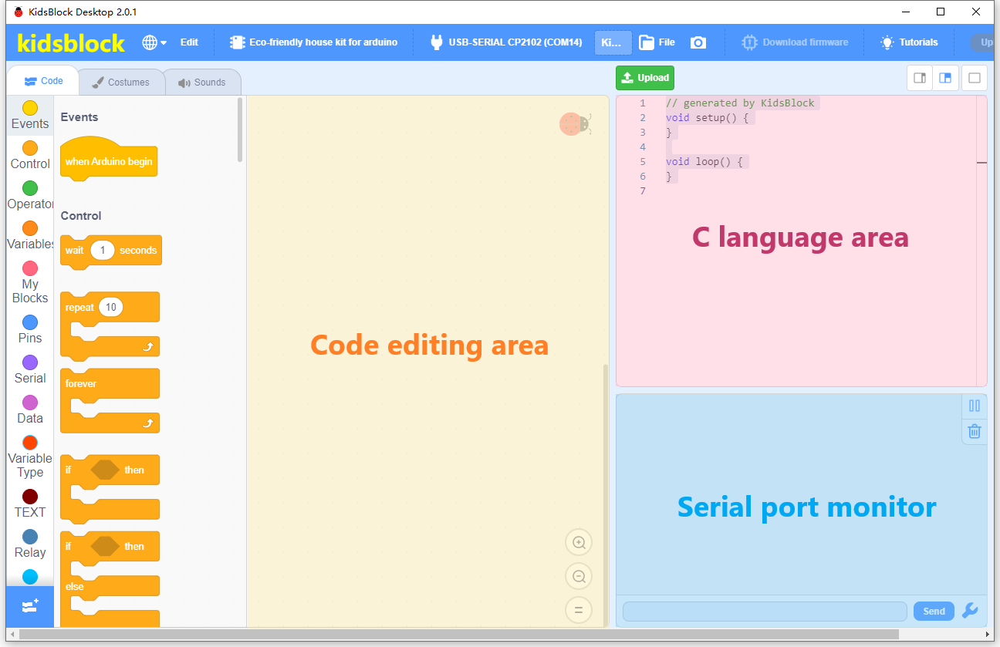

---

## 2. Download code

Please download the code:[KidsBlock Code](./KidsBlockCode.7z)

---

## 3. Single Module Learning

Before learning, flip the voltage switch on the main board to 5V.

### 3.1 SK6812 RGB Module

The built-in IC of the SK6812 can display 256 * 256 * 256 colors in a way that achieves multiple effects. Its control can be realized via only one signal wire. It is an intelligent externally controlled LED light source with the control circuit and the light-emitting circuit. Each LED element is the same as a 5050 LED lamp bead, and each component is a pixel. There are four lamp beads on the module, which indicates four pixels.

#### Three primary colors principle

The three primary colors of pigments are red, yellow and blue, and the three primary colors of colored light are red, green and blue, which is called RGB.

The human eyes are most sensitive to the RGB colors, and most colors can be produced by combining the RGB colors in different proportions. Similarly, most monochromatic light can also be decomposed into three colors of RGB. This is the most basic principle of colorimetry(three primary colors).

The three primary colors of RGB are added in different proportions to form mixed colors, which is called additive color mixing. And there is also the subtractive color mixing method. Colors can be added and subtracted as needed. The three primary colors of pigments cannot be adjusted to white, while the three primary colors of colored light can realize it via optical elements, which are obtained by mixing three equal parts of red, medium green and dark blue.

#### Parameters

Operating voltage : DC 5V 

Maximum power : 1W

Light source : SMD 5050 RGB

IC model : 4/WS2811

Gray level : 256 

Lighting angle : 180°

Light color: can be adjusted to white, red, yellow, blue and green via the controller

Operating temperature : -10°C ~ +50°C

Dimensions : 32 x 23.8 x 7.4 mm

Dimension of positioning hole: 4.8 mm in diameter

Port: 3-pin bent pin with a spacing of 2.54 mm

#### Schematic Diagram

From the schematic diagram, we can see that these four pixel lighting beads are all connected in series. In fact, no matter how many they are, we can use a pin to control a light and let it display any color. The pixel point contains a data latch signal shaping amplifier drive circuit, a high-precision internal oscillator and a 12V high-voltage programmable constant current control part, which effectively ensures the color of the pixel point light is highly consistent.

The data protocol adopts the communication method of unipolar nulling code, after the pixel point is reset, the DIN terminal accepts the data transmitted from the controller. The first 24bit data sent over is extracted by the first pixel point and sent to the data latch inside the pixel point, the rest of the data is shaped and amplified by the internal shaping processing circuit and then begins to be forwarded and outputted to the next cascade of pixel points via the DO port, and the signal is reduced by 24bit after the transmission of one pixel point. 

The pixel point adopts the automatic shaping and forwarding technology, so that the number of cascade of the pixel point is not subject to the limitation of signal transmission, but only subject to the limitation of signal transmission speed.

#### Components

| 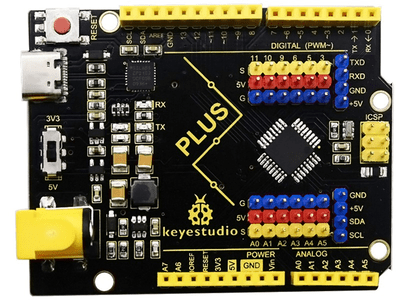 |  |  |  |
| --------------------------- | --------------------------- | ----------------------- | --------------------- |
| PLUS Main Board x1          | SK6812 RGB Module x1        | 3Pin 20cm Wire x1       | USB Cable  x1         |

#### Wiring Diagram

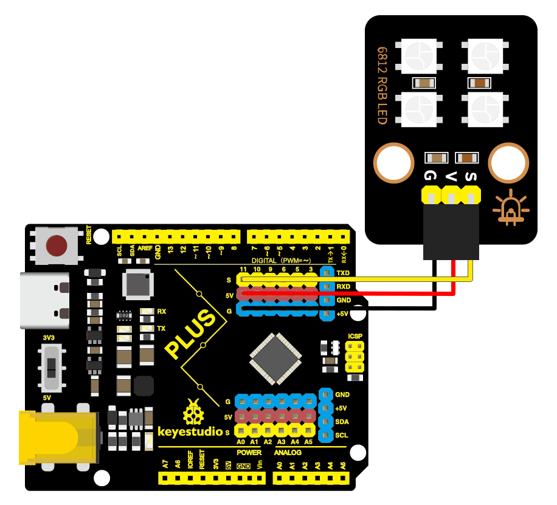

#### Test Code

In this tutorial, we use KidsBlock Desktop version 2.0.1

The code file 3.1Light_on.sb3 can be downloaded in the directory *Download Code*, please download it by yourself.

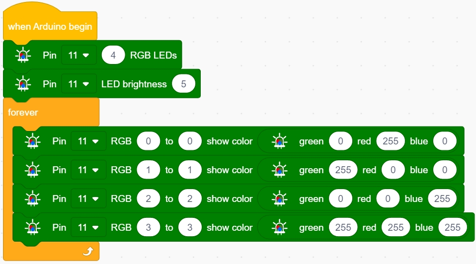

**Write Code：**

Open the KidsBlock software，then tap **Eco-friendly house kit for arduino**.

Then tap **Go to Editor** 

- Drag theblock from to the code editing area.

- Drag the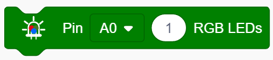block from to the code editing area. Then set the *Pin* to 11 and the *RGB LEDs* to 4.

- Repeat the same step to set the brightness code block.

- Drag the block from  to the code editing area.

- Drag the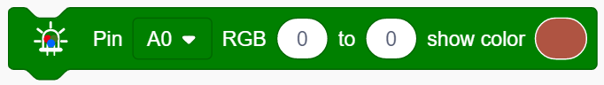and blocks fromto the code editing area. Then set the pin and the corresponding value.

  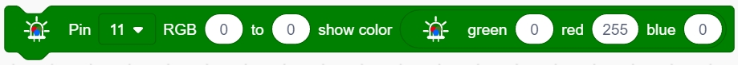

- Repeat the same step and set the corresponding value.

  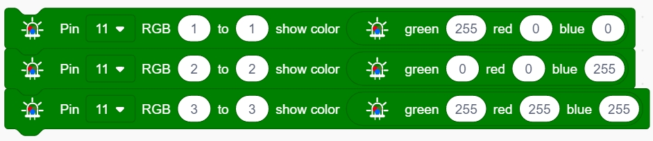

- Complete code

  

#### Code Explanation

| Blocks                        | Command block area                                | Explanation                    |
| ----------------------------- | ------------------------------------------------- | ------------------------------------------------------------ |
|    |                          | It can be used to call functions.|
|          |                | Set the pins on Arduino that are connected to the NeoPixels,  and the NeoPixels pixel size (number of leds). |
|          |  | Set the brightness.                                                   |
|  |                      | It is a loop module that executes code blocks repeatedly.              |
|          |            | Set leds and colors.                         |
|          |                      | Set colors.   |

#### Test Result

After uploading code successfully, we will see the four RGB LEDs show red, green, blue and white color. Since the RGB LEDs are very bright, I have set the brightness to 5 in the code. You can change its value as required, the range is 0 ~ 255.

---

### 3.2 PIR Motion Sensor

The PIR motion sensor mainly uses a RE200B-P sensor element. It is a human body pyroelectric motion sensor based on pyroelectric effect, which can detect infrared rays emitted by humans or animals, and the Fresnel lens enables to make the sensor's detection range farther and wider.

When using, we will determine if there is someone moving nearby by reading the high and low levels of the S terminal on the module.

#### Parameters

Operating voltage : DC 3.3 ~ 5V 

Operating current : 50 mA

Maximum power : 0.3 W

Quiescent current : <50 uA

Operating temperature : -10°C ~ +50°C

Control signal : digital signal

Trigger mode: L for non-repeatable trigger / H for repeatable trigger

Maximum detection distance : 7m

Sensing angle : <100°

Dimensions : 32 x 23.8 x 7.4 mm

Dimension of positioning hole: 4.8 mm in diameter

Port: 3-pin bent pin with a spacing of 2.54 mm

#### Schematic Diagram

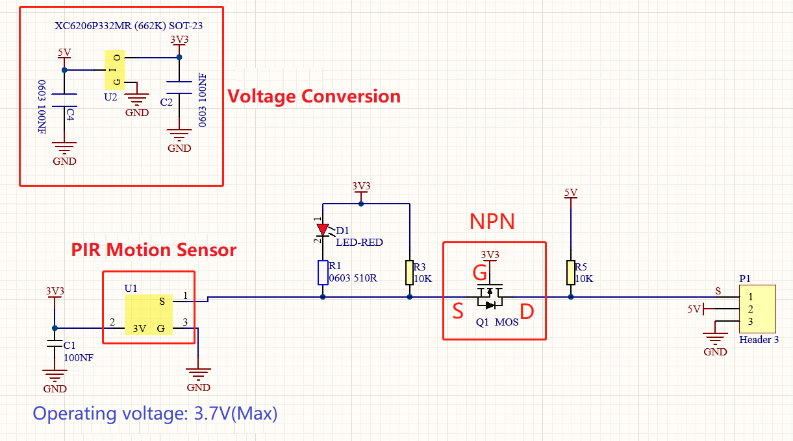

The voltage conversion part converts a 5V input voltage to a 3.3V input voltage. The working voltage of the PIR motion sensor we use is 3.3V, therefore we can’t use 5V directly. The voltage conversion circuit is needed.

When no infrared signal is received, and pin 1 of the sensor outputs low level. At this time, the LED on the module will light up and the MOS tube Q1(Q1 is an NPN MOS tube, model is 2N7002) will be connected and the signal terminal S will detect Low level. 

When  infrared signal is received, and pin 1 of the sensor outputs a high level. Then LED on the module will go off, the MOS tube Q1 is disconnected and the signal terminal S will detect high level that is pulled up by a 10K pull-up resistor R5.

#### Components

|  |  |  |  |
| --------------------------- | --------------------------- | ----------------------- | --------------------- |
| PLUS Main Board x1          | PIR Motion Sensor x1        | 3Pin 25cm Wire x1       | USB Cable x1          |

#### Wiring Diagram

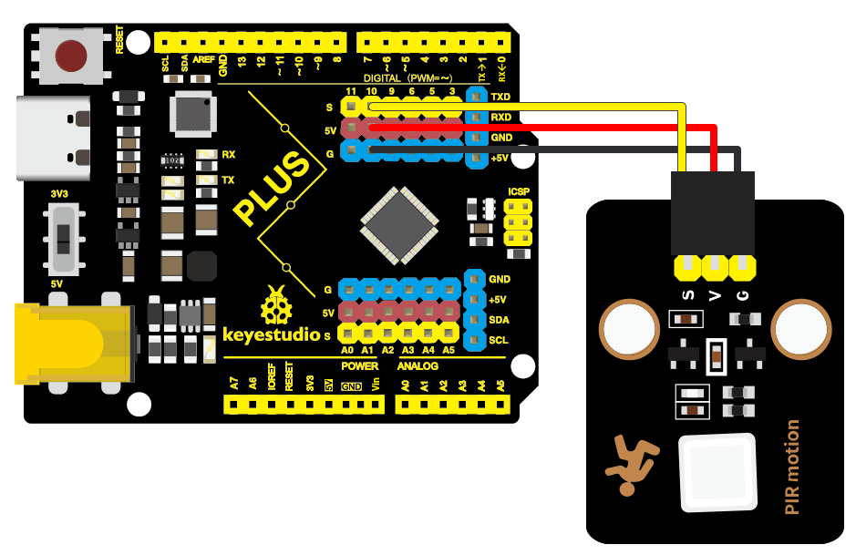

#### Test Code

In this tutorial, we use KidsBlock Desktop version 2.0.1

The code file 3.2PIR_motion.sb3 can be downloaded in the directory *Download Code*, please download it by yourself.

#### Code Explanation

| Blocks                            | Command block area                          |                           |
| --------------------------------- | ------------------------------------------- | ------------------------------------------- |
|            |  | Declare a global variable *item* with  integer numeric type and initial  default value 0. |
|        |  | Initialize serial communication and  set baud rate to 9600. |
| 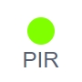             |  | Set the pins of the PIR motion  sensor and read its value. |
|            |  | Assign value to variable *item*. |
|        |  | Print " Hello KidsBlock " on the  serial port. Warp can be changed  to no-warp or HEX. |
|            |  | Variable *item* |
|  |  | Check if the values of the left  and right operands are equal,  if so the condition is true. |
|      | 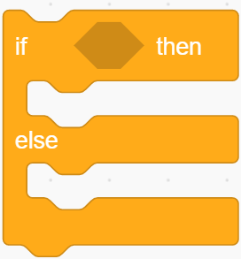 | If the condition is true, then  execute the code in the if block;  otherwise execute the code in  the else block. |
|      |  | Delay 1s |

#### Code Block Explanation

##### if judgment statement

There are three flow control statements：

- Sequential control

  The program is executed line by line from top to bottom, without any judgment or jump in between.
  
  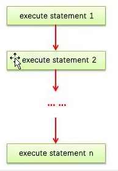

- Branch control 

  - Single branch

  - Dual branch

  - Multiple branch

- Cycle control 

  There are for cycle control, while cycle control and do..while cycle control.
  
  

###### Single branch

If the condition is true, the code in the if block is executed, otherwise, it is skipped.

---

###### Dual branch

If the condition is true, the code in the if block is executed, otherwise, the code in the else block is executed.

---

###### Multiple branch

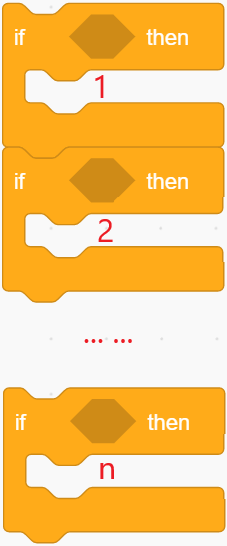

If the first if block is valid, execute code block 1.

If the first if block is not valid, then judge whether the second if block is valid, if so, then execute code block 2, otherwise continue to judge.

If the second if block is valid, block 2 will be executed, otherwise it will continue to judge. And if all the expressions are not valid, it will be skipped.

##### Example

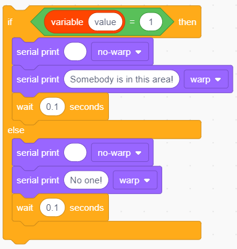 

Here we use the Dual branch structure.

When the value of the variable *value* is equal to 1, the following code block is executed：

Print four spaces (to separate the data and statement) on the serial monitor with no-warp, then print **Somebody is in this area!** with warp. Print it every 0.1s.

When the value of the variable *value* is not equal to 1, the following code block is executed：

Print four spaces (to separate the data and statement) on the serial monitor with no-warp, then print **No one!** with warp. Print it every 0.1s.

#### Test Result

After uploading code successfully，tap to set the baud rate to 9600.

When the sensor detects someone nearby, value is 1, the LED will light off and the monitor will show “**1 Somebody is in this area!**”. In contrast, the value is 0, the LED will light up and “**0 No one!**” will be shown.

---

### 3.3 Photoresistor

It mainly consists of a photoresistor element and its resistance changes with the light intensity. Also, it converts the resistance change into voltage change via the characteristic. It is able to simulate people's judgment of the intensity of the ambient light and facilitate the application of friendly interaction with people.

#### Parameters

Operating voltage : DC 3.3 ~ 5V 

Current : 20 mA

Maximum power : 0.1 W

Operating temperature : -10°C ~ +50°C

Output signal : Analog signal

Dimensions : 32 x 23.8 x 7.4 mm

Dimension of positioning hole: 4.8 mm in diameter

Port: 3-pin bent pin with a spacing of 2.54 mm

#### Schematic Diagram

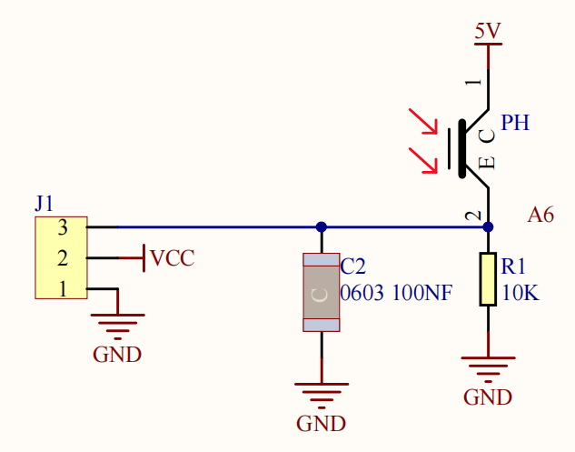

When there is no light, the signal end of the photoresistor detects a voltage close to 0. When the light intensity increases, the resistance of photoresistor will diminish, thus the detected voltage at the signal end increases.

#### Components

|  |  |  |  |
| --------------------------- | --------------------------- | ----------------------- | --------------------- |
| PLUS Main Board x1          | Photoresistor x1            | 3Pin 25cm Wire x1       | USB Cable x1          |

#### Wiring Diagram

#### Test Code

In this tutorial, we use KidsBlock Desktop version 2.0.1

The code file 3.3Photoresistance.sb3 can be downloaded in the directory *Download Code*, please download it by yourself.

#### Code Explanation

| Blocks                    | Command block area                  | Explanation                |
| ------------------------- | ----------------------------------- | ------------------------------------ |
|  |  | Set the pin of the photoresistor  and read its value. |

Set an integer variable *val* with an initial value of 0 and set the serial port baud rate to 9600.

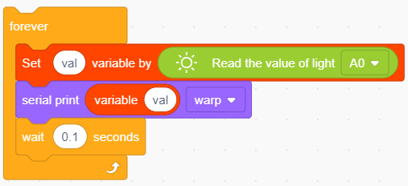

Set the pin of the photoresistor to A0, read its value and assign it to the variable *val*.

#### Test Result

After uploading code successfully，open the serial monitor and set the baud rate to **9600**. Then we can see the analog value corresponding to the light intensity, when the light intensity gets stronger, the analog value will be larger.

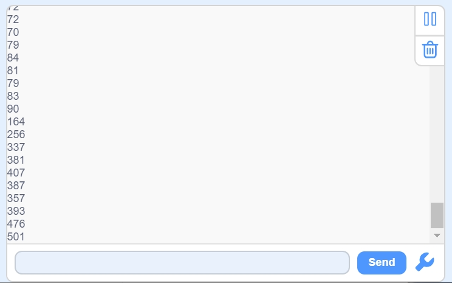

### 3.4 XHT11 Temperature and Humidity Sensor

XHT11 temperature and humidity sensor, a low-cost entry-level temperature and humidity sensor, is mainly composed of a resistive moisture-sensing element and a NTC temperature element. It uses a single-wire serial interface with 4-pin single-row pin package, and the signal transmission distance can reach more than 20m via an appropriate pull-up resistor.

It features fast response, strong anti-interference ability and cost-effective. 

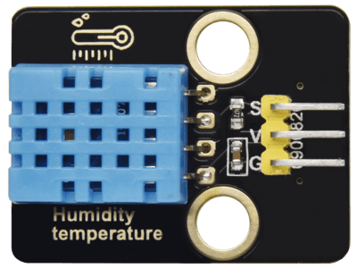

#### Parameters

Working voltage: DC 3.3 ~ 5V

Current: 50 mA

Maximum power: 0.25W

Operating temperature: -25°C ~ +60°C

Temperature range: 0 ~ 50°C ± 2 °C

Humidity range: 20% ~ 90%RH ± 5%RH

Output signal: digital bidirectional unibus

Dimensions: 32 x 23.8 x 9.7mm

Dimension of positioning hole: 4.8 mm in diameter

Port: 3-pin bent pin with a spacing of 2.54 mm

#### Schematic Diagram

The communication and synchronization between the single-chip microcomputer and XHT11 adopts the single bus data format. The communication time is about 4ms. The data is divided into fractional part and integer part. 

Operation process: A complete data transmission is 40bit, high bit first out. 

Data format: 8bit humidity integer data + 8bit humidity decimal data + 8bit temperature integer data + 8bit temperature decimal data + 8bit checksum 

8-bit checksum: 8-bit humidity integer data + 8-bit humidity decimal data + 8-bit temperature integer data + 8-bit temperature decimal data "Add the last 8 bits of the result.

#### Components

|  |                   |  |  |
| --------------------------- | -------------------------------------------- | ----------------------- | --------------------- |
| PLUS Main Board x1          | XHT11 Temperature  and Humidity Sensor x1 | 3Pin 20cm Wire x1       | USB Cable  x1         |

#### Wiring Diagram

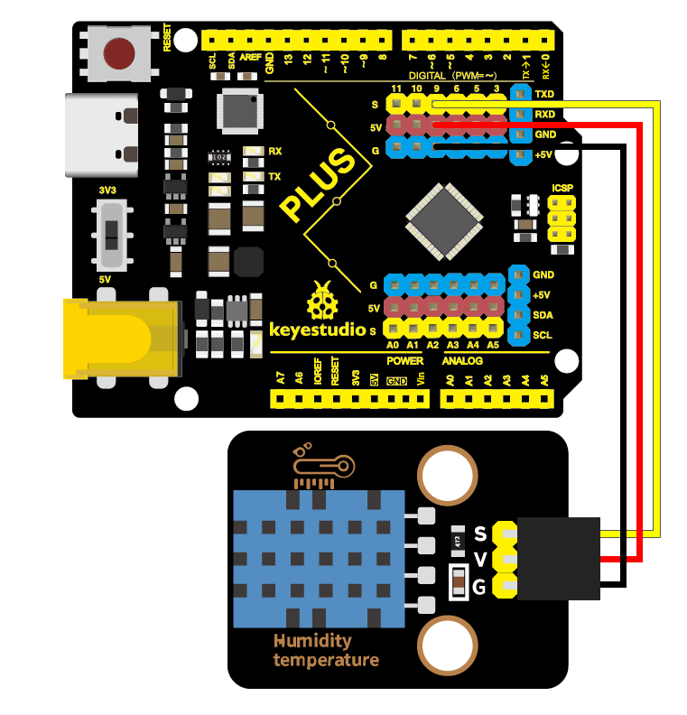

#### Test Code

In this tutorial, we use KidsBlock Desktop version 2.0.1

The code file 3.4XHT11.sb3  can be downloaded in the directory *Download Code*, please download it by yourself.

#### Code Explanation

| Blocks                    | Command block area                  | Explanation              |
| ------------------------- | ----------------------------------- | ---------------------------- |
|  |    | Set the pin for the temperature  and humidity sensor. |
|  |      | The humidity value read by the  temperature and humidity sensor. |
|  | 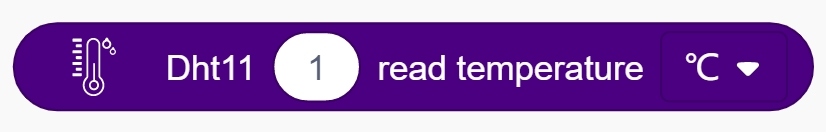 | The temperature value read by the  temperature and humidity sensor. |

#### Test Result

After uploading it successfully, open the serial monitor and set baud rate to 9600, then the monitor will display the temperature and humidity data of the current environment.

---

### 3.5 LCD1602 Display

1602 Liquid Crystal Display  is a dot matrix LCD module committed to displaying letters, numbers and symbols.

Character LCD is capable of displaying (16x02)32 characters at the same time. It is composed of a number of dot matrix character bits, each dot matrix character bit can display a character. There is a dot interval between every two dot matrix character bits, and an interval between each line, which plays the role of character spacing and line spacing, thus, it can not display graphics well.

It simplifies LCD1602 wiring and saves GPIO ports with IIC/I2C ports. It is compatible with Arduino library files for quick development. It can adjust the contrast via the potentiometer on the IIC expansion board.

#### Parameters

Operating voltage: 5V

Working current: < 130 mA

Operating temperature: -10°C ~ +50°C

Temperature range: 0 ~ 50°C ± 2 °C

IIC address: 0x27

Dimension：80 x 36 x 17.2 mm

Dimension of positioning hole: 3 mm in diameter

Port: 3-pin bent pin with a spacing of 2.54 mm

#### Schematic Diagram

Pins of the LCD1602 Display：

| Pin    | Symbol   | Pin Explanation                                              |
| ------ | -------- | ------------------------------------------------------------ |
| 1      | VSS      | Ground                                                       |
| 2      | VDD      | Positive pole of power                                       |
| 3      | V0       | V0 is the LCD contrast adjustment terminal, the contrast is weakest when connected to the positive power,  and highest when connected to ground power.   (If the contrast is too high, it will produce "shadow",  which can be adjusted via a 10K potentiometer when using.) |
| 4      | RS       | RS is the register selection,  the data register is selected for high level 1,  and the instruction register is selected for low level 0. |
| 5      | RW       | RW is a read and write signal wire.  The read operation is performed at high (1) level and  the write operation is performed at low (0) level. |
| 6      | E        | E(EN) is (enable)end, the information will be read when the level is high (1),  and the instruction is executed when the level is negative. |
| 7 ~ 14 | D0 ~ D14 | D0 ～D7 are 8-bit bidirectional data terminals.  15 ~ 16pins: empty or backlight power |
| 15     | BLA      | Positive pole of backlight                                   |
| 16     | BLK      | Negative pole of backlight                                   |

The LCD1602 display requires at least seven IO ports to drive up, occupying too many IO ports. However,  it simplifies the wiring and saves IO ports via an adapter board.

#### Components

|  |  |  |  |
| --------------------------- | ----------------------------- | ----------------------- | --------------------- |
| PLUS Main Boardx1           | I2C LCD1602 Displayx1         | 4Pin 20cm Wire x1       | USB Cable  x1         |

#### Wiring Diagram

#### Test Code

In this tutorial, we use KidsBlock Desktop version 2.0.1

The code file 3.5LCD.sb3  can be downloaded in the directory *Download Code*, please download it by yourself.

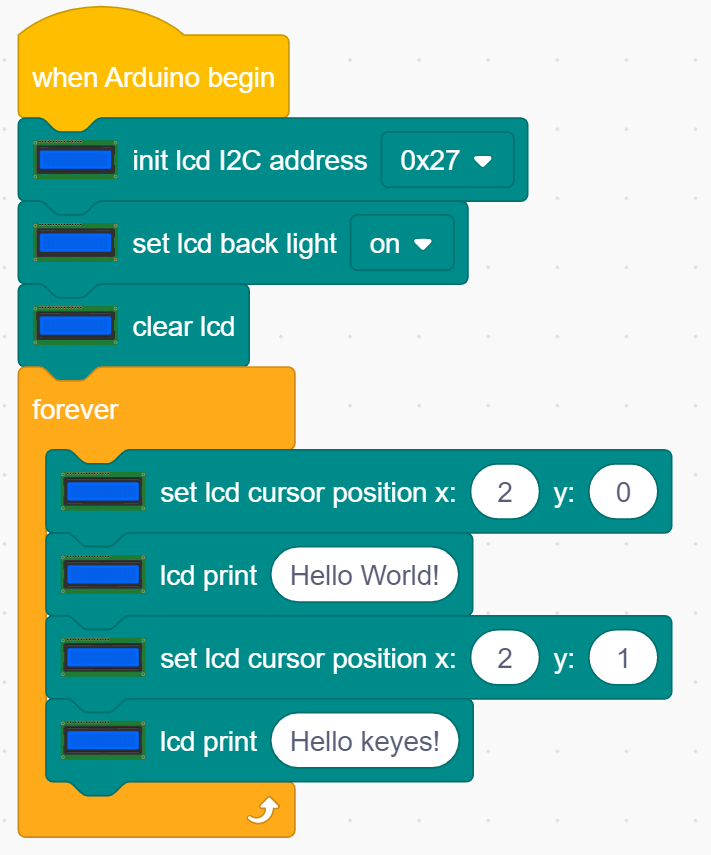

#### Code Explanation

| Blocks                | Command block area                        | Explanation                           |
| --------------------- | ----------------------------------------- | ------------------------------------------------------ |
|  | 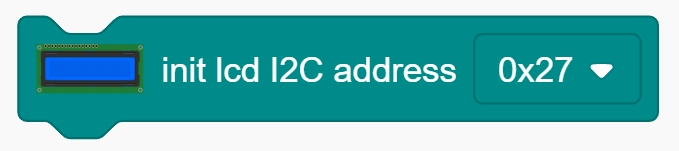     | Initialize lcd, address is 0x27, 16 columns, 2 rows.  |
|  |  | Turn on the backlight.                              |
|  | 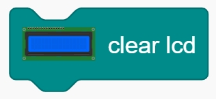         | Clear the display.   |
|  | 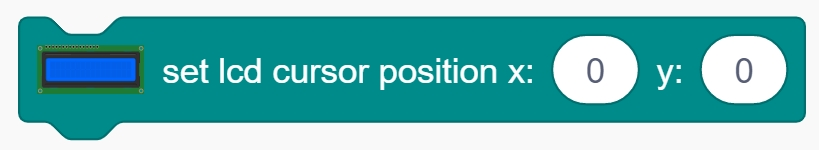   | Set the starting coordinates on the display.  y for rows and x for columns.        |
|  |          | Print " Hello keyestudio " from the starting  coordinates set on the display. |

#### Test Result

After the code is uploaded successfully, the first line of the LCD1602 display prints "**Hello World!** ", the second line prints "**Hello Keyes!** ".

---

### 3.6 Five AD Key Module

The difference between the five AD key module and the single AD key module is that the single AD key module can only read the output low level when the key is pressed and the output high level when it is released. The five AD key module collects analog output. When different keys are pressed, the output voltage and analog output are different, and only one analog port is occupied, which saves resources.

#### Parameters

Working voltage: DC 3.3 ~ 5V

Current: 20 mA

Maximum power: 0.1W

Data type: Analog signal

Operating temperature: -10°C ~ +50°C

Dimensions: 47.6 x 23.8 x 9.3mm

Dimension of positioning hole: 4.8 mm in diameter

Port: 3-pin bent pin with a spacing of 2.54 mm

#### Schematic Diagram

When the key is not pressed, the OUT output to the signal end S is pulled down by R1, then we read a low level of 0V.

When the key SW1 is pressed, the output OUT to the signal end S is equivalent to directly connecting to VCC, at this time we read a high level of 5V, the analog value is 1023.

When the key SW2 is pressed, the signal OUT terminal voltage we read is the voltage between R2 and R1, that is, VCC\*R1/(R2+R1), which is about 3.98V, and the analog value is about 815.

When the key SW3 is pressed, the signal OUT terminal voltage we read is the voltage between R2+R3 and R1, that is, VCC\*R1/(R3+R2+R1), which is about 3V, and the analog value is about 614.

When the key SW4 is pressed, the signal OUT terminal voltage we read is the voltage between R2+R3+R4 and R1, that is, VCC\*R1/(R4+R3+R2+R1), which is about 1.98V, and the analog value is about 407.

When the key SW5 is pressed, the signal OUT terminal voltage we read is the voltage between R2+R3+R4+R5 and R1, that is, VCC\*R1/(R5+R4+R3+R2+R1), which is about 1.02V, and the analog value is about 209.

#### Components

|  |  |  |  |
| --------------------------- | --------------------------- | ----------------------- | --------------------- |
| PLUS Main Board x1          | SK6812 RGB Module x1        | 3Pin 25cm Wire x1       | USB Cable  x1         |

#### Wiring Diagram

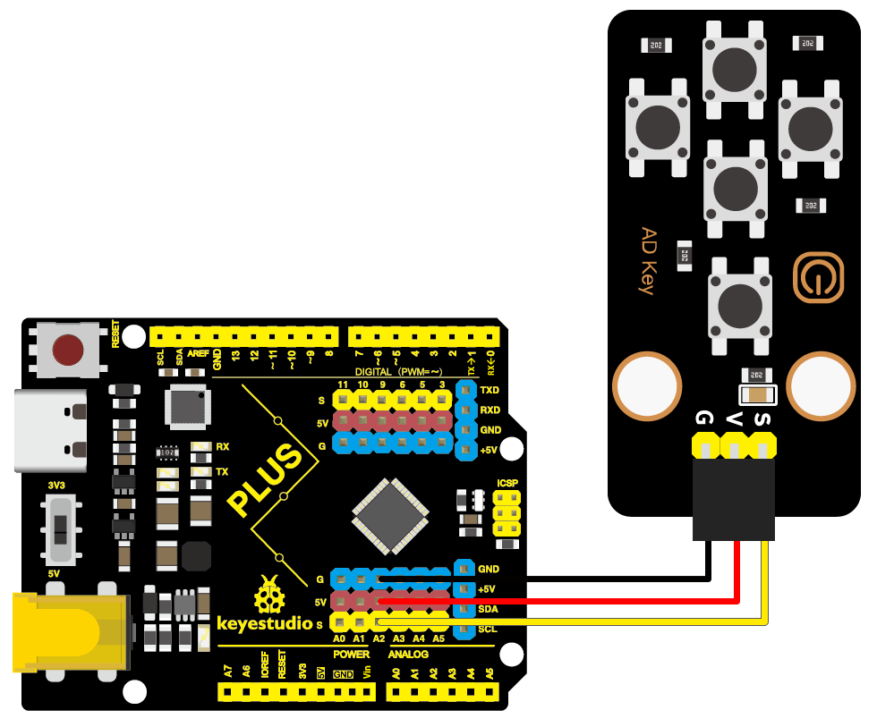

#### Test Code

In this tutorial, we use KidsBlock Desktop version 2.0.1

The code file 3.6AD_key.sb3  can be downloaded in the directory *Download Code*, please download it by yourself.

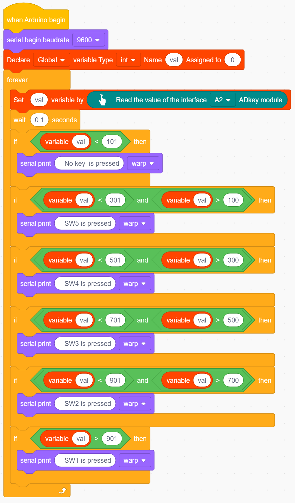

#### Code Explanation

| Blocks                            | Command block area                                        | Explanation              |
| --------------------------------- | --------------------------------------------------------- | -------------------------------------------------------- |
|                |                              | Set the pin of the AD key and read its value.                         |
|  |  | Check if the value of the left operand is greater  than the value of the right operand,  if so the condition is true. |
|  |        | Check if the value of the left operand is smaller  than the value of the right operand,  if so the condition is true. |
|  |                  | Logical and operator. If both operands are true,  the condition is true. |

When the value of *val* is smaller than 101, the serial monitor prints out the **No key is pressed** .

When the value of *val* is less than 301 and greater than 100, the serial monitor prints out the **SW5 is pressed**.

If 300 < *val* < 501，monitor prints out the **SW4 is pressed** .

If 500 < *val* < 701，monitor prints out the **SW3 is pressed** .

If 700 < *val* < 901，monitor prints out the **SW2 is pressed** .

If *val* > 901，monitor prints out the **SW1 is pressed** .

#### Test Result

After the code is uploaded successfully, open the serial monitor and set the baud rate to **9600**. When a key is pressed, the monitor prints the corresponding key information.

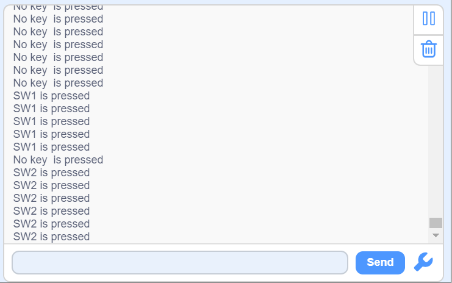

---

### 3.7 Soil Moisture Sensor

Soil moisture sensor is mainly used for measuring soil volumetric water content and soil moisture, agricultural irrigation as well as forestry protection. It is integrated into agricultural irrigation systems to help arrange water supplies efficiently, helping to reduce or enhance irrigation for optimal plant growth. Its surface is nickel-plated and has a wider sensing area to improve electrical conductivity, preventing rust in contact with soil and extending service life.

#### Parameters

Working voltage: DC 3.3 ~ 5V

Current: 44 mA (DC5V, when the soil module is shorted)

Output signal: analog signal

Operating temperature: -10°C ~ +50°C

Dimensions: 58 x 20 x 8 mm

Weight: 2.5g

Dimension of positioning hole: 4.8 mm in diameter

Port: 3-pin bent pin with a spacing of 2.54 mm

#### Schematic Diagram

The soil moisture sensor uses a resistive method to measure soil moisture. Soil moisture will be measured according to the relationship between the conductivity of soil solution and soil moisture content.

When the soil moisture sensor probe is suspended, the triode (S8050) base is in an open state, and the cutoff output of the triode is 0.  When it is inserted into the soil, the resistance value of the soil is different due to the different moisture content in the soil. The base of the triode provides a variable conduction current. The conduction current from the collector to the emitter of the triode is controlled by the base, and it will be converted into voltage after passing the puller resistance of the emitter. The more water content in the soil, the greater output voltage value will be.

Its hardware control circuit of the sensor is buried in the root of the crop to monitor the soil moisture in the root. The detection circuit of the sensor transmits the signals of "too high humidity" and "too low humidity"  to the main controller via the encoder, and the main controller decides the control state.

#### Components

|                |                |                       |
| ----------------------------------------- | ----------------------------------------- | --------------------- |
| PLUS Main Board x1                        | Soil Moisture Sensor x1                   |                       |
|  | 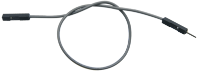 |  |
| 2Pin 20cm F-F Dupont Wire x1              | 1Pin 30cm M-F Dupont Wire x1              | USB Cable  x1         |

#### Wiring Diagram

#### Test Code

In this tutorial, we use KidsBlock Desktop version 2.0.1

The code file 3.7Soil_Humidity_Sensor.sb3  can be downloaded in the directory *Download Code*, please download it by yourself.

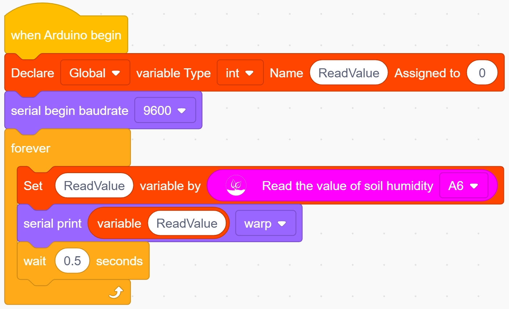

#### Code Explanation

| Blocks                  | Command block area                | Explanation           |
| ----------------------- | --------------------------------- | ---------------------------------------- |
|  |  | Set the pin of the soil moisture sensor and read its value. |

#### Test Result

After the code is uploaded successfully, open the serial monitor and set the baud rate to **9600**. Touch the sensor with a wet finger, the we can read the humidity value.

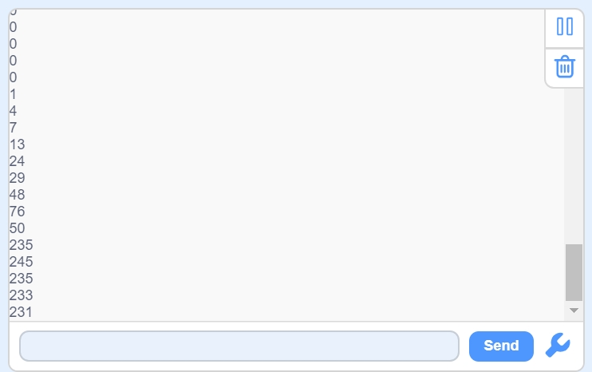

---

### 3.8 Water Level Sensor

Water level sensor measures the volume of water droplets and the amount of water by means of a trail of exposed parallel lines. Pure water conducts electricity very weakly and is an extremely weak electrolyte. Daily life water has more anions and cations due to the dissolution of other electrolytes to have a more pronounced conductivity, thus please use daily life water when doing experiments. It is not only smaller and smarter, but cleverly equipped with the following functions:

- Smooth conversion between water and analog values

- Strong flexibility, this sensor outputs basic analog values

- Low power consumption and high sensitivity

- Suitable for multiple development boards and controllers such as Aduino controllers, STC single-chip microcomputers as well as AVR single-chip microcomputers.

#### Parameters

Operating voltage : DC 5V

Operating current : < 20 mA

Output Signal : analog signal

Operating humidity : 10% ~ 90

Dimensions : 63 x 20 x 8 mm

Weight : 3.8 g

Dimension of positioning hole: 3.8 mm in diameter

Port: 3-pin bent pin with a spacing of 2.54 mm

#### Schematic Diagram

The water level sensor detects the amount of water through the exposed printed parallel lines on the circuit board.

It mainly utilizes the principle of current amplification of the triode: when the liquid level height makes the base of the triode and the positive pole of the power supply conductive, a certain size of current will be generated between the base of the triode and the emitter. At this time a certain magnification of the current will be generated between the collector and emitter of the triode, and the current will pass through the resistor of the emitter to generate the characteristic voltage, which will be collected by the AD converter. The more water there is, the more wires will be connected, and as the conductive contact area increases, the output voltage will gradually rise.

#### Components

|                |                |                       |
| ----------------------------------------- | ----------------------------------------- | --------------------- |
| PLUS Main Board x1                        | Water Level Sensor x1                     |                       |
|  |  |  |
| 2Pin 20cm F-F Dupont Wire x1              | 1Pin 30cm M-F Dupont Wire x1              | USB Cable  x1         |

#### Wiring Diagram

#### Test Code

In this tutorial, we use KidsBlock Desktop version 2.0.1

The code file 3.8Water_Level_Sensor.sb3  can be downloaded in the directory *Download Code*, please download it by yourself.

#### Code Explanation

| Blocks              | Command block area            | Explanation    |
| ------------------- | ----------------------------- | ---------------------------------------- |
| 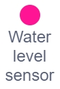 |  | Set the pin of the water level sensor and read its value. |

#### Test Result

After the code is uploaded successfully, open the serial monitor and set the baud rate to **9600**. Touch the sensor with a wet finger, the we can read the humidity value.

---

### 3.9 Single 5V Relay Module

Relay is an electrically controlled device, when the change of the input quantity reaches the specified requirements, the electrical output circuit controlled quantity will change in a predetermined way.

It has a control system and a controlled system, which is usually used in automated control circuits,  and it plays a role in automatic regulation, safety protection as well as conversion circuit in the circuit. By the way, the relay is equivalent to a switch, which can be connected to any wire for control.

#### Parameters

Operating voltage : DC 5V 

Current : 50 mA

Maximum power : 0.25 W

Input signal : digital signal

Contact current : less than 3 A

Operating temperature: -10°C ~ +50°C

Control signal : digital signal

Dimensions : 47.6 x 23.8 x 19 mm

Dimension of positioning hole: 4.8 mm in diameter

Port: 3-pin bent pin with a spacing of 2.54 mm

#### Schematic Diagram

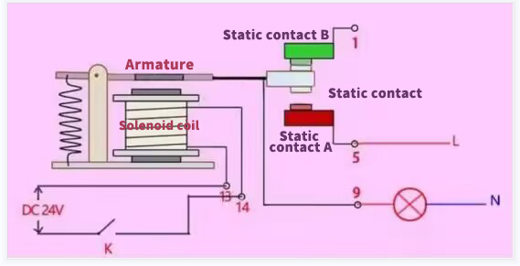

A relay has one moving contact and two static contacts A and B. 

When switch K is disconnected, no current passes through the relay wire, at which point the moving contact makes contact with static contact B and the upper half of the circuit is energized. The static contact B is called normally closed (NC). NC(normal close) is normally closed, that is, the coil is closed without being energized.

When switch K is closed, the relay circuit is magnetized by current, at which time the moving contact makes contact with static contact A and the lower half of the circuit is energized. The static contact A is called normally open contact (NO). NO (normal open) is normally disconnected, that is, the coil is disconnected without being energized.

And the moving contact is also known as common contact (COM).

Relay is a switch, VCC means positive power, GND means negative power, IN means signal input pin, COM means common end, NC (normal close) means normally closed, NO (normal open) means normally open.

The relay, compatible with multiple microcontroller control boards, is an "automatic switch" that uses a small current to control the operation of a large current. It allows MCU control boards to drive loads below 3A, such as LED light strips, DC motors and miniature water pumps. The solenoid valve is a pluggable interface, which is easy to use.

#### Components

|  |  |  |  |
| --------------------------- | --------------------------- | ----------------------- | --------------------- |
| PLUS Main Boardx1           | 5V Relay Module x1          | 3Pin 20cm Wire x1       | USB Cable  x1         |

#### Wiring Diagram

#### Test Code

In this tutorial, we use KidsBlock Desktop version 2.0.1

The code file 3.9Relay.sb3  can be downloaded in the directory *Download Code*, please download it by yourself.

#### Code Explanation

| Blocks                      | Command block area                        | Explanation                                                  |
| --------------------------- | ----------------------------------------- | ------------------------------------------------------------ |
|  |  | Number of bytes that can be read by the serial port          |
|  |      | Data read from the serial port                               |
|    | 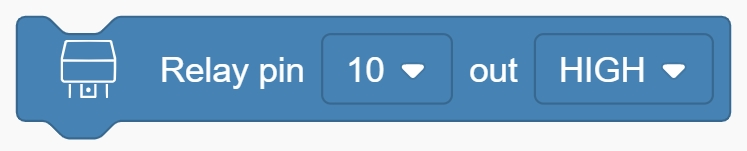         | Sets the pin of the relay.  Pull down the small triangle to set the input or output mode. |

When the number of bytes that can be read by the serial port is greater than 0, it means that the serial port has read the data.

When the serial monitor reads the data, it prints out the value then the relay will at a high and a low level for 0.5s respectively.

#### Test Result

After the code is uploaded successfully, open the serial monitor and tap to set the baud rate to **9600**. Then set the **End of line** to **No line terminators**.

Enter the character **d** in the input box and press **ENTER** on the keyboard or tap  to send, then you can see the red led on the relay blinking for 1s with the dynamic contact suction and release of the " Tick " sound. " The serial monitor prints out the Ascii code value of the character " **d** ".

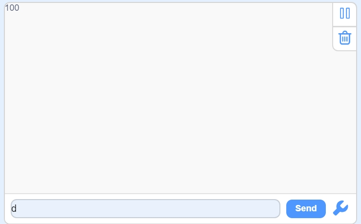

---

### 3.10 Water Pump

**Note: Please use water carefully, do not spill water from the pool and soil cell. If water is spilled on other sensors, it will cause a short circuit when energized, affecting the normal operation of the device, if water is spilled on the battery, it will lead to danger of heat generation and explosion.**

**Thus，please be careful when using the device. Children must be supervised by their parents when using the kit. To ensure the safe operation of the device, follow the relevant user guides and safety regulations.**

#### Parameters

Operating voltage : DC 3 ~ 5V 

Current : 100 mA

Maximum current : 200 mA

Dimensions : 38.3 x 25.4 x 46.3 mm

Weight : 29.8 g

#### Schematic Diagram

To drive the water pump, you just need to connect the VCC terminal of the water pump to the power terminal and the GND to GND terminal.
The red VCC wire of the water pump is connected to the 3V3 power port of the motherboard, the black GND wire of the water pump is connected to the COM terminal of the relay, and the NO terminal of the relay is connected to the GND port of the motherboard. When driving the relay, COM and NO are closed, at this time the GND wires are connected, and the water pump conducts and starts to work.

**Note：**

1. Water pump is a DC pump, the voltage must be DC power supply (batteries labeled DC power supply and transformer). Voltage can be used only within the specified voltage range, and don't use it over voltage.

2. It is prohibited to rotate without water for a long time.

3. It is prohibited to use in acidic and alkaline solution.

4. Don't use it in liquids with impurities greater than 0.35 mm and magnetizing particles, if the water quality is too dirty, you need to clean up the impurities of the water pump.

   

#### Components

|                |  |  |
| ----------------------------------------- | --------------------------- | --------------------------- |
| PLUS Main Board x1                        | Single 5V Relay Module x1   | Water Pump x1               |
| 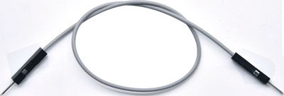 |      |        |
| 1Pin 22cm M-M Wire x1                     | 3Pin 20cm Wire x1           | USB Cable  x1               |

#### Wiring Diagram

#### Test Code

In this tutorial, we use KidsBlock Desktop version 2.0.1

The code file for this lesson is still 3.9Relay.sb3.

#### Test Result

**Note：Please use water carefully and control the direction of the water pipe and water flow, do not spill water on the motherboard or module,which will cause a short circuit and damage the motherboard and the module.**

After the code is uploaded successfully, open the serial monitor and set the baud rate to **9600**.

Enter the character "**d** " in the input box and press " **ENTER** " on the keyboard or tap  to send, then the pump will pump water once. Enter "**dd** " and send, it will pump water twice.

---

### 3.11 Passive Buzzer

The "source" of active and passive buzzers is vibration source.

An active buzzer has its own internal oscillator, thus it can produce sound once triggered, and the frequency of sound is stable. It features convenient program control and high sound pressure. DC power input passes through the amplifying and sampling circuit of the oscillation system to generate sound signal under the action of the resonant device.

However, a passive buzzer is a component without internal vibration source and it won't make sound if it passes through the DC signal. Because the magnetic circuit is constant, the vibration diaphragm has been in the adsorption state, and it can not vibrate and make sound. According to different needs, we will drive it via square waves, and then change the frequency to achieve different sound effects.

**Note： Active buzzer boasts internal vibration source,  and the sound frequency is stable. Passive buzzer doesn't boast the internal vibration and is driven by square waves, the sound frequency can be changed.**

#### Parameters

Operating voltage : DC 3.3 ~ 5V 

Current : 50 mA

Input signal : digital signal (square wave)

Dimensions : 32 x 23.8 x 9.7 mm

Dimension of positioning hole: 4.8 mm in diameter

Port: 3-pin bent pin with a spacing of 2.54 mm

#### Schematic Diagram

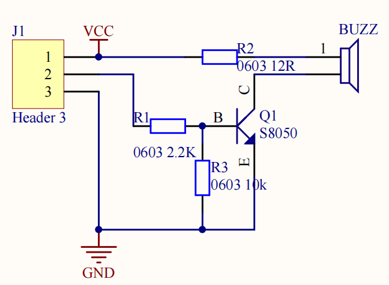

The sounding principle of a buzzer consists of a vibration device and a resonance device. Passive buzzer has no internal excitation source, and it makes sound via a certain frequency of the square wave signal.  Different input square waves will produce different sound (the passive buzzer can simulate the tune to achieve musical effects).

Passive buzzer sound is mainly controlled by the pin to output PWM wave, and the frequency and duty cycle are important. The frequency of a PWM wave with the same duty cycle maybe different, the duty cycle determines voltage of the buzzer and loudness, while the frequency determines the tone.

The level change of the pin can simulate a square wave, for example, a high level of the pin lasts for 500 us, and changes to a low level of 500 us, then  changes to a high level.
To drive a passive buzzer with a square wave of 200 to 5000 Hz, the Hz of the square wave can be calculated by the formula f=1/T, where f is the frequency and T is the time used for a complete cycle (the sum of the duration of each of the high and low levels).

#### Components

|  |  |  |  |
| --------------------------- | --------------------------- | ----------------------- | --------------------- |
| PLUS Main Board x1          | Passive Buzzer x1           | 3Pin 20cm Wire x1       | USB Cable  x1         |

#### Wiring Diagram

#### Test Code

In this tutorial, we use KidsBlock Desktop version 2.0.1

The code file 3.11Passive_buzzer.sb3  can be downloaded in the directory *Download Code*, please download it by yourself.

#### Code Explanation

| Blocks                      | Command block area                    | Explanation                                                  |
| --------------------------- | ------------------------------------- | ------------------------------------------------------------ |
|  |  | Set the pin of the passive buzzer and play music.  Pull down the small triangle can switch to other music. |

#### Test Result

After the code is successfully uploaded, the passive buzzer plays music circularly.

---

### 3.12  Solar Ultraviolet Sensor

The solar ultraviolet sensor uses the GUVA-S12SD chip. The output current of this sensor is proportional to the light intensity and the product output has a very high consistency. It is mainly used for the ultraviolet measurement in sunlight and UVA lamp intensity measurement, which is especially suitable for UVI detection.

#### Parameters

Supply voltage : 2.5V ~ 5V

Spectral detection range : 240 ~ 370 nm 

Active area :  $0.076 mm^{2}$

Response : 0.14 A/W (λ = 300 nm, $U_{R}= 0V$ test condition)

Dark current : 1 nA ( $U_{R}= 0.1V$  test condition)

Light current : 113 nA (UVA lamp,  $1  mW/cm^{2}$ test condition)

Light current : 26  nA (1 UVI test condition)

Temperature coefficient : 0.08 %/°C 

Dimensions : 32 x 23.8 x 9.7 mm

Dimension of positioning hole: 4.8 mm in diameter

Port: 3-pin bent pin with a spacing of 2.54 mm

#### Schematic Diagram

The ultraviolet sensor utilizes a photosensitive element to convert the UV signal into a measurable electrical signal through photovoltaic and photoconductive modes, with an output current proportional to the light intensity. The output electrical signal is output after amplification via an operational amplifier. The SGM8521 operational amplifier converts the current output of the sensor to voltage, and then amplifies the output so that an analog input on the main board can read the voltage to obtain a UV reading.

#### Components

|  |  |  |  |
| --------------------------- | --------------------------- | ----------------------- | --------------------- |
| PLUS Main Board x1          | Solar Ultraviolet Sensorx1  | 3Pin 25cm Wire x1       | USB Cable  x1         |

#### Wiring Diagram

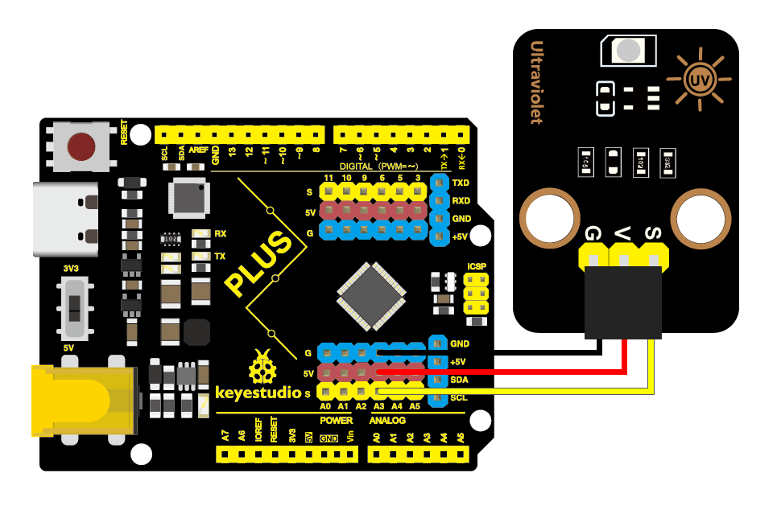

#### Test Code

In this tutorial, we use KidsBlock Desktop version 2.0.1

The code file 3.12Ultraviolet.sb3  can be downloaded in the directory *Download Code*, please download it by yourself.

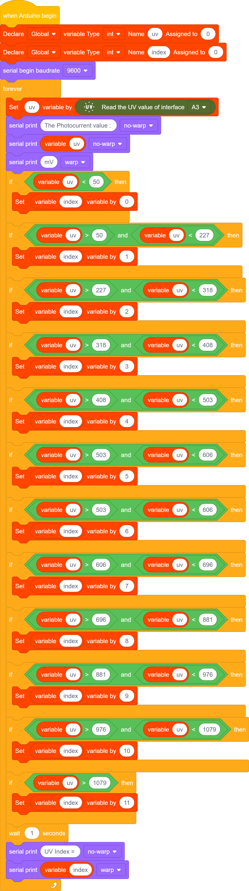

#### Code Explanation

| Blocks              | Command block area            | Explanation                     |
| ------------------- | ----------------------------- | -------------------------------------------- |
|  |  | Set the pin of the solar UV sensor and read its value. |

Set a variable *val* with an initial value of 0 to store the detected UV value and a variable *index* with an initial value of 0 to store the UV intensity level value, then set the serial baud rate to 9600.

Set the pin of the solar UV sensor to A3, read its value and assign it to the variable *uv* , then print it out on the serial port.

If the value of the variable *uv* is less than 50, set the value of the variable *index* to 0.

If the value of the variable *uv* is greater than 50 and less than 227, set the value of the variable *index* to 1.
Similarly, we can get the value of *index* for each *uv* range.

Print out the value of the variable *index* on the serial monitor, which is the UV level

#### Test Result

After the code is uploaded successfully, open the serial monitor and set the baud rate to **9600**. Then the serial monitor prints the UV level detected at this time.

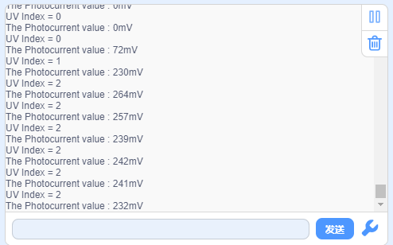

---

## 4. Product Assembly

[Product_Assembly](../Product_Assembly.md)

---

## 5. Projects

### 5.1 Energy-efficient Lighting

Energy-efficient lighting helps reduce carbon emissions and electricity consumption, which is a ideal way to tackle climate change and reduce environmental pollution. Traditional lighting fixtures consume more electricity, while its production is often associated with the burning of coal or fossil fuels, which produces large amounts of carbon dioxide emissions. 

By and large, it empowers to save energy, reduce carbon emissions, light pollution and the use of toxic substances, as well as extend resources of life. Importantly, it contributes to sustainable development and reduce energy consumption and environmental impact.

#### Flow Chart

The photosensitive module detects the ambient light value and the PIR motion sensor detects whether there is someone in the environment. The LED will be on when insufficient light and people are detected, otherwise it will be off.

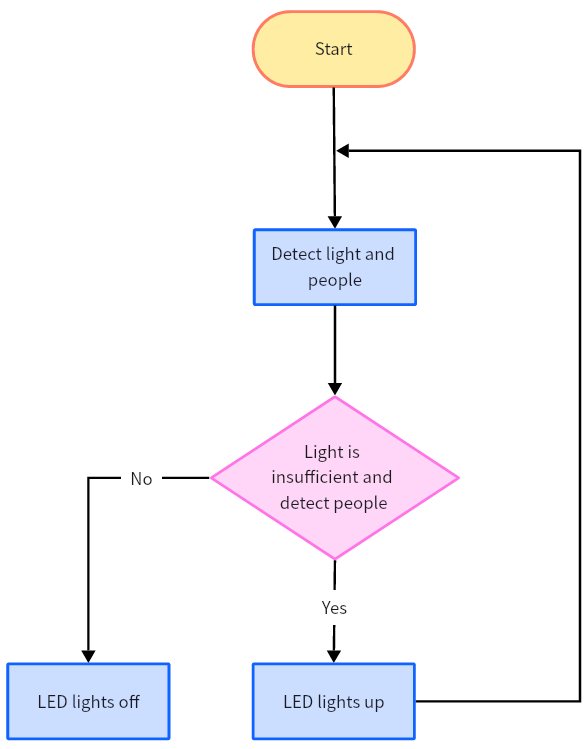

#### Wiring Diagram

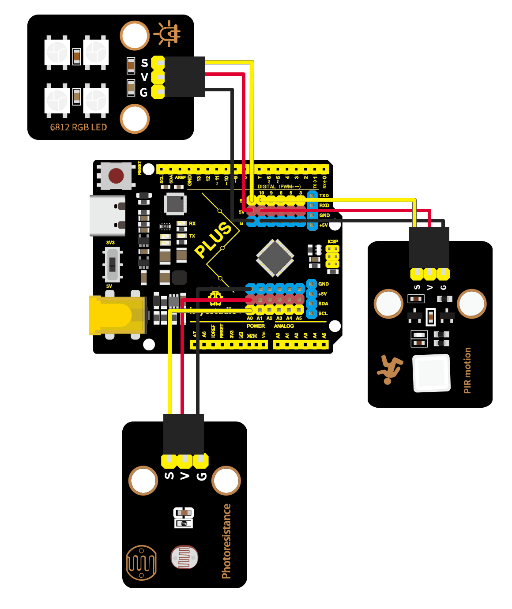

#### Test Code

In this tutorial, we use KidsBlock Desktop version 2.0.1

The code file 5.1Energy-efficient_Lighting.sb3 can be downloaded in the directory *Download Code*, please download it by yourself.

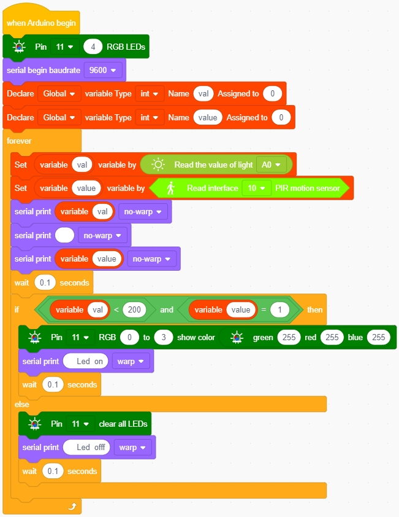

#### Code Explanation

Set the RGB pin as 11 and the LED to 4, and set the serial baud rate to 9600, then define two integer variables *val* and *value*, both with initial value 0.

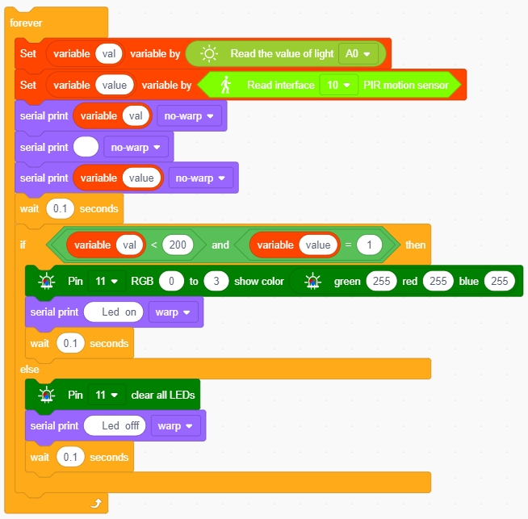

Assign the value read by the photosensitive sensor to the variable *val*, and the value read by the PIR motion sensor to the variable *value*, and print out the two values in the serial monitor every 100 ms with no-warp and four spaces between the two values.

Then an if loop will be executed, LEDs will be on only when *val < 200* (the analog value corresponding to the light intensity) and *value == 1* (a person is detected) and the serial monitor prints **Led on**, otherwise the LEDs are off and the serial monitor prints **Led off**.

#### Test Result

After the code is uploaded successfully, open the serial monitor and set the baud rate to **9600**. Then the serial monitor prints the analog value corresponding to the light intensity in the environment, the digital level value detected by the PIR motion sensor, and the LED state.

The LED will only be on if *val < 200* (analog value corresponding to the light intensity) and *value == 1* (a person is detected).

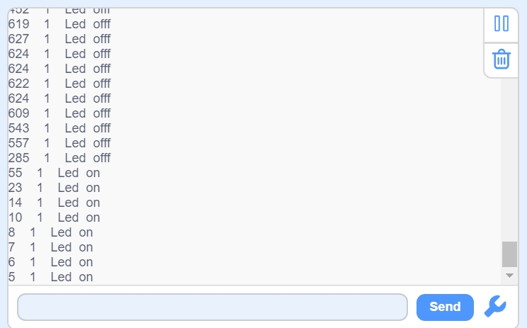

---

### 5.2 Plant Light System

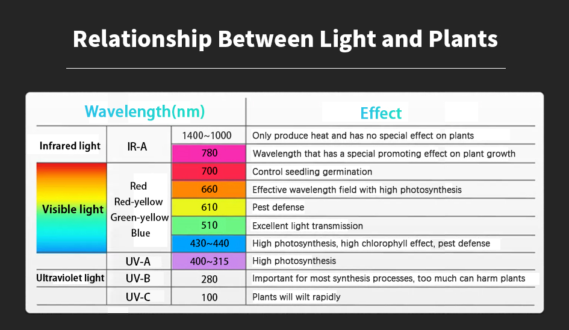

Photosynthesis is a prerequisite for plant growth, plants can absorb various wavelengths of light in photosynthesis, but the most absorbed are red light and blue-violet light. Chlorophyll mainly absorbs red and blue-violet light, including chlorophyll a and b. Carotenoids mainly absorb blue-violet light, including carotene and lutein. Blue light promotes the growth of plant roots, stems, and leaves. Red and orange light provide nutrients to chlorophyll.

In this project, we are going to make a simple plant light. Turn on the visible light that the plant needs via a button.

#### Flow Chart

#### Wiring Diagram

#### Test Code

In this tutorial, we use KidsBlock Desktop version 2.0.1

The code file 5.2Plant_Light.sb3 can be downloaded in the directory *Download Code*, please download it by yourself.

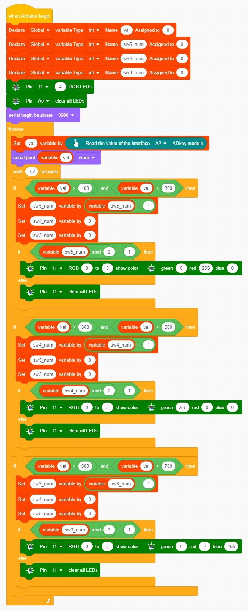

#### Code Explanation

| Blocks                            | Command block area                        |Explanation                                   |
| --------------------------------- | ----------------------------------------- | -------------------------------------- |
|  |  | Take the remainder after dividing the left and right operands. |

#### Test Result

After the code is uploaded successfully, all the leds are off. If you want to light up a led you like, just press the corresponding button, press it again will turn off it.

---

### 5.3 Environment Monitoring System

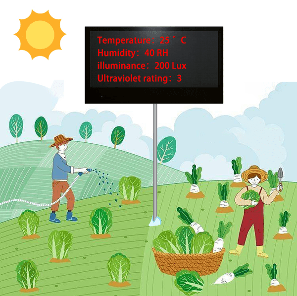

Greenhouse is a frequently used production method in recent modern agriculture, and therefore greenhouse environment monitoring system has been developed. It is mainly used to monitor and manage temperature and humidity, water and fertilizer irrigation, light level, gas concentration as well as supplemental lighting.

#### Flow Chart

#### Wiring Diagram

#### Test Code

In this tutorial, we use KidsBlock Desktop version 2.0.1

The code file 5.3Environmental_monitoring.sb3 can be downloaded in the directory *Download Code*, please download it by yourself.

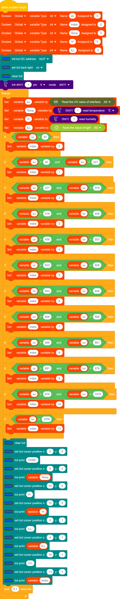

#### Code Explanation

We will read the values of the photosensitive sensor, XHT11 temperature and humidity sensor and solar UV sensor, and set the starting coordinates on the LCD 1602 display, then print them on it and update them in real time.

#### Test Result

After the code is uploaded successfully, real-time temperature, humidity, light and UV level will be displayed on the LCD 1602 display.

---

### 5.4 Application of Solar Energy

Solar panels convert sunlight into electricity, which can be used for multiple applications, such as powering outdoor lighting, charging mobile devices, or even as a backup power source for a home or business. By combining the power of the sun with the flexibility of Arduino, users are capable of creating complex and efficient solar power systems based on their specific needs.

The product welds a solar panel and a motor into a single unit, and utilizes the power converted from the sun to drive the motor.

**Note: This solar board needs to be used in a sunny environment, otherwise it will not be able to show the effect.**

#### Parameters

Voltage: 5 V

Current: 80 mA

Power: 400 mW

Operating temperature: -10°C ~ +50°C

Dimensions: 60 x 60 mm

Weight: 2.5g

#### Principle of converting solar energy into electricity

Solar energy can be converted into electricity and is a renewable energy source, which mainly uses the photovoltaic effect and the photothermal effect.

**Photovoltaic effect**：When light strikes a semiconductor material, it creates electrons and holes to form an electric current.

**Photothermal effect**：It uses solar energy to generate heat energy, which is then converted into power or electricity.

#### Convert light energy into electricity

Solar panels absorb sunlight and convert solar energy into electricity through the photovoltaic or photochemical effect.

Solar panels are capable of absorbing light energy from the sun, which is mainly composed of ultraviolet, visible and infrared light.

Typically, solar panels are capable of absorbing wavelengths in the range of 350 ~ 1140 nm, the wavelength range covers ultraviolet, visible and part infrared wavelengths.

The range of wavelengths absorbed by a solar panel depends on its material and design. The active part of the solar panel cell is made of a semiconductor material, usually silicon (Si), which effectively absorbs wavelengths in the visible range (the absorption peak of a silicon solar cell sheet is located in the wavelength range of 400 nm to 700 nm, which is the wavelength range of visible light).

Semiconductor is a material whose electrical conductivity is between a conductor and an insulator at normal temperature and generally does not conduct electricity well.

The semiconductor inside a solar cell is usually divided into three layers, as shown below:

- Red part：It contains silicon (Si) and a small amount of phosphorus (P), the phosphorus has more electrons than silicon, providing the top layer with ample electrons and conductivity. Therefore, the **top layer is also called negative or n-type**.

- Gray part：It has poor conductivity.

- Green part ：It contains silicon (Si) and boron (B), boron carries fewer electrons than silicon, leaving the substrate with fewer electrons that can move freely, and these missing electrons can be described as effective positive charge. Thus, the **underlayer is positive or P-type**.

The wavelength range of light absorbed by solar panels is usually 350 ~ 1140nm, and only this portion of light (including visible light, the long-wave portion of ultraviolet light, and the short-wave portion of infrared light) can be absorbed by the solar panel's interlayer.

 

UV wavelengths are so short that they generally stay on the surface of solar panels.

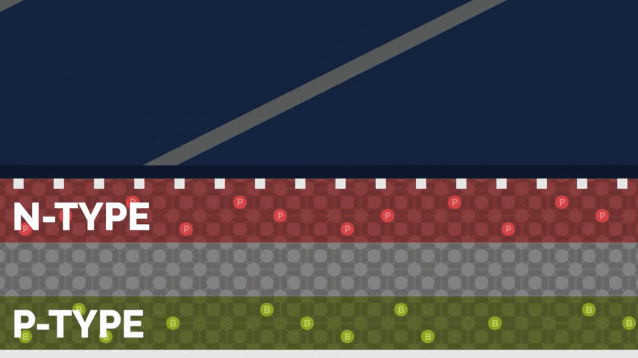

 

Infrared wavelengths are too long for solar panels to absorb this portion of light energy, which typically passes through the entire panel or is reflected back.

 

The light energy absorbed by the solar panel knocks electrons off the silicon atoms, leaving the electrons in a free state and creating an empty electron hole.

This electron hole is positive charge and is also called a "hole". The free electrons will move to the top and reach the top n-type layer, and the hole will move to the bottom and reach the bottom P-type layer.

As soon as sunlight hits a solar panel, a large number of free electrons and holes are produced, the electrons move to the top layer and the holes move to the bottom layer, an electrode is formed, then the flow of electrons creates an electric current.

 

**Solar panels absorb the sun's energy and convert the electrons in the top and bottom layers. The top layer (N-type layer) is converted to a negative charge and is the negative pole, and the bottom layer (P-type layer) is converted to a positive charge and is the positive pole, and if the two layers are connected via a wire, the electricity can be energized.**

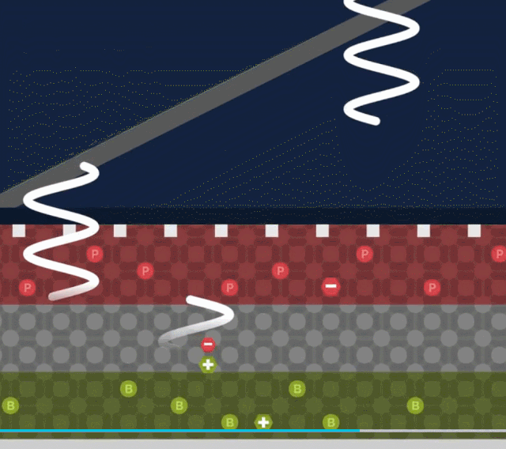

#### Test Result

When the solar panel is irradiated by sufficient sunlight, the motor drives the fan to rotate.

---

### 5.5 Water Level Monitoring

**Note: Please use water carefully, do not spill water from the pool and soil cell. If water is spilled on other sensors, it will cause a short circuit when energized, affecting the normal operation of the device, if water is spilled on the battery, it will lead to danger of heat generation and explosion.**

**Thus，please be careful when using the device. Children must be supervised by their parents when using the kit. To ensure the safe operation of the device, follow the relevant user guides and safety regulations.**

Monitoring the water level in a reservoir is important in agricultural automation. It gets real-time information about the water level, reminding us to fill water in time when the level is insufficient and sounding an alarm when the level is too high to prevent overflow.

#### Flow Chart

 #### Wiring Diagram

#### Test Code

In this tutorial, we use KidsBlock Desktop version 2.0.1

The code file 5.5Water_level_monitoring.sb3 can be downloaded in the directory *Download Code*, please download it by yourself.

#### Code Explanation

Set a variable ReadValue with an initial value of 0; initialize LCD, address is 0x27, 16 columns and 2 rows; turn on LCD backlight; clear display.

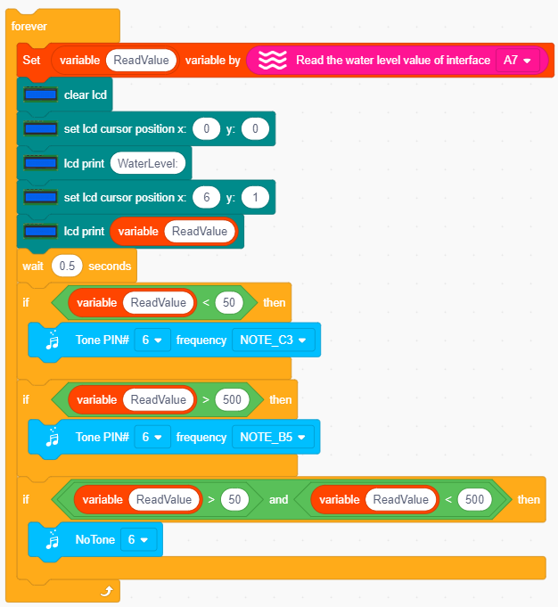

Assign the value read by pin A7 of the water level sensor to the variable ReadValue.

Clear the display to refresh the data, set the position to print the water level  value on the LCD1602, and refresh the print every 500ms.

When the water level value < 50, the passive buzzer plays a tone with frequency NOTE_C3.
When the water level value is > 500, the passive buzzer plays a tone with frequency NOTE_B5.
When 50 < water level value < 500, the passive buzzer does not sound.

#### Test Result

After the code is successfully uploaded, the LCD1602 display updates the water level value in real time. When the water level value is less than or equal to 20 (this threshold can be adjusted according to the actual situation), a slightly slow beep is issued to remind that it is time to fill water. 
When the value is greater than or equal to 500, a sharp beep is issued to remind that the water is about to overflow.

---

### 5.6 Soil Moisture Monitoring

The realization of soil moisture monitoring technology is crucial in the realization of automated agriculture, which not only can realize real-time monitoring throughout the day, but can greatly improve the efficiency of agricultural production.

#### Flow Chart

#### Wiring Diagram

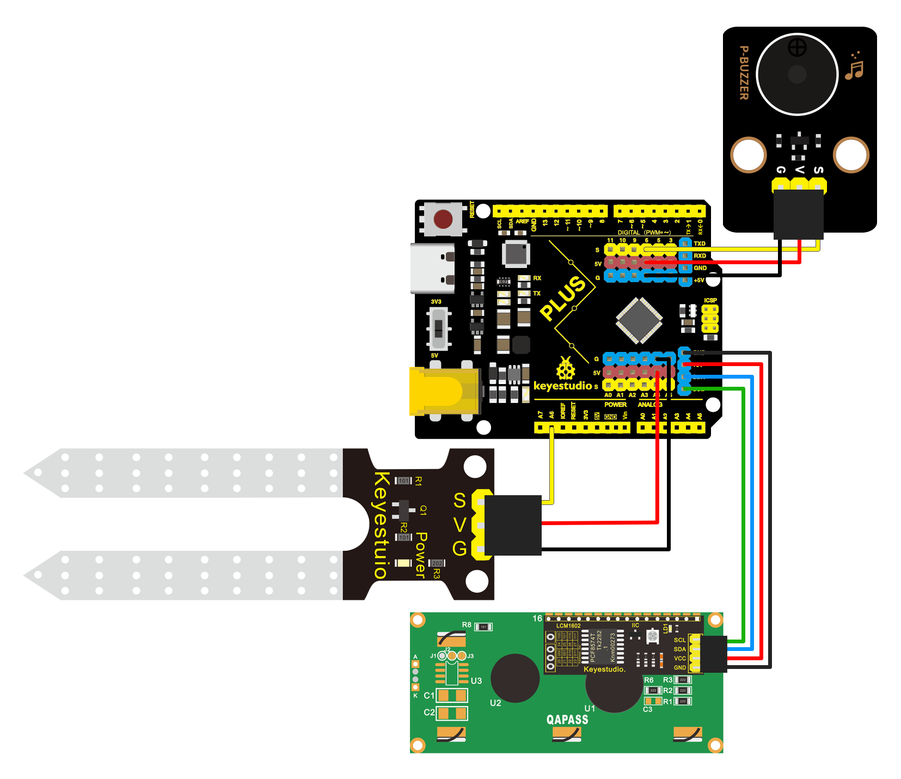

#### Test Code

In this tutorial, we use KidsBlock Desktop version 2.0.1

The code file 5.6Soil_humidity_monitor.sb3 can be downloaded in the directory *Download Code*, please download it by yourself.

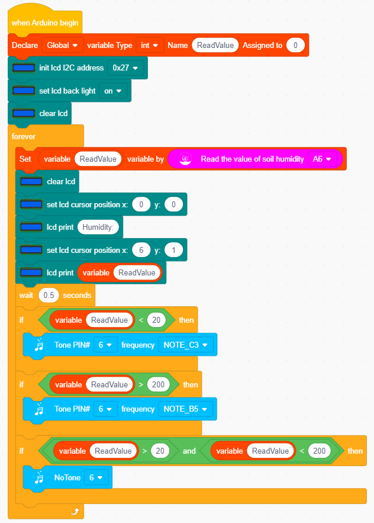

#### Code Explanation

Set a variable ReadValue with initial value 0, initialize LCD with address 0x27, 16 columns and 2 rows, then turn on LCD backlight and clear LCD.

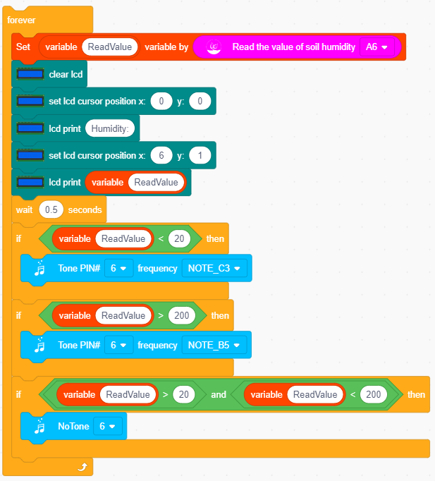
Assign the value read by pin A6 of the soil sensor to the variable ReadValue.

Clear the display to refresh the data, set the position to print the soil moisture value on the LCD1602, and refresh the print every 500ms.

When the soil moisture value < 20, the passive buzzer plays a tone with frequency NOTE_C3.
When the soil moisture value is > 200, the passive buzzer plays a tone with frequency NOTE_B5.
When 20 < soil humidity value < 200, the passive buzzer does not sound.

#### Test Result

After the code is successfully uploaded, the LCD1602 display updates the soil moisture value in real time. When the humidity value is less than or equal to 20 (this threshold can be adjusted according to the actual situation), a slightly slow beep is issued to remind that it is time to fill water. When the value is greater than or equal to 200, a sharp beep is issued to remind that the soil is too wet and it may drown the plant.

---

### 5.7 Irrigation System

Before learning, please place the water pipe.

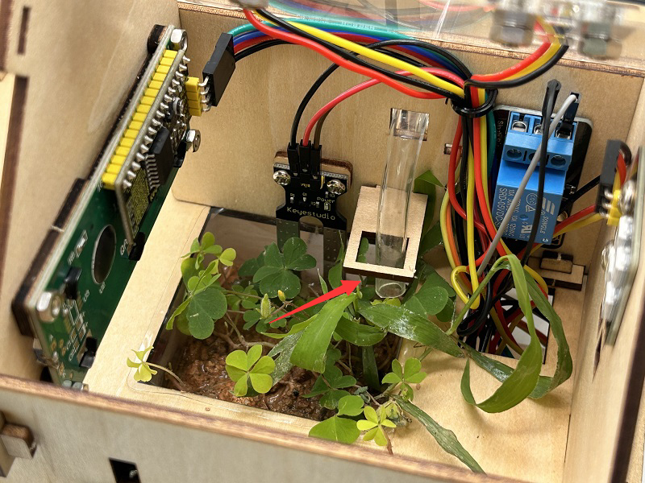

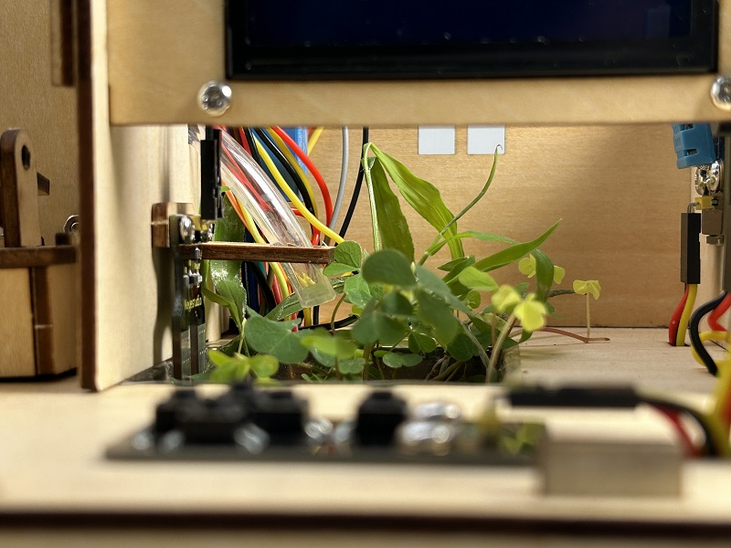

**Note: Please use water carefully, do not spill water from the pool and soil cell. If water is spilled on other sensors, it will cause a short circuit when energized, affecting the normal operation of the device, if water is spilled on the battery, it will lead to danger of heat generation and explosion.**

**Thus，please be careful when using the device. Children must be supervised by their parents when using the kit. To ensure the safe operation of the device, follow the relevant user guides and safety regulations.**

In farmland management, rational irrigation is an important measure to ensure crop growth. Reasonable irrigation means to scientifically control the amount of irrigation and irrigation times according to the water demand law of crops and soil water content in the process of crop growth, so as to ensure crop growth and save water. 

It is able to regulate the soil temperature, creating a suitable growing environment for crops. In addition, it empowers to improve soil aeration and promote the dissolution and release of nutrients in the soil. 
Now, let's design a simple irrigation system!

#### Flow Chart

#### Wiring Diagram

#### Test Code

In this tutorial, we use KidsBlock Desktop version 2.0.1

The code file 5.7Irrigation_system.sb3 can be downloaded in the directory *Download Code*, please download it by yourself.

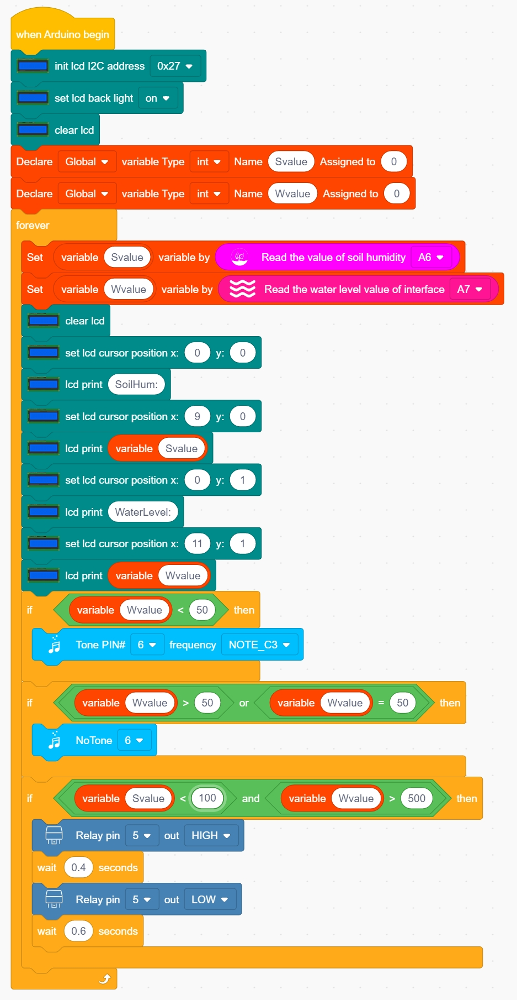

#### Code Explanation

Please refer to the previous project code.

#### Test Result

After the code is uploaded successfully, when the pool water level value is lower than 50 (threshold can be modified according to the actual situation), the buzzer sounds an alarm to remind that water needs to be filled.
And when the soil humidity value is lower than 100 and the pool water level value is higher than 500 (pool water is sufficient), the relay drives the pump to draw water for irrigation until the soil humidity value is higher than 100.

---

### 5.8 Water Wheel System

Before learning, please place the water pipe. The water pipe mouth should be perpendicular to the water wheel board as far as possible.

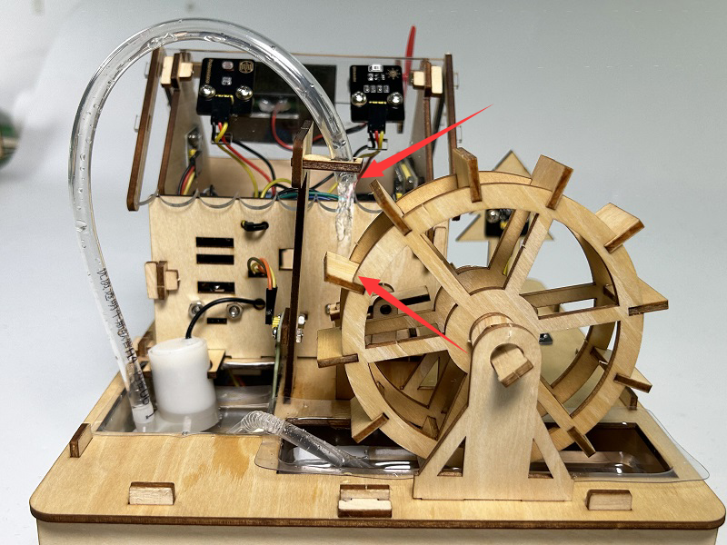

**Note: Please use water carefully, do not spill water from the pool and soil cell. If water is spilled on other sensors, it will cause a short circuit when energized, affecting the normal operation of the device, if water is spilled on the battery, it will lead to danger of heat generation and explosion.**

**Thus，please be careful when using the device. Children must be supervised by their parents when using the kit. To ensure the safe operation of the device, follow the relevant user guides and safety regulations.**

Ancient Chinese laborers used the principles of water power, lever and cam to process grain, and the machine that removes the hulls of grain with water power is called water powered trip hammer.

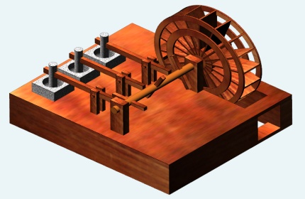

#### About Water Powered Trip Hammer 

Water powered trip hammer can be set up along the banks of streams and rivers, and multiple water powered trip hammers can be set up depending on the size of the water. With it, grain can be processed day and night.

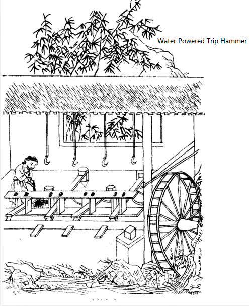

On the shelf next to the water wheel are four pestles for pounding grain.

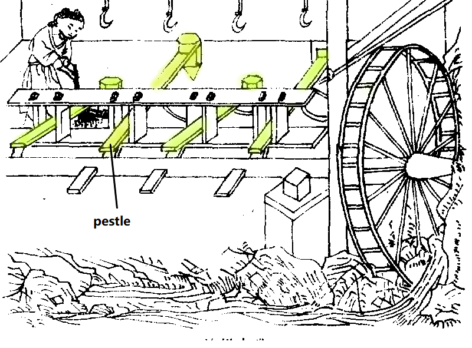

The horizontal shaft of the water wheel is connected to a short crosspiece

 

The impact of the water causes the water wheel to rotate, which make the horizontal shaft and the short crosspiece to rotate, then the short crosspiece touches the end of pestle, and presses it down, and the front end of the pestle is cocked up. When the short crosspiece turns over the end of the pestle, the upturned end falls down.

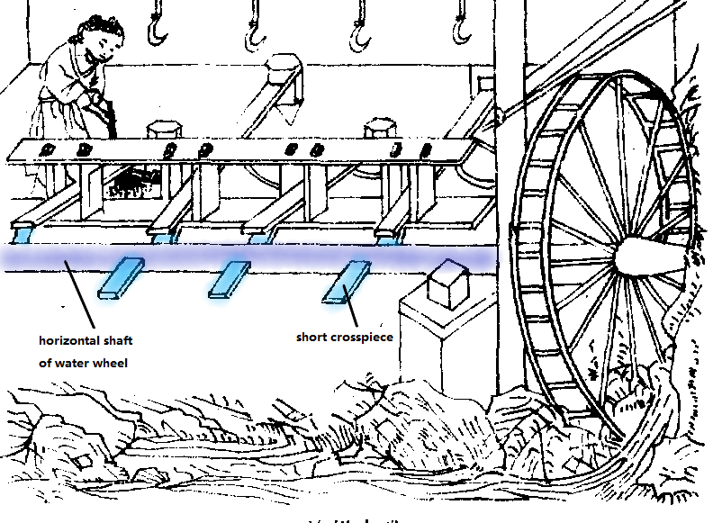

The short crosspiece will continuously hit the corresponding mortar and pestle, pounding the rice to remove the hulls so as to make it into white rice.

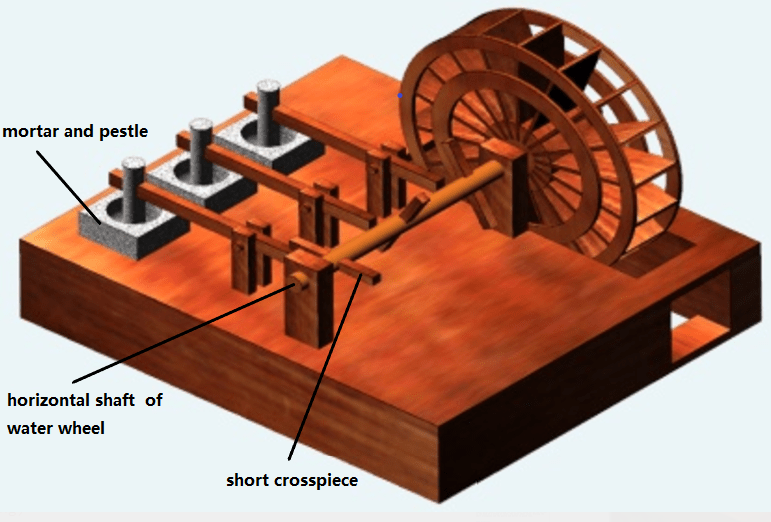

In this project, we use a relay to drive water pump to draw water and impact water wheel, simulating the water wheel being hit by the current on the bank of a stream or river. The water wheel turns, driving the short crosspiece and the pestle and mortar to pound rice.

#### Siphonage

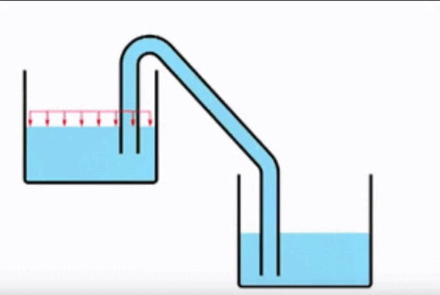

**Siphonage** is a phenomenon that utilizes the force of difference in liquid surface heights. After the liquid is filled with an inverted U-shaped tube, and placing the high end of the opening in a liquid-filled container, the liquid in the container will continue to flow out through the siphon tube to a lower position. The siphonage appears through the liquid and the atmospheric pressure.

With only one tube, the two pools will be connected and the water from the water wheel pool flows back to the reservoir automatically.

Step1, fill water to the pool. Fill two-thirds of the water to the reservoir, and a little water to the pool of the water wheel, just a little bit past the bottom.

Step2: Fill the tube with water. (You can either place it in a container filled with water or turn on the faucet and place the it underneath it to catch the water.)

Step3: Block one end of the tube with your finger when it fills with water.

After plugging one end and taking out the tube, you can see that the tube will not leak.

Step4: Place the unplugged side of the tube into the reservoir with the mouth of the tube below the surface of the water. Note that the plugged end of the tube should not be loosened.

Step5: Place the plugged side of the tube into the pool of the water wheel. Take care that the mouth of the tube sits below the surface of the water and then release your fingers.                                                                                           

Complete

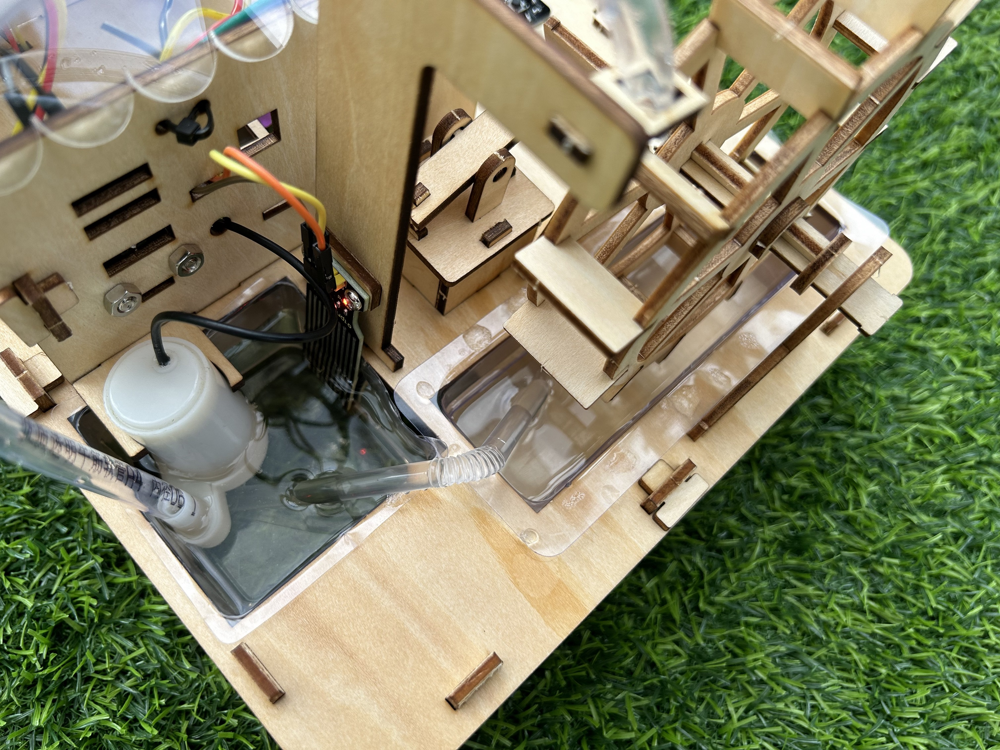

Water in the water wheel pool returns to the reservoir.              

 

#### Flow Chart

#### Wiring Diagram

#### Test Code

In this tutorial, we use KidsBlock Desktop version 2.0.1

The code file 5.8Driving_water_wheel.sb3 can be downloaded in the directory *Download Code*, please download it by yourself.

#### Code Explanation

Set a variable val with an initial value of 0 and read the A2 pin of five AD key, then assign it to the variable val. When SW2 is pressed, the relay outputs a high level and is energized to close, otherwise it outputs a low level and is disconnected.

#### Test Result

Assemble the water pipe of the water pump, after the code is uploaded successfully, press the key SW2, the relay is energized to drive the water pump to draw water.   At this time, the water impacts the water wheel to rotate.

The water wheel will rotate to make the pestle and mortar work, so as to simulate pounding the rice to remove the shell.

---

### 5.9 Integrated Project

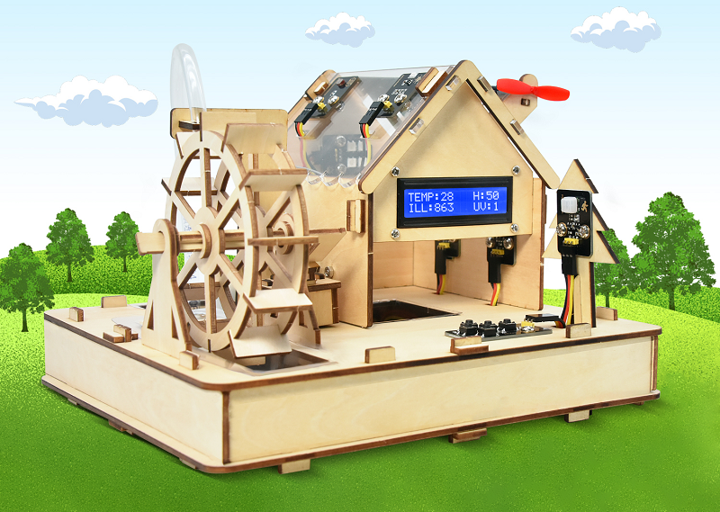

In this project, we will combine the previous projects to make an  integrated project. Press a button, then the corresponding experiment will be executed.

#### Flow Chart

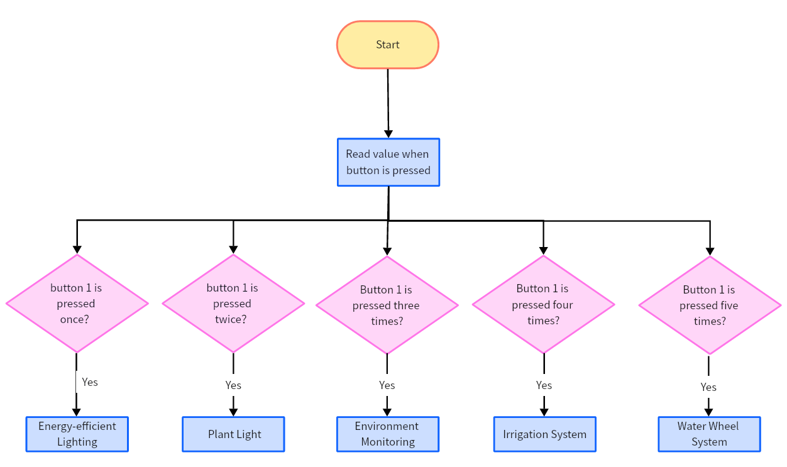

#### Wiring Diagram

#### Test Code

In this tutorial, we use KidsBlock Desktop version 2.0.1

The code file 5.9Comprehensive_experiment.sb3 can be downloaded in the directory *Download Code*, please download it by yourself.

#### Code Explanation

**Note：Place water pipes in the correct location before implementing automatic irrigation experiment and water wheel system  experiment.**

| Blocks              | Command block area            | Explanation     |
| ------------------- | ----------------------------- | --------------- |
|  | 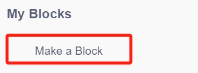 | Custom function |

Record the number of times the key SW1 is pressed, and divide it by 5 to get the remainder, then the range of the remainder is 0 ~ 4. Then define five functions for five experiments. Loop execution: if the remainder is 0, perform the first experiment, the remainder is 1, perform the second experiment ... The remainder is 4, perform the fifth experiment.

Define an *inital* function to store some initialization settings.

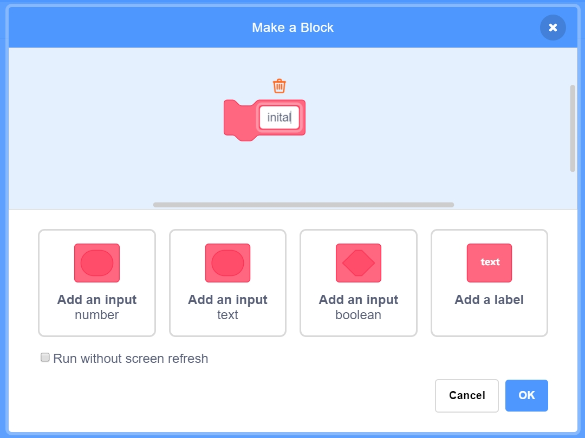

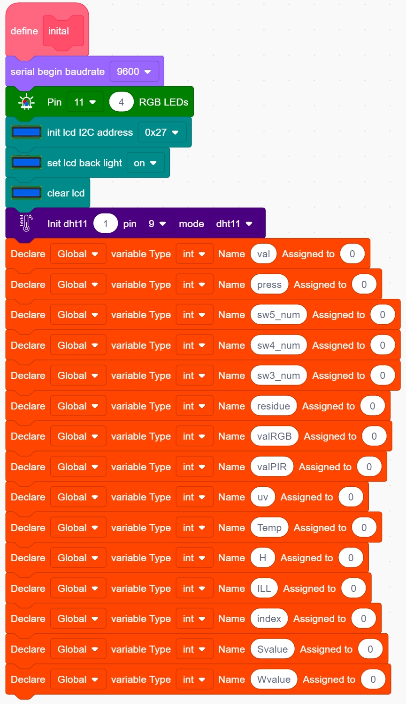

 

Then define a Key function to record the number of times SW1 is pressed.

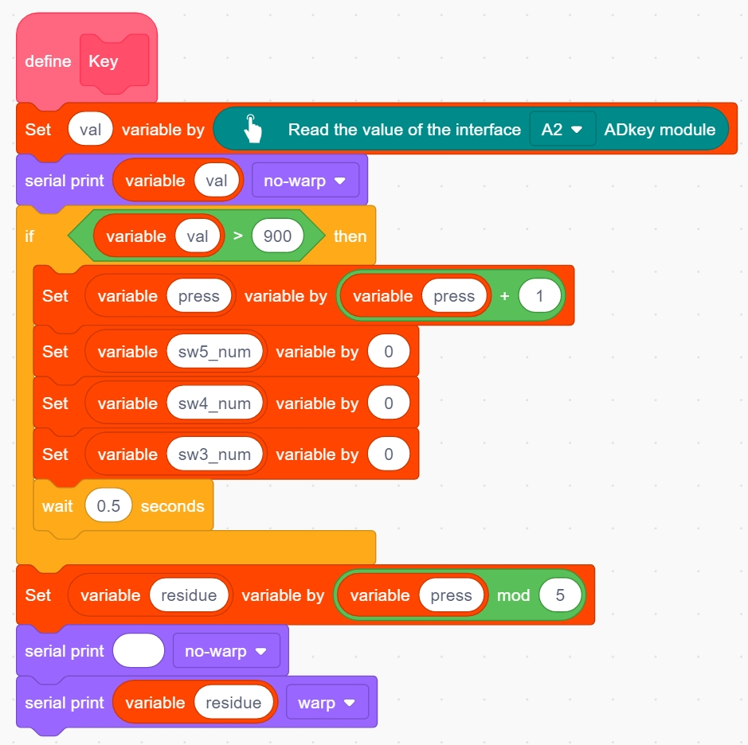

 

Then define functions *residue_0* 、*residue_1* 、*residue_2* 、*residue_3*  and *residue_4*  to save the code of  energy-efficient lighting experiment, plant light system experiment, environment monitoring system experiment, irrigation system experiment as well as water wheel system. 

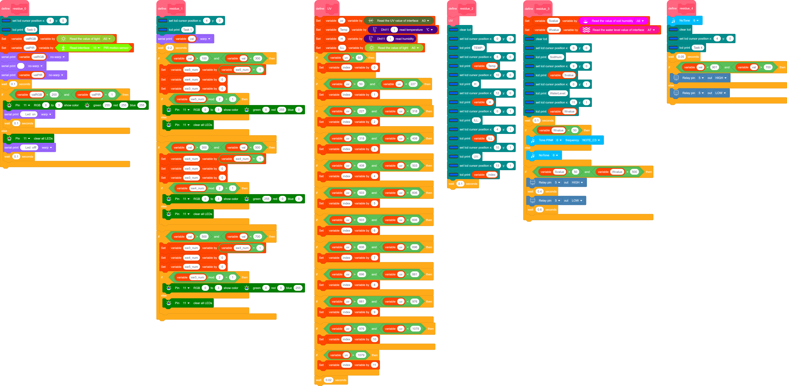

 

The main function settings are as follows:

First execute the custom *initial* function for initialization. Then loop execution: detect the current number of times SW1 is pressed, and execute the corresponding custom function.

​                                                                   

#### Test Result

**Note：Place water pipes in the correct location before implementing automatic irrigation experiment and water wheel system  experiment.**

After the code is uploaded successfully, the experiment will be switched every time SW1 is pressed. Five experiments are switched cyclically.

(1) If the key is not pressed, the remainder is 0, switch to the energy-efficient lighting experiment;

(2) Press the key, the remainder is 1, switch to the plant light system experiment;

(3) When the key is pressed for the second time , the remainder is 2, switch to the environment monitoring system experiment;

(4) When the key is pressed for the third time, the remainder is 3, switch to the irrigation system experiment;

(5) When the key is pressed for the fourth time,  the remainder is 4,  switch to the water wheel system experiment;

(6) When the key is pressed for the fifth time, the remainder is 0, back to the energy-efficient lighting experiment. Continuously press the key, the remainder of the cycle changes, the experiment also changes.

 

