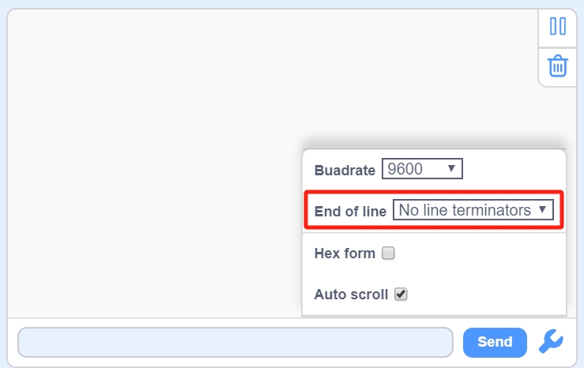
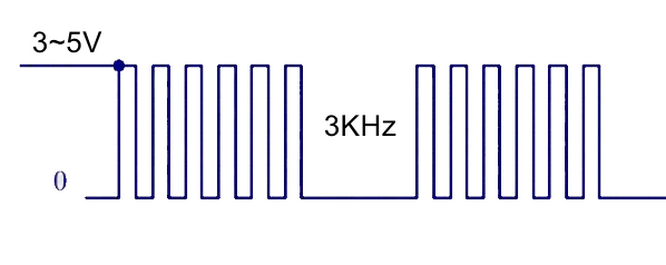
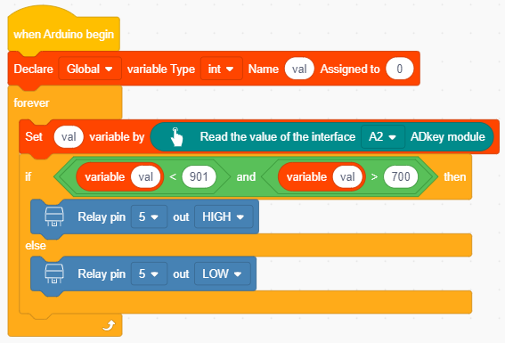

.. _KidsBlock-Tutorial:

KidsBlock Tutorial
==================

.. _1.-Software-Installation:

1. Software Installation
------------------------

.. _Install-KidsBlock-Software:

Install KidsBlock Software
~~~~~~~~~~~~~~~~~~~~~~~~~~

.. image:: media/1101.png
   :alt: 1101

#. `Software
   Download <https://kidsblocksite.readthedocs.io/en/latest/download/>`__
#. Install

   -  `for
      Windows <https://kidsblocksite.readthedocs.io/en/latest/Windows/>`__
   -  `for
      MacOS <https://kidsblocksite.readthedocs.io/en/latest/MacOS/>`__

#. `Install
   driver <https://kidsblocksite.readthedocs.io/en/latest/driver/>`__

--------------

.. _How-to-use-KidsBlock-software:

How to use KidsBlock software
~~~~~~~~~~~~~~~~~~~~~~~~~~~~~

Make sure that the main board is connected to the computer successfully,
then open the software.

Select Device

.. image:: media/1317.png
   :alt: 1317

Select **Eco-friendly house kit for arduino** .

Click **Connect**

Then tap **Go to Editor**

Interface：

.. image:: media/1322.png
   :alt: 1322

--------------

.. _2.-Download-code:

2. Download code
----------------

Please download the code:
:download:`KidsBlock Code<./KidsBlockCode.7z>`
--------------

.. _3.-Single-Module-Learning:

3. Single Module Learning
-------------------------

Before learning, flip the voltage switch on the main board to 5V.

.. _3.1-SK6812-RGB-Module:

3.1 SK6812 RGB Module
~~~~~~~~~~~~~~~~~~~~~

The built-in IC of the SK6812 can display 256 \* 256 \* 256 colors in a
way that achieves multiple effects. Its control can be realized via only
one signal wire. It is an intelligent externally controlled LED light
source with the control circuit and the light-emitting circuit. Each LED
element is the same as a 5050 LED lamp bead, and each component is a
pixel. There are four lamp beads on the module, which indicates four
pixels.

.. image:: media/KS6009.png
   :alt: KS6009

.. _Three-primary-colors-principle:

Three primary colors principle
^^^^^^^^^^^^^^^^^^^^^^^^^^^^^^

.. image:: media/2111.png
   :alt: 2111

The three primary colors of pigments are red, yellow and blue, and the
three primary colors of colored light are red, green and blue, which is
called RGB.

The human eyes are most sensitive to the RGB colors, and most colors can
be produced by combining the RGB colors in different proportions.
Similarly, most monochromatic light can also be decomposed into three
colors of RGB. This is the most basic principle of colorimetry(three
primary colors).

The three primary colors of RGB are added in different proportions to
form mixed colors, which is called additive color mixing. And there is
also the subtractive color mixing method. Colors can be added and
subtracted as needed. The three primary colors of pigments cannot be
adjusted to white, while the three primary colors of colored light can
realize it via optical elements, which are obtained by mixing three
equal parts of red, medium green and dark blue.

.. _Parameters:

Parameters
^^^^^^^^^^

Operating voltage : DC 5V

Maximum power : 1W

Light source : SMD 5050 RGB

IC model : 4/WS2811

Gray level : 256

Lighting angle : 180°

Light color: can be adjusted to white, red, yellow, blue and green via
the controller

Operating temperature : -10°C ~ +50°C

Dimensions : 32 x 23.8 x 7.4 mm

Dimension of positioning hole: 4.8 mm in diameter

Port: 3-pin bent pin with a spacing of 2.54 mm

.. _Schematic-Diagram:

Schematic Diagram
^^^^^^^^^^^^^^^^^

.. image:: media/2101.png
   :alt: 2101

From the schematic diagram, we can see that these four pixel lighting
beads are all connected in series. In fact, no matter how many they are,
we can use a pin to control a light and let it display any color. The
pixel point contains a data latch signal shaping amplifier drive
circuit, a high-precision internal oscillator and a 12V high-voltage
programmable constant current control part, which effectively ensures
the color of the pixel point light is highly consistent.

The data protocol adopts the communication method of unipolar nulling
code, after the pixel point is reset, the DIN terminal accepts the data
transmitted from the controller. The first 24bit data sent over is
extracted by the first pixel point and sent to the data latch inside the
pixel point, the rest of the data is shaped and amplified by the
internal shaping processing circuit and then begins to be forwarded and
outputted to the next cascade of pixel points via the DO port, and the
signal is reduced by 24bit after the transmission of one pixel point.

The pixel point adopts the automatic shaping and forwarding technology,
so that the number of cascade of the pixel point is not subject to the
limitation of signal transmission, but only subject to the limitation of
signal transmission speed.

.. _Components:

Components
^^^^^^^^^^

.. container:: table-wrapper

   ================== ==================== ================= ============
   |KS0486|           |KS6009|             |3pin|            |USB|
   ================== ==================== ================= ============
   PLUS Main Board x1 SK6812 RGB Module x1 3Pin 20cm Wire x1 USB Cable x1
   ================== ==================== ================= ============

.. _Wiring-Diagram:

Wiring Diagram
^^^^^^^^^^^^^^

.. image:: media/2103.png
   :alt: 2103

.. _Test-Code:

Test Code
^^^^^^^^^

In this tutorial, we use KidsBlock Desktop version 2.0.1

The code file 3.1Light_on.sb3 can be downloaded in the directory
*Download Code*, please download it by yourself.

.. image:: media/2105.png
   :alt: 2105

**Write Code：**

Open the KidsBlock software，then tap **Eco-friendly house kit for
arduino**.

Then tap **Go to Editor**

-  Drag the\ |begin|\ block from |Events|\ to the code editing area.

-  Drag the\ |RGB-setpin|\ block from |RGB|\ to the code editing area.
   Then set the *Pin* to 11 and the *RGB LEDs* to 4.

-  Repeat the same step to set the brightness code block.

-  Drag the |forever|\ block from |Control| to the code editing area.

-  Drag the\ |RGB-setcolor|\ and |RGB-rgb|\ blocks from\ |RGB|\ to the
   code editing area. Then set the pin and the corresponding value.

   .. image:: media/2109.png
      :alt: 2109

-  Repeat the same step and set the corresponding value.

   .. image:: media/2110.png
      :alt: 2110

-  Complete code

   .. image:: media/2105.png
      :alt: 2105

.. _Code-Explanation:

Code Explanation
^^^^^^^^^^^^^^^^

.. container:: table-wrapper

   +-----------------------+-----------------------+-----------------------+
   | Blocks                | Command block area    | Explanation           |
   +=======================+=======================+=======================+
   | |Events|              | |begin|               | It can be used to     |
   |                       |                       | call functions.       |
   +-----------------------+-----------------------+-----------------------+
   | |RGB|                 | |RGB-setpin|          | Set the pins on       |
   |                       |                       | Arduino that are      |
   |                       |                       | connected to the      |
   |                       |                       | NeoPixels,            |
   |                       |                       | and the NeoPixels     |
   |                       |                       | pixel size (number of |
   |                       |                       | leds).                |
   +-----------------------+-----------------------+-----------------------+
   | |RGB|                 | |RGB-setbrightness|   | Set the brightness.   |
   +-----------------------+-----------------------+-----------------------+
   | |Control|             | |forever|             | It is a loop module   |
   |                       |                       | that executes code    |
   |                       |                       | blocks repeatedly.    |
   +-----------------------+-----------------------+-----------------------+
   | |RGB|                 | |RGB-setcolor|        | Set leds and colors.  |
   +-----------------------+-----------------------+-----------------------+
   | |RGB|                 | |RGB-rgb|             | Set colors.           |
   +-----------------------+-----------------------+-----------------------+

.. _Test-Result:

Test Result
^^^^^^^^^^^

After uploading code successfully, we will see the four RGB LEDs show
red, green, blue and white color. Since the RGB LEDs are very bright, I
have set the brightness to 5 in the code. You can change its value as
required, the range is 0 ~ 255.

--------------

.. _3.2-PIR-Motion-Sensor:

3.2 PIR Motion Sensor
~~~~~~~~~~~~~~~~~~~~~

The PIR motion sensor mainly uses a RE200B-P sensor element. It is a
human body pyroelectric motion sensor based on pyroelectric effect,
which can detect infrared rays emitted by humans or animals, and the
Fresnel lens enables to make the sensor's detection range farther and
wider.

When using, we will determine if there is someone moving nearby by
reading the high and low levels of the S terminal on the module.

.. image:: media/KS6018.png
   :alt: KS6018

.. _Parameters:

Parameters
^^^^^^^^^^

Operating voltage : DC 3.3 ~ 5V

Operating current : 50 mA

Maximum power : 0.3 W

Quiescent current : <50 uA

Operating temperature : -10°C ~ +50°C

Control signal : digital signal

Trigger mode: L for non-repeatable trigger / H for repeatable trigger

Maximum detection distance : 7m

Sensing angle : <100°

Dimensions : 32 x 23.8 x 7.4 mm

Dimension of positioning hole: 4.8 mm in diameter

Port: 3-pin bent pin with a spacing of 2.54 mm

.. _Schematic-Diagram:

Schematic Diagram
^^^^^^^^^^^^^^^^^

.. image:: media/2201.png
   :alt: 2201

The voltage conversion part converts a 5V input voltage to a 3.3V input
voltage. The working voltage of the PIR motion sensor we use is 3.3V,
therefore we can’t use 5V directly. The voltage conversion circuit is
needed.

When no infrared signal is received, and pin 1 of the sensor outputs low
level. At this time, the LED on the module will light up and the MOS
tube Q1(Q1 is an NPN MOS tube, model is 2N7002) will be connected and
the signal terminal S will detect Low level.

When infrared signal is received, and pin 1 of the sensor outputs a high
level. Then LED on the module will go off, the MOS tube Q1 is
disconnected and the signal terminal S will detect high level that is
pulled up by a 10K pull-up resistor R5.

.. _Components:

Components
^^^^^^^^^^

.. container:: table-wrapper

   ================== ==================== ================= ============
   |KS0486|           |KS6018|             |3pin|            |USB|
   ================== ==================== ================= ============
   PLUS Main Board x1 PIR Motion Sensor x1 3Pin 25cm Wire x1 USB Cable x1
   ================== ==================== ================= ============

.. _Wiring-Diagram:

Wiring Diagram
^^^^^^^^^^^^^^

.. image:: media/2202.png
   :alt: 2202

.. _Test-Code:

Test Code
^^^^^^^^^

In this tutorial, we use KidsBlock Desktop version 2.0.1

The code file 3.2PIR_motion.sb3 can be downloaded in the directory
*Download Code*, please download it by yourself.

.. _Code-Explanation:

Code Explanation
^^^^^^^^^^^^^^^^

.. container:: table-wrapper

   +-----------------------+-----------------------+-----------------------+
   | Blocks                | Command block area    |                       |
   +=======================+=======================+=======================+
   | |Vari|                | |Vari-Declare|        | Declare a global      |
   |                       |                       | variable *item* with  |
   |                       |                       | integer numeric type  |
   |                       |                       | and initial           |
   |                       |                       | default value 0.      |
   +-----------------------+-----------------------+-----------------------+
   | |Serial|              | |Serial-begin|        | Initialize serial     |
   |                       |                       | communication and     |
   |                       |                       | set baud rate to      |
   |                       |                       | 9600.                 |
   +-----------------------+-----------------------+-----------------------+
   | |PIR|                 | |PIR-Read|            | Set the pins of the   |
   |                       |                       | PIR motion            |
   |                       |                       | sensor and read its   |
   |                       |                       | value.                |
   +-----------------------+-----------------------+-----------------------+
   | |Vari|                | |Vari-set|            | Assign value to       |
   |                       |                       | variable *item*.      |
   +-----------------------+-----------------------+-----------------------+
   | |Serial|              | |Serial-print|        | Print " Hello         |
   |                       |                       | KidsBlock " on the    |
   |                       |                       | serial port. Warp can |
   |                       |                       | be changed            |
   |                       |                       | to no-warp or HEX.    |
   +-----------------------+-----------------------+-----------------------+
   | |Vari|                | |Variable|            | Variable *item*       |
   +-----------------------+-----------------------+-----------------------+
   | |Operators|           | |=|                   | Check if the values   |
   |                       |                       | of the left           |
   |                       |                       | and right operands    |
   |                       |                       | are equal,            |
   |                       |                       | if so the condition   |
   |                       |                       | is true.              |
   +-----------------------+-----------------------+-----------------------+
   | |Control|             | |Control-ifelse|      | If the condition is   |
   |                       |                       | true, then            |
   |                       |                       | execute the code in   |
   |                       |                       | the if block;         |
   |                       |                       | otherwise execute the |
   |                       |                       | code in               |
   |                       |                       | the else block.       |
   +-----------------------+-----------------------+-----------------------+
   | |Control|             | |Control-delay|       | Delay 1s              |
   +-----------------------+-----------------------+-----------------------+

.. _Code-Block-Explanation:

Code Block Explanation
^^^^^^^^^^^^^^^^^^^^^^

if judgment statement
'''''''''''''''''''''

There are three flow control statements：

-  Sequential control

   The program is executed line by line from top to bottom, without any
   judgment or jump in between.

   .. image:: media/22.png
      :alt: 22

-  Branch control

   -  Single branch

   -  Dual branch

   -  Multiple branch

-  Cycle control

   There are for cycle control, while cycle control and do..while cycle
   control.

.. _Single-branch:

Single branch
             

If the condition is true, the code in the if block is executed,
otherwise, it is skipped.

--------------

.. _Dual-branch:

Dual branch
           

.. image:: media/Control-ifelse.png
   :alt: Control-ifelse

If the condition is true, the code in the if block is executed,
otherwise, the code in the else block is executed.

--------------

.. _Multiple-branch:

Multiple branch
               

.. image:: media/Control-ifif.png
   :alt: Control-ifif

If the first if block is valid, execute code block 1.

If the first if block is not valid, then judge whether the second if
block is valid, if so, then execute code block 2, otherwise continue to
judge.

If the second if block is valid, block 2 will be executed, otherwise it
will continue to judge. And if all the expressions are not valid, it
will be skipped.

.. _Example:

Example
'''''''

.. image:: media/2205.png
   :alt: 2205

Here we use the Dual branch structure.

| When the value of the variable *value* is equal to 1, the following
  code block is executed：
| |2206|

Print four spaces (to separate the data and statement) on the serial
monitor with no-warp, then print **Somebody is in this area!** with
warp. Print it every 0.1s.

| When the value of the variable *value* is not equal to 1, the
  following code block is executed：
| |2207|

Print four spaces (to separate the data and statement) on the serial
monitor with no-warp, then print **No one!** with warp. Print it every
0.1s.

.. _Test-Result:

Test Result
^^^^^^^^^^^

After uploading code successfully，tap |tool|\ to set the baud rate to
9600.

When the sensor detects someone nearby, value is 1, the LED will light
off and the monitor will show “\ **1 Somebody is in this area!**\ ”. In
contrast, the value is 0, the LED will light up and “\ **0 No one!**\ ”
will be shown.

--------------

.. _3.3-Photoresistor:

3.3 Photoresistor
~~~~~~~~~~~~~~~~~

It mainly consists of a photoresistor element and its resistance changes
with the light intensity. Also, it converts the resistance change into
voltage change via the characteristic. It is able to simulate people's
judgment of the intensity of the ambient light and facilitate the
application of friendly interaction with people.

.. image:: media/KS6026.png
   :alt: KS6026

.. _Parameters:

Parameters
^^^^^^^^^^

Operating voltage : DC 3.3 ~ 5V

Current : 20 mA

Maximum power : 0.1 W

Operating temperature : -10°C ~ +50°C

Output signal : Analog signal

Dimensions : 32 x 23.8 x 7.4 mm

Dimension of positioning hole: 4.8 mm in diameter

Port: 3-pin bent pin with a spacing of 2.54 mm

.. _Schematic-Diagram:

Schematic Diagram
^^^^^^^^^^^^^^^^^

.. image:: media/2301.png
   :alt: 2301

When there is no light, the signal end of the photoresistor detects a
voltage close to 0. When the light intensity increases, the resistance
of photoresistor will diminish, thus the detected voltage at the signal
end increases.

.. _Components:

Components
^^^^^^^^^^

.. container:: table-wrapper

   ================== ================ ================= ============
   |KS0486|           |KS6026|         |3pin|            |USB|
   ================== ================ ================= ============
   PLUS Main Board x1 Photoresistor x1 3Pin 25cm Wire x1 USB Cable x1
   ================== ================ ================= ============

.. _Wiring-Diagram:

Wiring Diagram
^^^^^^^^^^^^^^

.. _Test-Code:

Test Code
^^^^^^^^^

In this tutorial, we use KidsBlock Desktop version 2.0.1

The code file 3.3Photoresistance.sb3 can be downloaded in the directory
*Download Code*, please download it by yourself.

.. _Code-Explanation:

Code Explanation
^^^^^^^^^^^^^^^^

.. container:: table-wrapper

   +-----------------------+-----------------------+-----------------------+
   | Blocks                | Command block area    | Explanation           |
   +=======================+=======================+=======================+
   | |Light|               | |Light-read|          | Set the pin of the    |
   |                       |                       | photoresistor         |
   |                       |                       | and read its value.   |
   +-----------------------+-----------------------+-----------------------+

.. image:: media/2304.png
   :alt: 2304

Set an integer variable *val* with an initial value of 0 and set the
serial port baud rate to 9600.

.. image:: media/2305.png
   :alt: 2305

Set the pin of the photoresistor to A0, read its value and assign it to
the variable *val*.

.. _Test-Result:

Test Result
^^^^^^^^^^^

After uploading code successfully，open the serial monitor and set the
baud rate to **9600**. Then we can see the analog value corresponding to
the light intensity, when the light intensity gets stronger, the analog
value will be larger.

.. image:: media/2306.png
   :alt: 2306

.. _3.4-XHT11-Temperature-and-Humidity-Sensor:

3.4 XHT11 Temperature and Humidity Sensor
~~~~~~~~~~~~~~~~~~~~~~~~~~~~~~~~~~~~~~~~~

XHT11 temperature and humidity sensor, a low-cost entry-level
temperature and humidity sensor, is mainly composed of a resistive
moisture-sensing element and a NTC temperature element. It uses a
single-wire serial interface with 4-pin single-row pin package, and the
signal transmission distance can reach more than 20m via an appropriate
pull-up resistor.

It features fast response, strong anti-interference ability and
cost-effective.

.. image:: media/KS6033.png
   :alt: KS6033

.. _Parameters:

Parameters
^^^^^^^^^^

Working voltage: DC 3.3 ~ 5V

Current: 50 mA

Maximum power: 0.25W

Operating temperature: -25°C ~ +60°C

Temperature range: 0 ~ 50°C ± 2 °C

Humidity range: 20% ~ 90%RH ± 5%RH

Output signal: digital bidirectional unibus

Dimensions: 32 x 23.8 x 9.7mm

Dimension of positioning hole: 4.8 mm in diameter

Port: 3-pin bent pin with a spacing of 2.54 mm

.. _Schematic-Diagram:

Schematic Diagram
^^^^^^^^^^^^^^^^^

.. image:: media/2401.png
   :alt: 2401

The communication and synchronization between the single-chip
microcomputer and XHT11 adopts the single bus data format. The
communication time is about 4ms. The data is divided into fractional
part and integer part.

Operation process: A complete data transmission is 40bit, high bit first
out.

Data format: 8bit humidity integer data + 8bit humidity decimal data +
8bit temperature integer data + 8bit temperature decimal data + 8bit
checksum

8-bit checksum: 8-bit humidity integer data + 8-bit humidity decimal
data + 8-bit temperature integer data + 8-bit temperature decimal data
"Add the last 8 bits of the result.

.. _Components:

Components
^^^^^^^^^^

.. container:: table-wrapper

   +-----------------+-----------------+-----------------+-----------------+
   | |KS0486|        | |KS6033|        | |3pin|          | |USB|           |
   +=================+=================+=================+=================+
   | PLUS Main Board | XHT11           | 3Pin 20cm Wire  | USB Cable x1    |
   | x1              | Temperature     | x1              |                 |
   |                 | and Humidity    |                 |                 |
   |                 | Sensor x1       |                 |                 |
   +-----------------+-----------------+-----------------+-----------------+

.. _Wiring-Diagram:

Wiring Diagram
^^^^^^^^^^^^^^

.. image:: media/2402.png
   :alt: 2402

.. _Test-Code:

Test Code
^^^^^^^^^

In this tutorial, we use KidsBlock Desktop version 2.0.1

The code file 3.4XHT11.sb3 can be downloaded in the directory *Download
Code*, please download it by yourself.

.. _Code-Explanation:

Code Explanation
^^^^^^^^^^^^^^^^

.. container:: table-wrapper

   +-----------------------+-----------------------+-----------------------+
   | Blocks                | Command block area    | Explanation           |
   +=======================+=======================+=======================+
   | |DHT11|               | |DHT11-pin|           | Set the pin for the   |
   |                       |                       | temperature           |
   |                       |                       | and humidity sensor.  |
   +-----------------------+-----------------------+-----------------------+
   | |DHT11|               | |DHT1-hum|            | The humidity value    |
   |                       |                       | read by the           |
   |                       |                       | temperature and       |
   |                       |                       | humidity sensor.      |
   +-----------------------+-----------------------+-----------------------+
   | |DHT11|               | |DHT11-temp|          | The temperature value |
   |                       |                       | read by the           |
   |                       |                       | temperature and       |
   |                       |                       | humidity sensor.      |
   +-----------------------+-----------------------+-----------------------+

.. _Test-Result:

Test Result
^^^^^^^^^^^

After uploading it successfully, open the serial monitor and set baud
rate to 9600, then the monitor will display the temperature and humidity
data of the current environment.

--------------

.. _3.5-LCD1602-Display:

3.5 LCD1602 Display
~~~~~~~~~~~~~~~~~~~

1602 Liquid Crystal Display is a dot matrix LCD module committed to
displaying letters, numbers and symbols.

Character LCD is capable of displaying (16x02)32 characters at the same
time. It is composed of a number of dot matrix character bits, each dot
matrix character bit can display a character. There is a dot interval
between every two dot matrix character bits, and an interval between
each line, which plays the role of character spacing and line spacing,
thus, it can not display graphics well.

It simplifies LCD1602 wiring and saves GPIO ports with IIC/I2C ports. It
is compatible with Arduino library files for quick development. It can
adjust the contrast via the potentiometer on the IIC expansion board.

.. _Parameters:

Parameters
^^^^^^^^^^

Operating voltage: 5V

Working current: < 130 mA

Operating temperature: -10°C ~ +50°C

Temperature range: 0 ~ 50°C ± 2 °C

IIC address: 0x27

Dimension：80 x 36 x 17.2 mm

Dimension of positioning hole: 3 mm in diameter

Port: 3-pin bent pin with a spacing of 2.54 mm

.. _Schematic-Diagram:

Schematic Diagram
^^^^^^^^^^^^^^^^^

.. image:: media/2501.png
   :alt: 2501

Pins of the LCD1602 Display：

.. container:: table-wrapper

   +-----------------------+-----------------------+-----------------------+
   | Pin                   | Symbol                | Pin Explanation       |
   +=======================+=======================+=======================+
   | 1                     | VSS                   | Ground                |
   +-----------------------+-----------------------+-----------------------+
   | 2                     | VDD                   | Positive pole of      |
   |                       |                       | power                 |
   +-----------------------+-----------------------+-----------------------+
   | 3                     | V0                    | V0 is the LCD         |
   |                       |                       | contrast adjustment   |
   |                       |                       | terminal,             |
   |                       |                       | the contrast is       |
   |                       |                       | weakest when          |
   |                       |                       | connected to the      |
   |                       |                       | positive power,       |
   |                       |                       | and highest when      |
   |                       |                       | connected to ground   |
   |                       |                       | power.                |
   |                       |                       | (If the contrast is   |
   |                       |                       | too high, it will     |
   |                       |                       | produce "shadow",     |
   |                       |                       | which can be adjusted |
   |                       |                       | via a 10K             |
   |                       |                       | potentiometer when    |
   |                       |                       | using.)               |
   +-----------------------+-----------------------+-----------------------+
   | 4                     | RS                    | RS is the register    |
   |                       |                       | selection,            |
   |                       |                       | the data register is  |
   |                       |                       | selected for high     |
   |                       |                       | level 1,              |
   |                       |                       | and the instruction   |
   |                       |                       | register is selected  |
   |                       |                       | for low level 0.      |
   +-----------------------+-----------------------+-----------------------+
   | 5                     | RW                    | RW is a read and      |
   |                       |                       | write signal wire.    |
   |                       |                       | The read operation is |
   |                       |                       | performed at high (1) |
   |                       |                       | level and             |
   |                       |                       | the write operation   |
   |                       |                       | is performed at low   |
   |                       |                       | (0) level.            |
   +-----------------------+-----------------------+-----------------------+
   | 6                     | E                     | E(EN) is (enable)end, |
   |                       |                       | the information will  |
   |                       |                       | be read when the      |
   |                       |                       | level is high (1),    |
   |                       |                       | and the instruction   |
   |                       |                       | is executed when the  |
   |                       |                       | level is negative.    |
   +-----------------------+-----------------------+-----------------------+
   | 7 ~ 14                | D0 ~ D14              | D0 ～D7 are 8-bit     |
   |                       |                       | bidirectional data    |
   |                       |                       | terminals.            |
   |                       |                       | 15 ~ 16pins: empty or |
   |                       |                       | backlight power       |
   +-----------------------+-----------------------+-----------------------+
   | 15                    | BLA                   | Positive pole of      |
   |                       |                       | backlight             |
   +-----------------------+-----------------------+-----------------------+
   | 16                    | BLK                   | Negative pole of      |
   |                       |                       | backlight             |
   +-----------------------+-----------------------+-----------------------+

The LCD1602 display requires at least seven IO ports to drive up,
occupying too many IO ports. However, it simplifies the wiring and saves
IO ports via an adapter board.

.. _Components:

Components
^^^^^^^^^^

.. container:: table-wrapper

   ================= ===================== ================= ============
   |KS0486|          |LCD1602|             |4pin|            |USB|
   ================= ===================== ================= ============
   PLUS Main Boardx1 I2C LCD1602 Displayx1 4Pin 20cm Wire x1 USB Cable x1
   ================= ===================== ================= ============

.. _Wiring-Diagram:

Wiring Diagram
^^^^^^^^^^^^^^

.. image:: media/2502.png
   :alt: 2502

.. _Test-Code:

Test Code
^^^^^^^^^

In this tutorial, we use KidsBlock Desktop version 2.0.1

The code file 3.5LCD.sb3 can be downloaded in the directory *Download
Code*, please download it by yourself.

.. image:: media/2503.png
   :alt: 2503

.. _Code-Explanation:

Code Explanation
^^^^^^^^^^^^^^^^

.. container:: table-wrapper

   +-----------------------+-----------------------+-----------------------+
   | Blocks                | Command block area    | Explanation           |
   +=======================+=======================+=======================+
   | |LCD|                 | |LCD-address|         | Initialize lcd,       |
   |                       |                       | address is 0x27, 16   |
   |                       |                       | columns, 2 rows.      |
   +-----------------------+-----------------------+-----------------------+
   | |LCD|                 | |LCD-backlight|       | Turn on the           |
   |                       |                       | backlight.            |
   +-----------------------+-----------------------+-----------------------+
   | |LCD|                 | |LCD-clear|           | Clear the display.    |
   +-----------------------+-----------------------+-----------------------+
   | |LCD|                 | |LCD-position|        | Set the starting      |
   |                       |                       | coordinates on the    |
   |                       |                       | display.              |
   |                       |                       | y for rows and x for  |
   |                       |                       | columns.              |
   +-----------------------+-----------------------+-----------------------+
   | |LCD|                 | |LCD-print|           | Print " Hello         |
   |                       |                       | keyestudio " from the |
   |                       |                       | starting              |
   |                       |                       | coordinates set on    |
   |                       |                       | the display.          |
   +-----------------------+-----------------------+-----------------------+

.. _Test-Result:

Test Result
^^^^^^^^^^^

After the code is uploaded successfully, the first line of the LCD1602
display prints "**Hello World!** ", the second line prints "**Hello
Keyes!** ".

--------------

.. _3.6-Five-AD-Key-Module:

3.6 Five AD Key Module
~~~~~~~~~~~~~~~~~~~~~~

The difference between the five AD key module and the single AD key
module is that the single AD key module can only read the output low
level when the key is pressed and the output high level when it is
released. The five AD key module collects analog output. When different
keys are pressed, the output voltage and analog output are different,
and only one analog port is occupied, which saves resources.

.. image:: media/2601.png
   :alt: 2601

.. _Parameters:

Parameters
^^^^^^^^^^

Working voltage: DC 3.3 ~ 5V

Current: 20 mA

Maximum power: 0.1W

Data type: Analog signal

Operating temperature: -10°C ~ +50°C

Dimensions: 47.6 x 23.8 x 9.3mm

Dimension of positioning hole: 4.8 mm in diameter

Port: 3-pin bent pin with a spacing of 2.54 mm

.. _Schematic-Diagram:

Schematic Diagram
^^^^^^^^^^^^^^^^^

.. image:: media/2602.png
   :alt: 2602

When the key is not pressed, the OUT output to the signal end S is
pulled down by R1, then we read a low level of 0V.

When the key SW1 is pressed, the output OUT to the signal end S is
equivalent to directly connecting to VCC, at this time we read a high
level of 5V, the analog value is 1023.

When the key SW2 is pressed, the signal OUT terminal voltage we read is
the voltage between R2 and R1, that is, VCC*R1/(R2+R1), which is about
3.98V, and the analog value is about 815.

When the key SW3 is pressed, the signal OUT terminal voltage we read is
the voltage between R2+R3 and R1, that is, VCC*R1/(R3+R2+R1), which is
about 3V, and the analog value is about 614.

When the key SW4 is pressed, the signal OUT terminal voltage we read is
the voltage between R2+R3+R4 and R1, that is, VCC*R1/(R4+R3+R2+R1),
which is about 1.98V, and the analog value is about 407.

When the key SW5 is pressed, the signal OUT terminal voltage we read is
the voltage between R2+R3+R4+R5 and R1, that is,
VCC*R1/(R5+R4+R3+R2+R1), which is about 1.02V, and the analog value is
about 209.

.. _Components:

Components
^^^^^^^^^^

.. container:: table-wrapper

   ================== ==================== ================= ============
   |KS0486|           |KS6068|             |3pin|            |USB|
   ================== ==================== ================= ============
   PLUS Main Board x1 SK6812 RGB Module x1 3Pin 25cm Wire x1 USB Cable x1
   ================== ==================== ================= ============

.. _Wiring-Diagram:

Wiring Diagram
^^^^^^^^^^^^^^

.. image:: media/2603.png
   :alt: 2603

.. _Test-Code:

Test Code
^^^^^^^^^

In this tutorial, we use KidsBlock Desktop version 2.0.1

The code file 3.6AD_key.sb3 can be downloaded in the directory *Download
Code*, please download it by yourself.

.. image:: media/2604.png
   :alt: 2604

.. _Code-Explanation:

Code Explanation
^^^^^^^^^^^^^^^^

.. container:: table-wrapper

   +-----------------------+-----------------------+-----------------------+
   | Blocks                | Command block area    | Explanation           |
   +=======================+=======================+=======================+
   | |AD|                  | |AD-read|             | Set the pin of the AD |
   |                       |                       | key and read its      |
   |                       |                       | value.                |
   +-----------------------+-----------------------+-----------------------+
   | |Operators|           | |O                    | Check if the value of |
   |                       | perators-greaterthan| | the left operand is   |
   |                       |                       | greater               |
   |                       |                       | than the value of the |
   |                       |                       | right operand,        |
   |                       |                       | if so the condition   |
   |                       |                       | is true.              |
   +-----------------------+-----------------------+-----------------------+
   | |Operators|           | |Operators-lessthan|  | Check if the value of |
   |                       |                       | the left operand is   |
   |                       |                       | smaller               |
   |                       |                       | than the value of the |
   |                       |                       | right operand,        |
   |                       |                       | if so the condition   |
   |                       |                       | is true.              |
   +-----------------------+-----------------------+-----------------------+
   | |Operators|           | |Operators-and|       | Logical and operator. |
   |                       |                       | If both operands are  |
   |                       |                       | true,                 |
   |                       |                       | the condition is      |
   |                       |                       | true.                 |
   +-----------------------+-----------------------+-----------------------+

| |2605|
| When the value of *val* is smaller than 101, the serial monitor prints
  out the **No key is pressed** .

| |2606|
| When the value of *val* is less than 301 and greater than 100, the
  serial monitor prints out the **SW5 is pressed**.

If 300 < *val* < 501，monitor prints out the **SW4 is pressed** .

If 500 < *val* < 701，monitor prints out the **SW3 is pressed** .

If 700 < *val* < 901，monitor prints out the **SW2 is pressed** .

If *val* > 901，monitor prints out the **SW1 is pressed** .

.. _Test-Result:

Test Result
^^^^^^^^^^^

After the code is uploaded successfully, open the serial monitor and set
the baud rate to **9600**. When a key is pressed, the monitor prints the
corresponding key information.

.. image:: media/2607.png
   :alt: 2607

--------------

.. _3.7-Soil-Moisture-Sensor:

3.7 Soil Moisture Sensor
~~~~~~~~~~~~~~~~~~~~~~~~

.. image:: media/KS0049.png
   :alt: KS0049

Soil moisture sensor is mainly used for measuring soil volumetric water
content and soil moisture, agricultural irrigation as well as forestry
protection. It is integrated into agricultural irrigation systems to
help arrange water supplies efficiently, helping to reduce or enhance
irrigation for optimal plant growth. Its surface is nickel-plated and
has a wider sensing area to improve electrical conductivity, preventing
rust in contact with soil and extending service life.

.. _Parameters:

Parameters
^^^^^^^^^^

Working voltage: DC 3.3 ~ 5V

Current: 44 mA (DC5V, when the soil module is shorted)

Output signal: analog signal

Operating temperature: -10°C ~ +50°C

Dimensions: 58 x 20 x 8 mm

Weight: 2.5g

Dimension of positioning hole: 4.8 mm in diameter

Port: 3-pin bent pin with a spacing of 2.54 mm

.. _Schematic-Diagram:

Schematic Diagram
^^^^^^^^^^^^^^^^^

.. image:: media/2701.png
   :alt: 2701

The soil moisture sensor uses a resistive method to measure soil
moisture. Soil moisture will be measured according to the relationship
between the conductivity of soil solution and soil moisture content.

When the soil moisture sensor probe is suspended, the triode (S8050)
base is in an open state, and the cutoff output of the triode is 0. When
it is inserted into the soil, the resistance value of the soil is
different due to the different moisture content in the soil. The base of
the triode provides a variable conduction current. The conduction
current from the collector to the emitter of the triode is controlled by
the base, and it will be converted into voltage after passing the puller
resistance of the emitter. The more water content in the soil, the
greater output voltage value will be.

Its hardware control circuit of the sensor is buried in the root of the
crop to monitor the soil moisture in the root. The detection circuit of
the sensor transmits the signals of "too high humidity" and "too low
humidity" to the main controller via the encoder, and the main
controller decides the control state.

.. _Components:

Components
^^^^^^^^^^

.. container:: table-wrapper

   ============================ ============================ ============
   |KS0486|                     |KS0049|                     
   ============================ ============================ ============
   PLUS Main Board x1           Soil Moisture Sensor x1      
   |2pin_10220035|              |1pin_10220036|              |USB|
   2Pin 20cm F-F Dupont Wire x1 1Pin 30cm M-F Dupont Wire x1 USB Cable x1
   ============================ ============================ ============

.. _Wiring-Diagram:

Wiring Diagram
^^^^^^^^^^^^^^

.. image:: media/2702.png
   :alt: 2702

.. _Test-Code:

Test Code
^^^^^^^^^

In this tutorial, we use KidsBlock Desktop version 2.0.1

The code file 3.7Soil_Humidity_Sensor.sb3 can be downloaded in the
directory *Download Code*, please download it by yourself.

.. image:: media/2703.png
   :alt: 2703

.. _Code-Explanation:

Code Explanation
^^^^^^^^^^^^^^^^

.. container:: table-wrapper

   +-----------------------+-----------------------+-----------------------+
   | Blocks                | Command block area    | Explanation           |
   +=======================+=======================+=======================+
   | |Soil|                | |Soil-read|           | Set the pin of the    |
   |                       |                       | soil moisture         |
   |                       |                       | sensor and read its   |
   |                       |                       | value.                |
   +-----------------------+-----------------------+-----------------------+

.. _Test-Result:

Test Result
^^^^^^^^^^^

After the code is uploaded successfully, open the serial monitor and set
the baud rate to **9600**. Touch the sensor with a wet finger, the we
can read the humidity value.

.. image:: media/2704.png
   :alt: 2704

--------------

.. _3.8-Water-Level-Sensor:

3.8 Water Level Sensor
~~~~~~~~~~~~~~~~~~~~~~

Water level sensor measures the volume of water droplets and the amount
of water by means of a trail of exposed parallel lines. Pure water
conducts electricity very weakly and is an extremely weak electrolyte.
Daily life water has more anions and cations due to the dissolution of
other electrolytes to have a more pronounced conductivity, thus please
use daily life water when doing experiments. It is not only smaller and
smarter, but cleverly equipped with the following functions:

-  Smooth conversion between water and analog values

-  Strong flexibility, this sensor outputs basic analog values

-  Low power consumption and high sensitivity

-  Suitable for multiple development boards and controllers such as
   Aduino controllers, STC single-chip microcomputers as well as AVR
   single-chip microcomputers.

.. image:: media/KS0048.png
   :alt: KS0048

.. _Parameters:

Parameters
^^^^^^^^^^

Operating voltage : DC 5V

Operating current : < 20 mA

Output Signal : analog signal

Operating humidity : 10% ~ 90

Dimensions : 63 x 20 x 8 mm

Weight : 3.8 g

Dimension of positioning hole: 3.8 mm in diameter

Port: 3-pin bent pin with a spacing of 2.54 mm

.. _Schematic-Diagram:

Schematic Diagram
^^^^^^^^^^^^^^^^^

The water level sensor detects the amount of water through the exposed
printed parallel lines on the circuit board.

It mainly utilizes the principle of current amplification of the triode:
when the liquid level height makes the base of the triode and the
positive pole of the power supply conductive, a certain size of current
will be generated between the base of the triode and the emitter. At
this time a certain magnification of the current will be generated
between the collector and emitter of the triode, and the current will
pass through the resistor of the emitter to generate the characteristic
voltage, which will be collected by the AD converter. The more water
there is, the more wires will be connected, and as the conductive
contact area increases, the output voltage will gradually rise.

.. _Components:

Components
^^^^^^^^^^

.. container:: table-wrapper

   ============================ ============================ ============
   |KS0486|                     |KS0048|                     
   ============================ ============================ ============
   PLUS Main Board x1           Water Level Sensor x1        
   |2pin_10220035|              |1pin_10220036|              |USB|
   2Pin 20cm F-F Dupont Wire x1 1Pin 30cm M-F Dupont Wire x1 USB Cable x1
   ============================ ============================ ============

.. _Wiring-Diagram:

Wiring Diagram
^^^^^^^^^^^^^^

.. _Test-Code:

Test Code
^^^^^^^^^

In this tutorial, we use KidsBlock Desktop version 2.0.1

The code file 3.8Water_Level_Sensor.sb3 can be downloaded in the
directory *Download Code*, please download it by yourself.

.. _Code-Explanation:

Code Explanation
^^^^^^^^^^^^^^^^

.. container:: table-wrapper

   +-----------------------+-----------------------+-----------------------+
   | Blocks                | Command block area    | Explanation           |
   +=======================+=======================+=======================+
   | |WL|                  | |WL-read|             | Set the pin of the    |
   |                       |                       | water level           |
   |                       |                       | sensor and read its   |
   |                       |                       | value.                |
   +-----------------------+-----------------------+-----------------------+

.. _Test-Result:

Test Result
^^^^^^^^^^^

After the code is uploaded successfully, open the serial monitor and set
the baud rate to **9600**. Touch the sensor with a wet finger, the we
can read the humidity value.

--------------

.. _3.9-Single-5V-Relay-Module:

3.9 Single 5V Relay Module
~~~~~~~~~~~~~~~~~~~~~~~~~~

Relay is an electrically controlled device, when the change of the input
quantity reaches the specified requirements, the electrical output
circuit controlled quantity will change in a predetermined way.

It has a control system and a controlled system, which is usually used
in automated control circuits, and it plays a role in automatic
regulation, safety protection as well as conversion circuit in the
circuit. By the way, the relay is equivalent to a switch, which can be
connected to any wire for control.

.. image:: media/2901.png
   :alt: 2901

.. _Parameters:

Parameters
^^^^^^^^^^

Operating voltage : DC 5V

Current : 50 mA

Maximum power : 0.25 W

Input signal : digital signal

Contact current : less than 3 A

Operating temperature: -10°C ~ +50°C

Control signal : digital signal

Dimensions : 47.6 x 23.8 x 19 mm

Dimension of positioning hole: 4.8 mm in diameter

Port: 3-pin bent pin with a spacing of 2.54 mm

.. _Schematic-Diagram:

Schematic Diagram
^^^^^^^^^^^^^^^^^

.. image:: media/2902.png
   :alt: 2902

A relay has one moving contact and two static contacts A and B.

When switch K is disconnected, no current passes through the relay wire,
at which point the moving contact makes contact with static contact B
and the upper half of the circuit is energized. The static contact B is
called normally closed (NC). NC(normal close) is normally closed, that
is, the coil is closed without being energized.

When switch K is closed, the relay circuit is magnetized by current, at
which time the moving contact makes contact with static contact A and
the lower half of the circuit is energized. The static contact A is
called normally open contact (NO). NO (normal open) is normally
disconnected, that is, the coil is disconnected without being energized.

And the moving contact is also known as common contact (COM).

Relay is a switch, VCC means positive power, GND means negative power,
IN means signal input pin, COM means common end, NC (normal close) means
normally closed, NO (normal open) means normally open.

The relay, compatible with multiple microcontroller control boards, is
an "automatic switch" that uses a small current to control the operation
of a large current. It allows MCU control boards to drive loads below
3A, such as LED light strips, DC motors and miniature water pumps. The
solenoid valve is a pluggable interface, which is easy to use.

.. _Components:

Components
^^^^^^^^^^

.. container:: table-wrapper

   ================= ================== ================= ============
   |KS0486|          |KS6062|           |3pin|            |USB|
   ================= ================== ================= ============
   PLUS Main Boardx1 5V Relay Module x1 3Pin 20cm Wire x1 USB Cable x1
   ================= ================== ================= ============

.. _Wiring-Diagram:

Wiring Diagram
^^^^^^^^^^^^^^

.. _Test-Code:

Test Code
^^^^^^^^^

In this tutorial, we use KidsBlock Desktop version 2.0.1

The code file 3.9Relay.sb3 can be downloaded in the directory *Download
Code*, please download it by yourself.

.. _Code-Explanation:

Code Explanation
^^^^^^^^^^^^^^^^

.. container:: table-wrapper

   +-----------------------+-----------------------+-----------------------+
   | Blocks                | Command block area    | Explanation           |
   +=======================+=======================+=======================+
   | |Serial|              | |Serial-length|       | Number of bytes that  |
   |                       |                       | can be read by the    |
   |                       |                       | serial port           |
   +-----------------------+-----------------------+-----------------------+
   | |Serial|              | |Serial-read|         | Data read from the    |
   |                       |                       | serial port           |
   +-----------------------+-----------------------+-----------------------+
   | |Relay|               | |Relay-pin|           | Sets the pin of the   |
   |                       |                       | relay.                |
   |                       |                       | Pull down the small   |
   |                       |                       | triangle to set the   |
   |                       |                       | input or output mode. |
   +-----------------------+-----------------------+-----------------------+

.. image:: media/2906.png
   :alt: 2906

When the number of bytes that can be read by the serial port is greater
than 0, it means that the serial port has read the data.

When the serial monitor reads the data, it prints out the value then the
relay will at a high and a low level for 0.5s respectively.

.. _Test-Result:

Test Result
^^^^^^^^^^^

After the code is uploaded successfully, open the serial monitor and
tap\ |tool| to set the baud rate to **9600**. Then set the **End of
line** to **No line terminators**.

Enter the character **d** in the input box and press **ENTER** on the
keyboard or tap |send| to send, then you can see the red led on the
relay blinking for 1s with the dynamic contact suction and release of
the " Tick " sound. " The serial monitor prints out the Ascii code value
of the character " **d** ".

.. image:: media/2909.png
   :alt: 2909

--------------

.. _3.10-Water-Pump:

3.10 Water Pump
~~~~~~~~~~~~~~~

Note: Please use water carefully, do not spill water from the pool and
soil cell. If water is spilled on other sensors, it will cause a short
circuit when energized, affecting the normal operation of the device, if
water is spilled on the battery, it will lead to danger of heat
generation and explosion.Thus，please be careful when using the device.
Children must be supervised by their parents when using the kit. To
ensure the safe operation of the device, follow the relevant user guides
and safety regulations.

.. _Parameters:

Parameters
^^^^^^^^^^

Operating voltage : DC 3 ~ 5V

Current : 100 mA

Maximum current : 200 mA

Dimensions : 38.3 x 25.4 x 46.3 mm

Weight : 29.8 g

.. _Schematic-Diagram:

Schematic Diagram
^^^^^^^^^^^^^^^^^

.. image:: media/21002.png
   :alt: 21002

| To drive the water pump, you just need to connect the VCC terminal of
  the water pump to the power terminal and the GND to GND terminal.
| The red VCC wire of the water pump is connected to the 3V3 power port
  of the motherboard, the black GND wire of the water pump is connected
  to the COM terminal of the relay, and the NO terminal of the relay is
  connected to the GND port of the motherboard. When driving the relay,
  COM and NO are closed, at this time the GND wires are connected, and
  the water pump conducts and starts to work.

Note：

#. Water pump is a DC pump, the voltage must be DC power supply
   (batteries labeled DC power supply and transformer). Voltage can be
   used only within the specified voltage range, and don't use it over
   voltage.

#. It is prohibited to rotate without water for a long time.

#. It is prohibited to use in acidic and alkaline solution.

#. Don't use it in liquids with impurities greater than 0.35 mm and
   magnetizing particles, if the water quality is too dirty, you need to
   clean up the impurities of the water pump.

.. _Components:

Components
^^^^^^^^^^

.. container:: table-wrapper

   ===================== ========================= =============
   |KS0486|              |KS6062|                  |OR0394|
   ===================== ========================= =============
   PLUS Main Board x1    Single 5V Relay Module x1 Water Pump x1
   |1pin_10120010|       |3pin|                    |USB|
   1Pin 22cm M-M Wire x1 3Pin 20cm Wire x1         USB Cable x1
   ===================== ========================= =============

.. _Wiring-Diagram:

Wiring Diagram
^^^^^^^^^^^^^^

.. image:: media/21003.png
   :alt: 21003

.. _Test-Code:

Test Code
^^^^^^^^^

In this tutorial, we use KidsBlock Desktop version 2.0.1

The code file for this lesson is still 3.9Relay.sb3.

.. _Test-Result:

Test Result
^^^^^^^^^^^

Note：Please use water carefully and control the direction of the water
pipe and water flow, do not spill water on the motherboard or
module,which will cause a short circuit and damage the motherboard and
the module.

After the code is uploaded successfully, open the serial monitor and set
the baud rate to **9600**.

Enter the character "**d** " in the input box and press " **ENTER** " on
the keyboard or tap |send| to send, then the pump will pump water once.
Enter "**dd** " and send, it will pump water twice.

--------------

.. _3.11-Passive-Buzzer:

3.11 Passive Buzzer
~~~~~~~~~~~~~~~~~~~

The "source" of active and passive buzzers is vibration source.

An active buzzer has its own internal oscillator, thus it can produce
sound once triggered, and the frequency of sound is stable. It features
convenient program control and high sound pressure. DC power input
passes through the amplifying and sampling circuit of the oscillation
system to generate sound signal under the action of the resonant device.

However, a passive buzzer is a component without internal vibration
source and it won't make sound if it passes through the DC signal.
Because the magnetic circuit is constant, the vibration diaphragm has
been in the adsorption state, and it can not vibrate and make sound.
According to different needs, we will drive it via square waves, and
then change the frequency to achieve different sound effects.

**Note： Active buzzer boasts internal vibration source, and the sound
frequency is stable. Passive buzzer doesn't boast the internal vibration
and is driven by square waves, the sound frequency can be changed.**

.. _Parameters:

Parameters
^^^^^^^^^^

Operating voltage : DC 3.3 ~ 5V

Current : 50 mA

Input signal : digital signal (square wave)

Dimensions : 32 x 23.8 x 9.7 mm

Dimension of positioning hole: 4.8 mm in diameter

Port: 3-pin bent pin with a spacing of 2.54 mm

.. _Schematic-Diagram:

Schematic Diagram
^^^^^^^^^^^^^^^^^

.. image:: media/21101.png
   :alt: 21101

The sounding principle of a buzzer consists of a vibration device and a
resonance device. Passive buzzer has no internal excitation source, and
it makes sound via a certain frequency of the square wave signal.
Different input square waves will produce different sound (the passive
buzzer can simulate the tune to achieve musical effects).

Passive buzzer sound is mainly controlled by the pin to output PWM wave,
and the frequency and duty cycle are important. The frequency of a PWM
wave with the same duty cycle maybe different, the duty cycle determines
voltage of the buzzer and loudness, while the frequency determines the
tone.

| The level change of the pin can simulate a square wave, for example, a
  high level of the pin lasts for 500 us, and changes to a low level of
  500 us, then changes to a high level.
| To drive a passive buzzer with a square wave of 200 to 5000 Hz, the Hz
  of the square wave can be calculated by the formula f=1/T, where f is
  the frequency and T is the time used for a complete cycle (the sum of
  the duration of each of the high and low levels).

.. _Components:

Components
^^^^^^^^^^

.. container:: table-wrapper

   ================== ================= ================= ============
   |KS0486|           |KS6011|          |3pin|            |USB|
   ================== ================= ================= ============
   PLUS Main Board x1 Passive Buzzer x1 3Pin 20cm Wire x1 USB Cable x1
   ================== ================= ================= ============

.. _Wiring-Diagram:

Wiring Diagram
^^^^^^^^^^^^^^

.. _Test-Code:

Test Code
^^^^^^^^^

In this tutorial, we use KidsBlock Desktop version 2.0.1

The code file 3.11Passive_buzzer.sb3 can be downloaded in the directory
*Download Code*, please download it by yourself.

.. _Code-Explanation:

Code Explanation
^^^^^^^^^^^^^^^^

.. container:: table-wrapper

   +-----------------------+-----------------------+-----------------------+
   | Blocks                | Command block area    | Explanation           |
   +=======================+=======================+=======================+
   | |Buzzer|              | |Buzzer-play|         | Set the pin of the    |
   |                       |                       | passive buzzer and    |
   |                       |                       | play music.           |
   |                       |                       | Pull down the small   |
   |                       |                       | triangle can switch   |
   |                       |                       | to other music.       |
   +-----------------------+-----------------------+-----------------------+

.. _Test-Result:

Test Result
^^^^^^^^^^^

After the code is successfully uploaded, the passive buzzer plays music
circularly.

--------------

.. _3.12-Solar-Ultraviolet-Sensor:

3.12 Solar Ultraviolet Sensor
~~~~~~~~~~~~~~~~~~~~~~~~~~~~~

The solar ultraviolet sensor uses the GUVA-S12SD chip. The output
current of this sensor is proportional to the light intensity and the
product output has a very high consistency. It is mainly used for the
ultraviolet measurement in sunlight and UVA lamp intensity measurement,
which is especially suitable for UVI detection.

.. image:: media/KS6032.png
   :alt: KS6032

.. _Parameters:

Parameters
^^^^^^^^^^

Supply voltage : 2.5V ~ 5V

Spectral detection range : 240 ~ 370 nm

Active area : :math:`0.076mm^{2}`

Response : 0.14 A/W (λ = 300 nm, :math:`U_{R} = 0V` test condition)

Dark current : 1 nA ( :math:`U_{R} = 0.1V` test condition)

Light current : 113 nA (UVA lamp, :math:`1mW/cm^{2}` test condition)

Light current : 26 nA (1 UVI test condition)

Temperature coefficient : 0.08 %/°C

Dimensions : 32 x 23.8 x 9.7 mm

Dimension of positioning hole: 4.8 mm in diameter

Port: 3-pin bent pin with a spacing of 2.54 mm

.. _Schematic-Diagram:

Schematic Diagram
^^^^^^^^^^^^^^^^^

The ultraviolet sensor utilizes a photosensitive element to convert the
UV signal into a measurable electrical signal through photovoltaic and
photoconductive modes, with an output current proportional to the light
intensity. The output electrical signal is output after amplification
via an operational amplifier. The SGM8521 operational amplifier converts
the current output of the sensor to voltage, and then amplifies the
output so that an analog input on the main board can read the voltage to
obtain a UV reading.

.. _Components:

Components
^^^^^^^^^^

.. container:: table-wrapper

   +----------------+----------------+----------------+--------------+
   | |KS0486|       | |KS6032|       | |3pin|         | |USB|        |
   +================+================+================+==============+
   | PLUS Main      | Solar          | 3Pin 25cm Wire | USB Cable x1 |
   | Board x1       | Ultraviolet    | x1             |              |
   |                | Sensorx1       |                |              |
   +----------------+----------------+----------------+--------------+

.. _Wiring-Diagram:

Wiring Diagram
^^^^^^^^^^^^^^

.. image:: media/21202.png
   :alt: 21202

.. _Test-Code:

Test Code
^^^^^^^^^

In this tutorial, we use KidsBlock Desktop version 2.0.1

The code file 3.12Ultraviolet.sb3 can be downloaded in the directory
*Download Code*, please download it by yourself.

.. image:: media/21203.png
   :alt: 21203

.. _Code-Explanation:

Code Explanation
^^^^^^^^^^^^^^^^

.. container:: table-wrapper

   +--------+--------------------+--------------------------------------+
   | Blocks | Command block area | Explanation                          |
   +========+====================+======================================+
   | |UV|   | |UV-read|          | Set the pin of the solar UV sensor   |
   |        |                    | and read its value.                  |
   +--------+--------------------+--------------------------------------+

Set a variable *val* with an initial value of 0 to store the detected UV
value and a variable *index* with an initial value of 0 to store the UV
intensity level value, then set the serial baud rate to 9600.

Set the pin of the solar UV sensor to A3, read its value and assign it
to the variable *uv* , then print it out on the serial port.

If the value of the variable *uv* is less than 50, set the value of the
variable *index* to 0.

| If the value of the variable *uv* is greater than 50 and less than
  227, set the value of the variable *index* to 1.
| Similarly, we can get the value of *index* for each *uv* range.

Print out the value of the variable *index* on the serial monitor, which
is the UV level

.. _Test-Result:

Test Result
^^^^^^^^^^^

After the code is uploaded successfully, open the serial monitor and set
the baud rate to **9600**. Then the serial monitor prints the UV level
detected at this time.

.. image:: media/21209.png
   :alt: 21209

--------------

.. _4.-Product-Assembly:

4. Product Assembly
-------------------

`Product_Assembly <../Product_Assembly.md>`__

--------------

.. _5.-Projects:

5. Projects
-----------

.. _5.1-Energy-efficient-Lighting:

5.1 Energy-efficient Lighting
~~~~~~~~~~~~~~~~~~~~~~~~~~~~~

.. image:: media/4101.png
   :alt: 4101

Energy-efficient lighting helps reduce carbon emissions and electricity
consumption, which is a ideal way to tackle climate change and reduce
environmental pollution. Traditional lighting fixtures consume more
electricity, while its production is often associated with the burning
of coal or fossil fuels, which produces large amounts of carbon dioxide
emissions.

By and large, it empowers to save energy, reduce carbon emissions, light
pollution and the use of toxic substances, as well as extend resources
of life. Importantly, it contributes to sustainable development and
reduce energy consumption and environmental impact.

.. _Flow-Chart:

Flow Chart
^^^^^^^^^^

The photosensitive module detects the ambient light value and the PIR
motion sensor detects whether there is someone in the environment. The
LED will be on when insufficient light and people are detected,
otherwise it will be off.

.. image:: media/4102.png
   :alt: 4102

.. _Wiring-Diagram:

Wiring Diagram
^^^^^^^^^^^^^^

.. image:: media/4103.png
   :alt: 4103

.. _Test-Code:

Test Code
^^^^^^^^^

In this tutorial, we use KidsBlock Desktop version 2.0.1

The code file 5.1Energy-efficient_Lighting.sb3 can be downloaded in the
directory *Download Code*, please download it by yourself.

.. image:: media/4104.png
   :alt: 4104

.. _Code-Explanation:

Code Explanation
^^^^^^^^^^^^^^^^

Set the RGB pin as 11 and the LED to 4, and set the serial baud rate to
9600, then define two integer variables *val* and *value*, both with
initial value 0.

.. image:: media/4106.png
   :alt: 4106

Assign the value read by the photosensitive sensor to the variable
*val*, and the value read by the PIR motion sensor to the variable
*value*, and print out the two values in the serial monitor every 100 ms
with no-warp and four spaces between the two values.

Then an if loop will be executed, LEDs will be on only when *val < 200*
(the analog value corresponding to the light intensity) and *value == 1*
(a person is detected) and the serial monitor prints **Led on**,
otherwise the LEDs are off and the serial monitor prints **Led off**.

.. _Test-Result:

Test Result
^^^^^^^^^^^

After the code is uploaded successfully, open the serial monitor and set
the baud rate to **9600**. Then the serial monitor prints the analog
value corresponding to the light intensity in the environment, the
digital level value detected by the PIR motion sensor, and the LED
state.

The LED will only be on if *val < 200* (analog value corresponding to
the light intensity) and *value == 1* (a person is detected).

.. image:: media/4107.png
   :alt: 4107

--------------

.. _5.2-Plant-Light-System:

5.2 Plant Light System
~~~~~~~~~~~~~~~~~~~~~~

.. image:: media/4201.png
   :alt: 4201

Photosynthesis is a prerequisite for plant growth, plants can absorb
various wavelengths of light in photosynthesis, but the most absorbed
are red light and blue-violet light. Chlorophyll mainly absorbs red and
blue-violet light, including chlorophyll a and b. Carotenoids mainly
absorb blue-violet light, including carotene and lutein. Blue light
promotes the growth of plant roots, stems, and leaves. Red and orange
light provide nutrients to chlorophyll.

In this project, we are going to make a simple plant light. Turn on the
visible light that the plant needs via a button.

.. _Flow-Chart:

Flow Chart
^^^^^^^^^^

.. _Wiring-Diagram:

Wiring Diagram
^^^^^^^^^^^^^^

.. image:: media/4203.png
   :alt: 4203

.. _Test-Code:

Test Code
^^^^^^^^^

In this tutorial, we use KidsBlock Desktop version 2.0.1

The code file 5.2Plant_Light.sb3 can be downloaded in the directory
*Download Code*, please download it by yourself.

.. image:: media/4204.png
   :alt: 4204

.. _Code-Explanation:

Code Explanation
^^^^^^^^^^^^^^^^

.. container:: table-wrapper

   +-------------+--------------------+---------------------------------+
   | Blocks      | Command block area | Explanation                     |
   +=============+====================+=================================+
   | |Operators| | |Operators-mod|    | Take the remainder after        |
   |             |                    | dividing the left and right     |
   |             |                    | operands.                       |
   +-------------+--------------------+---------------------------------+

.. _Test-Result:

Test Result
^^^^^^^^^^^

After the code is uploaded successfully, all the leds are off. If you
want to light up a led you like, just press the corresponding button,
press it again will turn off it.

.. image:: media/4205.gif
   :alt: 4205

.. image:: media/4206.gif
   :alt: 4206

--------------

.. _5.3-Environment-Monitoring-System:

5.3 Environment Monitoring System
~~~~~~~~~~~~~~~~~~~~~~~~~~~~~~~~~

.. image:: media/4301.png
   :alt: 4301

Greenhouse is a frequently used production method in recent modern
agriculture, and therefore greenhouse environment monitoring system has
been developed. It is mainly used to monitor and manage temperature and
humidity, water and fertilizer irrigation, light level, gas
concentration as well as supplemental lighting.

.. _Flow-Chart:

Flow Chart
^^^^^^^^^^

.. _Wiring-Diagram:

Wiring Diagram
^^^^^^^^^^^^^^

.. _Test-Code:

Test Code
^^^^^^^^^

In this tutorial, we use KidsBlock Desktop version 2.0.1

The code file 5.3Environmental_monitoring.sb3 can be downloaded in the
directory *Download Code*, please download it by yourself.

.. image:: media/4304.png
   :alt: 4304

.. _Code-Explanation:

Code Explanation
^^^^^^^^^^^^^^^^

We will read the values of the photosensitive sensor, XHT11 temperature
and humidity sensor and solar UV sensor, and set the starting
coordinates on the LCD 1602 display, then print them on it and update
them in real time.

.. _Test-Result:

Test Result
^^^^^^^^^^^

After the code is uploaded successfully, real-time temperature,
humidity, light and UV level will be displayed on the LCD 1602 display.

.. image:: media/4306.png
   :alt: 4306

--------------

.. _5.4-Application-of-Solar-Energy:

5.4 Application of Solar Energy
~~~~~~~~~~~~~~~~~~~~~~~~~~~~~~~

Solar panels convert sunlight into electricity, which can be used for
multiple applications, such as powering outdoor lighting, charging
mobile devices, or even as a backup power source for a home or business.
By combining the power of the sun with the flexibility of Arduino, users
are capable of creating complex and efficient solar power systems based
on their specific needs.

The product welds a solar panel and a motor into a single unit, and
utilizes the power converted from the sun to drive the motor.

Note: This solar board needs to be used in a sunny environment,
otherwise it will not be able to show the effect.

.. _Parameters:

Parameters
^^^^^^^^^^

Voltage: 5 V

Current: 80 mA

Power: 400 mW

Operating temperature: -10°C ~ +50°C

Dimensions: 60 x 60 mm

Weight: 2.5g

.. _Principle-of-converting-solar-energy-into-electricity:

Principle of converting solar energy into electricity
^^^^^^^^^^^^^^^^^^^^^^^^^^^^^^^^^^^^^^^^^^^^^^^^^^^^^

Solar energy can be converted into electricity and is a renewable energy
source, which mainly uses the photovoltaic effect and the photothermal
effect.

**Photovoltaic effect**\ ：When light strikes a semiconductor material,
it creates electrons and holes to form an electric current.

**Photothermal effect**\ ：It uses solar energy to generate heat energy,
which is then converted into power or electricity.

.. _Convert-light-energy-into-electricity:

Convert light energy into electricity
^^^^^^^^^^^^^^^^^^^^^^^^^^^^^^^^^^^^^

Solar panels absorb sunlight and convert solar energy into electricity
through the photovoltaic or photochemical effect.

Solar panels are capable of absorbing light energy from the sun, which
is mainly composed of ultraviolet, visible and infrared light.

.. image:: media/4404.png
   :alt: 4404

Typically, solar panels are capable of absorbing wavelengths in the
range of 350 ~ 1140 nm, the wavelength range covers ultraviolet, visible
and part infrared wavelengths.

The range of wavelengths absorbed by a solar panel depends on its
material and design. The active part of the solar panel cell is made of
a semiconductor material, usually silicon (Si), which effectively
absorbs wavelengths in the visible range (the absorption peak of a
silicon solar cell sheet is located in the wavelength range of 400 nm to
700 nm, which is the wavelength range of visible light).

Semiconductor is a material whose electrical conductivity is between a
conductor and an insulator at normal temperature and generally does not
conduct electricity well.

The semiconductor inside a solar cell is usually divided into three
layers, as shown below:

-  Red part：It contains silicon (Si) and a small amount of phosphorus
   (P), the phosphorus has more electrons than silicon, providing the
   top layer with ample electrons and conductivity. Therefore, the **top
   layer is also called negative or n-type**.

-  Gray part：It has poor conductivity.

-  Green part ：It contains silicon (Si) and boron (B), boron carries
   fewer electrons than silicon, leaving the substrate with fewer
   electrons that can move freely, and these missing electrons can be
   described as effective positive charge. Thus, the **underlayer is
   positive or P-type**.

The wavelength range of light absorbed by solar panels is usually 350 ~
1140nm, and only this portion of light (including visible light, the
long-wave portion of ultraviolet light, and the short-wave portion of
infrared light) can be absorbed by the solar panel's interlayer.

| 

UV wavelengths are so short that they generally stay on the surface of
solar panels.

.. image:: media/4408.gif
   :alt: 4408

| 

Infrared wavelengths are too long for solar panels to absorb this
portion of light energy, which typically passes through the entire panel
or is reflected back.

| 

The light energy absorbed by the solar panel knocks electrons off the
silicon atoms, leaving the electrons in a free state and creating an
empty electron hole.

This electron hole is positive charge and is also called a "hole". The
free electrons will move to the top and reach the top n-type layer, and
the hole will move to the bottom and reach the bottom P-type layer.

.. image:: media/4410.gif
   :alt: 4410

As soon as sunlight hits a solar panel, a large number of free electrons
and holes are produced, the electrons move to the top layer and the
holes move to the bottom layer, an electrode is formed, then the flow of
electrons creates an electric current.

| 

**Solar panels absorb the sun's energy and convert the electrons in the
top and bottom layers. The top layer (N-type layer) is converted to a
negative charge and is the negative pole, and the bottom layer (P-type
layer) is converted to a positive charge and is the positive pole, and
if the two layers are connected via a wire, the electricity can be
energized.**

.. image:: media/4411.gif
   :alt: 4411

.. _Test-Result:

Test Result
^^^^^^^^^^^

When the solar panel is irradiated by sufficient sunlight, the motor
drives the fan to rotate.

.. image:: media/4412.gif
   :alt: 4412

--------------

.. _5.5-Water-Level-Monitoring:

5.5 Water Level Monitoring
~~~~~~~~~~~~~~~~~~~~~~~~~~

Note: Please use water carefully, do not spill water from the pool and
soil cell. If water is spilled on other sensors, it will cause a short
circuit when energized, affecting the normal operation of the device, if
water is spilled on the battery, it will lead to danger of heat
generation and explosion.Thus，please be careful when using the device.
Children must be supervised by their parents when using the kit. To
ensure the safe operation of the device, follow the relevant user guides
and safety regulations.

Monitoring the water level in a reservoir is important in agricultural
automation. It gets real-time information about the water level,
reminding us to fill water in time when the level is insufficient and
sounding an alarm when the level is too high to prevent overflow.

.. _Flow-Chart:

Flow Chart
^^^^^^^^^^

.. _Wiring-Diagram:

Wiring Diagram
^^^^^^^^^^^^^^

.. image:: media/4503.png
   :alt: 4503

.. _Test-Code:

Test Code
^^^^^^^^^

In this tutorial, we use KidsBlock Desktop version 2.0.1

The code file 5.5Water_level_monitoring.sb3 can be downloaded in the
directory *Download Code*, please download it by yourself.

.. _Code-Explanation:

Code Explanation
^^^^^^^^^^^^^^^^

Set a variable ReadValue with an initial value of 0; initialize LCD,
address is 0x27, 16 columns and 2 rows; turn on LCD backlight; clear
display.

.. image:: media/4505.png
   :alt: 4505

Assign the value read by pin A7 of the water level sensor to the
variable ReadValue.

Clear the display to refresh the data, set the position to print the
water level value on the LCD1602, and refresh the print every 500ms.

| When the water level value < 50, the passive buzzer plays a tone with
  frequency NOTE_C3.
| When the water level value is > 500, the passive buzzer plays a tone
  with frequency NOTE_B5.
| When 50 < water level value < 500, the passive buzzer does not sound.

.. _Test-Result:

Test Result
^^^^^^^^^^^

| After the code is successfully uploaded, the LCD1602 display updates
  the water level value in real time. When the water level value is less
  than or equal to 20 (this threshold can be adjusted according to the
  actual situation), a slightly slow beep is issued to remind that it is
  time to fill water.
| When the value is greater than or equal to 500, a sharp beep is issued
  to remind that the water is about to overflow.

.. image:: media/4506.png
   :alt: 4506

--------------

.. _5.6-Soil-Moisture-Monitoring:

5.6 Soil Moisture Monitoring
~~~~~~~~~~~~~~~~~~~~~~~~~~~~

.. image:: media/4601.png
   :alt: 4601

The realization of soil moisture monitoring technology is crucial in the
realization of automated agriculture, which not only can realize
real-time monitoring throughout the day, but can greatly improve the
efficiency of agricultural production.

.. _Flow-Chart:

Flow Chart
^^^^^^^^^^

.. _Wiring-Diagram:

Wiring Diagram
^^^^^^^^^^^^^^

.. image:: media/4603.png
   :alt: 4603

.. _Test-Code:

Test Code
^^^^^^^^^

In this tutorial, we use KidsBlock Desktop version 2.0.1

The code file 5.6Soil_humidity_monitor.sb3 can be downloaded in the
directory *Download Code*, please download it by yourself.

.. image:: media/4604.png
   :alt: 4604

.. _Code-Explanation:

Code Explanation
^^^^^^^^^^^^^^^^

Set a variable ReadValue with initial value 0, initialize LCD with
address 0x27, 16 columns and 2 rows, then turn on LCD backlight and
clear LCD.

| |4606|
| Assign the value read by pin A6 of the soil sensor to the variable
  ReadValue.

Clear the display to refresh the data, set the position to print the
soil moisture value on the LCD1602, and refresh the print every 500ms.

| When the soil moisture value < 20, the passive buzzer plays a tone
  with frequency NOTE_C3.
| When the soil moisture value is > 200, the passive buzzer plays a tone
  with frequency NOTE_B5.
| When 20 < soil humidity value < 200, the passive buzzer does not
  sound.

.. _Test-Result:

Test Result
^^^^^^^^^^^

After the code is successfully uploaded, the LCD1602 display updates the
soil moisture value in real time. When the humidity value is less than
or equal to 20 (this threshold can be adjusted according to the actual
situation), a slightly slow beep is issued to remind that it is time to
fill water. When the value is greater than or equal to 200, a sharp beep
is issued to remind that the soil is too wet and it may drown the plant.

--------------

.. _5.7-Irrigation-System:

5.7 Irrigation System
~~~~~~~~~~~~~~~~~~~~~

Before learning, please place the water pipe.

.. image:: media/4705.png
   :alt: 4705

.. image:: media/4706.png
   :alt: 4706

.. image:: media/4707.png
   :alt: 4707

Note: Please use water carefully, do not spill water from the pool and
soil cell. If water is spilled on other sensors, it will cause a short
circuit when energized, affecting the normal operation of the device, if
water is spilled on the battery, it will lead to danger of heat
generation and explosion.Thus，please be careful when using the device.
Children must be supervised by their parents when using the kit. To
ensure the safe operation of the device, follow the relevant user guides
and safety regulations.

.. image:: media/4701.png
   :alt: 4701

In farmland management, rational irrigation is an important measure to
ensure crop growth. Reasonable irrigation means to scientifically
control the amount of irrigation and irrigation times according to the
water demand law of crops and soil water content in the process of crop
growth, so as to ensure crop growth and save water.

| It is able to regulate the soil temperature, creating a suitable
  growing environment for crops. In addition, it empowers to improve
  soil aeration and promote the dissolution and release of nutrients in
  the soil.
| Now, let's design a simple irrigation system!

.. _Flow-Chart:

Flow Chart
^^^^^^^^^^

.. _Wiring-Diagram:

Wiring Diagram
^^^^^^^^^^^^^^

.. _Test-Code:

Test Code
^^^^^^^^^

In this tutorial, we use KidsBlock Desktop version 2.0.1

The code file 5.7Irrigation_system.sb3 can be downloaded in the
directory *Download Code*, please download it by yourself.

.. image:: media/4704.png
   :alt: 4704

.. _Code-Explanation:

Code Explanation
^^^^^^^^^^^^^^^^

Please refer to the previous project code.

.. _Test-Result:

Test Result
^^^^^^^^^^^

| After the code is uploaded successfully, when the pool water level
  value is lower than 50 (threshold can be modified according to the
  actual situation), the buzzer sounds an alarm to remind that water
  needs to be filled.
| And when the soil humidity value is lower than 100 and the pool water
  level value is higher than 500 (pool water is sufficient), the relay
  drives the pump to draw water for irrigation until the soil humidity
  value is higher than 100.

--------------

.. _5.8-Water-Wheel-System:

5.8 Water Wheel System
~~~~~~~~~~~~~~~~~~~~~~

Before learning, please place the water pipe. The water pipe mouth
should be perpendicular to the water wheel board as far as possible.

.. image:: media/4819.png
   :alt: 4819

Note: Please use water carefully, do not spill water from the pool and
soil cell. If water is spilled on other sensors, it will cause a short
circuit when energized, affecting the normal operation of the device, if
water is spilled on the battery, it will lead to danger of heat
generation and explosion.Thus，please be careful when using the device.
Children must be supervised by their parents when using the kit. To
ensure the safe operation of the device, follow the relevant user guides
and safety regulations.

Ancient Chinese laborers used the principles of water power, lever and
cam to process grain, and the machine that removes the hulls of grain
with water power is called water powered trip hammer.

.. image:: media/4801.png
   :alt: 4801

.. _About-Water-Powered-Trip-Hammer:

About Water Powered Trip Hammer
^^^^^^^^^^^^^^^^^^^^^^^^^^^^^^^

Water powered trip hammer can be set up along the banks of streams and
rivers, and multiple water powered trip hammers can be set up depending
on the size of the water. With it, grain can be processed day and night.

.. image:: media/990.png
   :alt: 990

On the shelf next to the water wheel are four pestles for pounding
grain.

.. image:: media/980.png
   :alt: 980

| 
The horizontal shaft of the water wheel is connected to a
  short crosspiece

The impact of the water causes the water wheel to rotate, which make the
horizontal shaft and the short crosspiece to rotate, then the short
crosspiece touches the end of pestle, and presses it down, and the front
end of the pestle is cocked up. When the short crosspiece turns over the
end of the pestle, the upturned end falls down.

.. image:: media/981.png
   :alt: 981

The short crosspiece will continuously hit the corresponding mortar and
pestle, pounding the rice to remove the hulls so as to make it into
white rice.

.. image:: media/982.png
   :alt: 982

In this project, we use a relay to drive water pump to draw water and
impact water wheel, simulating the water wheel being hit by the current
on the bank of a stream or river. The water wheel turns, driving the
short crosspiece and the pestle and mortar to pound rice.

.. _Siphonage:

Siphonage
^^^^^^^^^

.. image:: media/4806.gif
   :alt: 4806

**Siphonage** is a phenomenon that utilizes the force of difference in
liquid surface heights. After the liquid is filled with an inverted
U-shaped tube, and placing the high end of the opening in a
liquid-filled container, the liquid in the container will continue to
flow out through the siphon tube to a lower position. The siphonage
appears through the liquid and the atmospheric pressure.

With only one tube, the two pools will be connected and the water from
the water wheel pool flows back to the reservoir automatically.

| Step1, fill water to the pool. Fill two-thirds of the water to the
  reservoir, and a little water to the pool of the water wheel, just a
  little bit past the bottom.
| |4807|

Step2: Fill the tube with water. (You can either place it in a container
filled with water or turn on the faucet and place the it underneath it
to catch the water.)

.. image:: media/4808.png
   :alt: 4808

Step3: Block one end of the tube with your finger when it fills with
water.

.. image:: media/4809.png
   :alt: 4809

| After plugging one end and taking out the tube, you can see that the
  tube will not leak.
| |4810|

Step4: Place the unplugged side of the tube into the reservoir with the
mouth of the tube below the surface of the water. Note that the plugged
end of the tube should not be loosened.

.. image:: media/4811.png
   :alt: 4811

Step5: Place the plugged side of the tube into the pool of the water
wheel. Take care that the mouth of the tube sits below the surface of
the water and then release your fingers.

.. image:: media/4812.png
   :alt: 4812

.. image:: media/4813.png
   :alt: 4813

Complete

.. image:: media/4814.png
   :alt: 4814

Water in the water wheel pool returns to the reservoir.

.. image:: media/4815.gif
   :alt: 4815

.. _Flow-Chart:

Flow Chart
^^^^^^^^^^

.. _Wiring-Diagram:

Wiring Diagram
^^^^^^^^^^^^^^

.. _Test-Code:

Test Code
^^^^^^^^^

In this tutorial, we use KidsBlock Desktop version 2.0.1

The code file 5.8Driving_water_wheel.sb3 can be downloaded in the
directory *Download Code*, please download it by yourself.

.. _Code-Explanation:

Code Explanation
^^^^^^^^^^^^^^^^

Set a variable val with an initial value of 0 and read the A2 pin of
five AD key, then assign it to the variable val. When SW2 is pressed,
the relay outputs a high level and is energized to close, otherwise it
outputs a low level and is disconnected.

.. _Test-Result:

Test Result
^^^^^^^^^^^

.. image:: media/2601.png
   :alt: 2601

Assemble the water pipe of the water pump, after the code is uploaded
successfully, press the key SW2, the relay is energized to drive the
water pump to draw water. At this time, the water impacts the water
wheel to rotate.

The water wheel will rotate to make the pestle and mortar work, so as to
simulate pounding the rice to remove the shell.

.. image:: media/4818.gif
   :alt: 4818

--------------

.. _5.9-Integrated-Project:

5.9 Integrated Project
~~~~~~~~~~~~~~~~~~~~~~

.. image:: media/4901.png
   :alt: 4901

In this project, we will combine the previous projects to make an
integrated project. Press a button, then the corresponding experiment
will be executed.

.. _Flow-Chart:

Flow Chart
^^^^^^^^^^

.. image:: media/4910.png
   :alt: 4910

.. _Wiring-Diagram:

Wiring Diagram
^^^^^^^^^^^^^^

.. _Test-Code:

Test Code
^^^^^^^^^

In this tutorial, we use KidsBlock Desktop version 2.0.1

The code file 5.9Comprehensive_experiment.sb3 can be downloaded in the
directory *Download Code*, please download it by yourself.

.. image:: media/4903.png
   :alt: 4903

.. _Code-Explanation:

Code Explanation
^^^^^^^^^^^^^^^^

Note：Place water pipes in the correct location before implementing
automatic irrigation experiment and water wheel system experiment.

.. container:: table-wrapper

   ====== ================== ===============
   Blocks Command block area Explanation
   ====== ================== ===============
   |My|   |My-make|          Custom function
   ====== ================== ===============

Record the number of times the key SW1 is pressed, and divide it by 5 to
get the remainder, then the range of the remainder is 0 ~ 4. Then define
five functions for five experiments. Loop execution: if the remainder is
0, perform the first experiment, the remainder is 1, perform the second
experiment ... The remainder is 4, perform the fifth experiment.

Define an *inital* function to store some initialization settings.

.. image:: media/4905.png
   :alt: 4905

.. image:: media/4906.png
   :alt: 4906

| 

Then define a Key function to record the number of times SW1 is pressed.

.. image:: media/4907.png
   :alt: 4907

| 

Then define functions *residue_0* 、\ *residue_1* 、\ *residue_2*
、\ *residue_3* and *residue_4* to save the code of energy-efficient
lighting experiment, plant light system experiment, environment
monitoring system experiment, irrigation system experiment as well as
water wheel system.

.. image:: media/4908.png
   :alt: 4908

| 

The main function settings are as follows:

First execute the custom *initial* function for initialization. Then
loop execution: detect the current number of times SW1 is pressed, and
execute the corresponding custom function.

​

.. _Test-Result:

Test Result
^^^^^^^^^^^

Note：Place water pipes in the correct location before implementing
automatic irrigation experiment and water wheel system experiment.

After the code is uploaded successfully, the experiment will be switched
every time SW1 is pressed. Five experiments are switched cyclically.

(1) If the key is not pressed, the remainder is 0, switch to the
energy-efficient lighting experiment;

(2) Press the key, the remainder is 1, switch to the plant light system
experiment;

(3) When the key is pressed for the second time , the remainder is 2,
switch to the environment monitoring system experiment;

(4) When the key is pressed for the third time, the remainder is 3,
switch to the irrigation system experiment;

(5) When the key is pressed for the fourth time, the remainder is 4,
switch to the water wheel system experiment;

(6) When the key is pressed for the fifth time, the remainder is 0, back
to the energy-efficient lighting experiment. Continuously press the key,
the remainder of the cycle changes, the experiment also changes.

.. |KS0486| image:: media/KS0486.png
.. |KS6009| image:: media/KS6009.png

.. |USB| image:: media/USB.png
.. |begin| image:: media/begin.png
.. |Events| image:: media/Events.png
.. |RGB-setpin| image:: media/RGB-setpin.png

.. |forever| image:: media/forever.png

.. |RGB-setcolor| image:: media/RGB-setcolor.png
.. |RGB-rgb| image:: media/RGB-rgb.png

.. |KS6018| image:: media/KS6018.png
.. |Vari| image:: media/Vari.png

.. |Serial| image:: media/Serial.png
.. |Serial-begin| image:: media/Serial-begin.png
.. |PIR| image:: media/PIR.png

.. |Serial-print| image:: media/Serial-print.png
.. |Variable| image:: media/Variable.png
.. |Operators| image:: media/Operators.png
.. |=| image:: media/=.png
.. |Control-ifelse| image:: media/Control-ifelse.png
.. |Control-delay| image:: media/Control-delay.png

.. |KS6026| image:: media/KS6026.png

.. |Light-read| image:: media/Light-read.png
.. |KS6033| image:: media/KS6033.png

.. |DHT11-pin| image:: media/DHT11-pin.png
.. |DHT1-hum| image:: media/DHT1-hum.png
.. |DHT11-temp| image:: media/DHT11-temp.png

.. |LCD-address| image:: media/LCD-address.png

.. |LCD-clear| image:: media/LCD-clear.png
.. |LCD-position| image:: media/LCD-position.png

.. |KS6068| image:: media/KS6068.png

.. |AD-read| image:: media/AD-read.png
.. |Operators-greaterthan| image:: media/Operators-greaterthan.png
.. |Operators-lessthan| image:: media/Operators-lessthan.png
.. |Operators-and| image:: media/Operators-and.png

.. |KS0049| image:: media/KS0049.png
.. |2pin_10220035| image:: media/2pin_10220035.png
.. |1pin_10220036| image:: media/1pin_10220036.png

.. |KS0048| image:: media/KS0048.png
.. |WL| image:: media/WL.png
.. |WL-read| image:: media/WL-read.png
.. |KS6062| image:: media/KS6062.png
.. |Serial-length| image:: media/Serial-length.png

.. |Relay-pin| image:: media/Relay-pin.png
.. |send| image:: media/send.png
.. |OR0394| image:: media/OR0394.png
.. |1pin_10120010| image:: media/1pin_10120010.png

.. |Buzzer| image:: media/Buzzer.png

.. |KS6032| image:: media/KS6032.png

.. |4606| image:: media/4606.png

.. |4810| image:: media/4810.png
.. |My| image:: media/My.png
.. |My-make| image:: media/My-make.png
