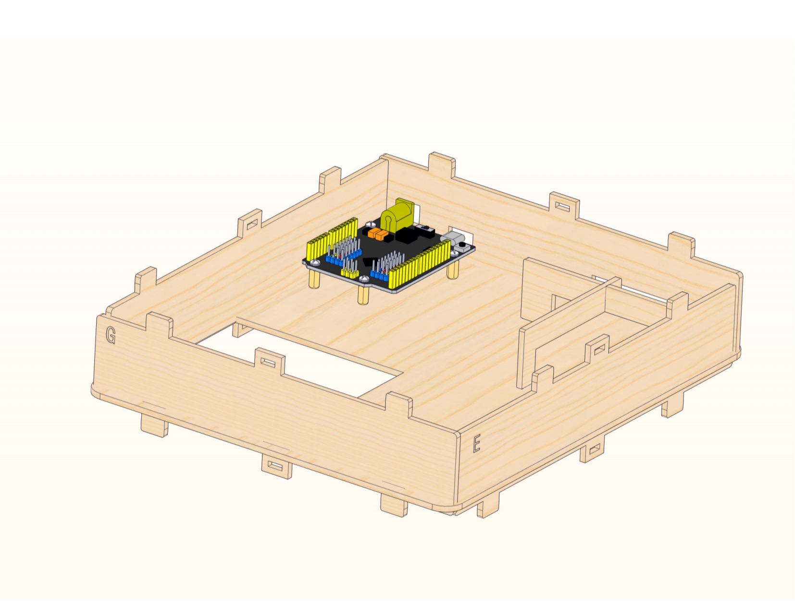
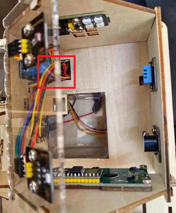
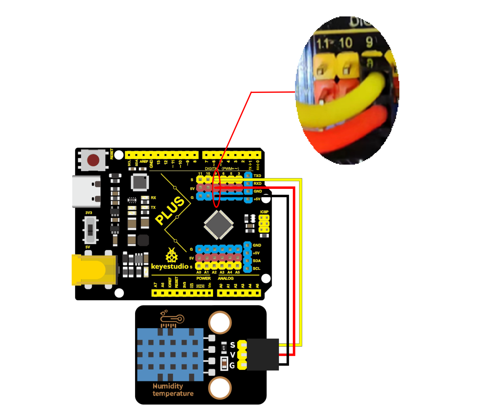
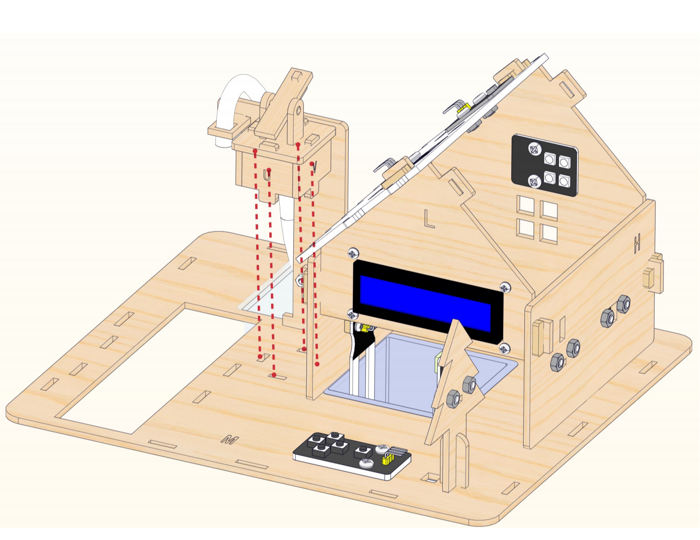
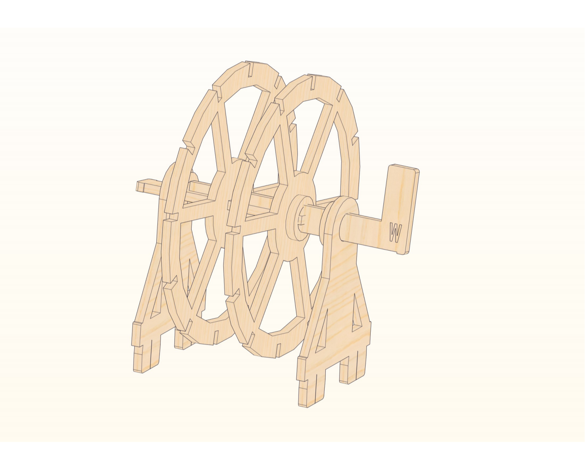

# Product Assembly

[Video of installation](https://fs.keyestudio.com/KS0576)

**Step 1**

 

**Step 2**

  

**Step 3**

**Step 4**

**Step 5**

**Step 6**

**Step 7**

Place the plastic box first, then assemble the house.

**Step 8**

Assemble the fixing bracket of water pump and the bottom latch.

Connect the wirings of the relay into the hole.

Use a screwdriver to loosen the relay terminal, and insert the black wire of the water pump into the COM port, the M-M wire into the NO port of the relay, and then tighten the relay terminal again.                    

                                                

**Step 9**

Connect the wirings of the water level sensor into the hole.
                                 

Connect the wirings of the other sensors into the corresponding hole.

**Step 10**

Connect the motor into the hole ① to reach the bottom of the acrylic board.

Then connect the motor into the hole ② back to the top of the acrylic and place it on the wooden board.

Assemble the fan.

Use plastic ties to secure the motor.

**Step 11**

**Step 12**

Connect the wirings of the photoresistor and UV sensor into the corresponding hole.

Bind the wires.

**Step 13**

Connect the wirings of the PIR motion sensor and the five AD key module into the corresponding hole.

Wiring Diagram

The relay module is connected to the IO5 port,  the red wire of the water pump is connected to the 3V3 port of the motherboard.

                                                                                                                                                                                                                        The passive buzzer is connected to the IO6 port of the motherboard.      

The XHT11 temperature and humidity sensor is connected to the IO9 port of the motherboard.

The PIR motion sensor is connected to the IO10 port of the motherboard.

The 6812RGB module is connected to the IO11 port of the motherboard.

The soil sensor is connected to A6 port and the water level sensor is connected to A7 port of the motherboard.

The solar UV sensor is connected to A3 port, the five AD key module is connected to A2 port of the motherboard.

The photoresistor is connected to the A0 port of the motherboard.

The LCD1602 display is connected to the motherboard.

**Step 14**

**Step 15**

Place the plastic box first, then assemble the water wheel.

**Step 16**

**Step 17**

Then assemble 6 AA batteries as shown below（mind the positive and negative poles）.

Place the battery holder first, then assemble the latch. 

Complete