**About Keyestudio**

Keyestudio is a best-selling brand owned by KEYES Corporation. Our
product contains Arduino development boards, expansion boards, sensors
and modules, Raspberry Pi, micro: bit expansion boards as well as smart
cars, which can help customers at any level to learn about Arduino.

| Notably, all of our products are in line with international quality
  standards and are greatly appreciated in a variety of different
  markets across the world.
| Welcome to check out more contents from our official website:
| http://www.keyestudio.com

--------------

**Obtain Information and After-sales Service**

#. Tutorial link:

   `ks0576-keyestudio-smart-eco-friendly-kit.readthedocs.io <https://docs.keyestudio.com/projects/KS0576/en/latest/>`__

#. If something is found missing or broken, or you have some difficulty
   learning the kit, please feel free to contact us. Welcome to send
   email to
   us：\ `service@keyestudio.com <http://m.138.gz.cn/webadmin/~CAmsnCrrNXhTAySKCerrIfWjjZuuWVfI/~/usr/mod_edituser.jsp?;uid=service@keyestudio.com;;clearCache=>`__

#. We will seek to update projects and products continuously from your
   sincere advice.

--------------

**Warning**

#. This product contains row pins, please keep it out of reach of
   children under 7 years old.
#. This product contains conductive parts (control board and electronic
   module). Please operate according to the requirements of tutorials.
   Improper operation may cause parts to overheat damage. Do not touch
   and immediately disconnect the circuit power.

--------------

**Copyright**

The keyes trademark and logo are the copyright of KEYES DIY ROBOT
co.,LTD. All products under Keyes brand can’t be copied, sold and resold
without authorization by anyone or company. If you are interested in our
products, please contact to our sales
representatives：\ `fennie@keyestudio.com <http://m.138.gz.cn/webadmin/~CAmsnCrrNXhTAySKCerrIfWjjZuuWVfI/~/usr/mod_edituser.jsp?;uid=fennie@keyestudio.com;;clearCache=>`__.

--------------

.. _Keyestudio-Smart-Eco-Friendly-House-Kit:

Keyestudio Smart Eco-Friendly House Kit
=======================================

.. image:: media/01.png
   :alt: 01

--------------

.. _Kit-List:

Kit List
--------

.. container:: table-wrapper

   +-----------------+-----------------+-----------------+-----------------+
   | #               | Picture         | Components      | QTY             |
   +=================+=================+=================+=================+
   | 1               | |KS6009|        | 6812 RGB Module | 1               |
   +-----------------+-----------------+-----------------+-----------------+
   | 2               | |KS6018|        | PIR Motion      | 1               |
   |                 |                 | Sensor          |                 |
   +-----------------+-----------------+-----------------+-----------------+
   | 3               | |KS6026|        | Photoresistor   | 1               |
   +-----------------+-----------------+-----------------+-----------------+
   | 4               | |KS6033|        | XHT11           | 1               |
   |                 |                 | Temperature and |                 |
   |                 |                 | Humidity Sensor |                 |
   +-----------------+-----------------+-----------------+-----------------+
   | 5               | |LCD1602|       | I2C LCD1602     | 1               |
   |                 |                 | Display         |                 |
   +-----------------+-----------------+-----------------+-----------------+
   | 6               | |KS6068|        | Five AD Key     | 1               |
   |                 |                 | Module          |                 |
   +-----------------+-----------------+-----------------+-----------------+
   | 7               | |KS0049|        | Soil Sensor     | 1               |
   +-----------------+-----------------+-----------------+-----------------+
   | 8               | |KS0048|        | Water Level     | 1               |
   |                 |                 | Sensor          |                 |
   +-----------------+-----------------+-----------------+-----------------+
   | 9               | |KS6062|        | Single 5V Relay | 1               |
   |                 |                 | Module          |                 |
   +-----------------+-----------------+-----------------+-----------------+
   | 10              | |KS6011|        | Passive Buzzer  | 1               |
   +-----------------+-----------------+-----------------+-----------------+
   | 11              | |KS6032|        | Solar           | 1               |
   |                 |                 | Ultraviolet     |                 |
   |                 |                 | Sensor          |                 |
   +-----------------+-----------------+-----------------+-----------------+
   | 12              | |KS0486|        | UNO PLUS Board  | 1               |
   +-----------------+-----------------+-----------------+-----------------+
   | 13              | |box1|          | Blister Box     | 2               |
   |                 |                 | 68*64*33 mm     |                 |
   +-----------------+-----------------+-----------------+-----------------+
   | 14              | |box2|          | Blister Box     | 1               |
   |                 |                 | 130*38*24 mm    |                 |
   +-----------------+-----------------+-----------------+-----------------+
   | 15              | |OR0394|        | Water Pump      | 1               |
   +-----------------+-----------------+-----------------+-----------------+
   | 16              | |hose|          | Water Pipe      | 1               |
   +-----------------+-----------------+-----------------+-----------------+
   | 17              | |battery|       | Battery Holder  | 1               |
   +-----------------+-----------------+-----------------+-----------------+
   | 18              | |4401|          | Solar Panel     | 1               |
   +-----------------+-----------------+-----------------+-----------------+
   | 19              | |propeller|     | Fan             | 1               |
   +-----------------+-----------------+-----------------+-----------------+
   | 20              | |USB|           | USB Cable       | 1               |
   +-----------------+-----------------+-----------------+-----------------+
   | 21              | |1pin_10120010| | 22CM M-M Wire   | 1               |
   +-----------------+-----------------+-----------------+-----------------+
   | 22              | |Wire|          | 20CM F-F DuPont | 4               |
   |                 |                 | Wire            |                 |
   +-----------------+-----------------+-----------------+-----------------+
   | 23              | |Wire30cm|      | 30CM M-F DuPont | 2               |
   |                 |                 | Wire            |                 |
   +-----------------+-----------------+-----------------+-----------------+
   | 24              | |3pin|          | 20CM 3P F-F     | 4               |
   |                 |                 | DuPont Wire     |                 |
   +-----------------+-----------------+-----------------+-----------------+
   | 25              | |3pin|          | 25CM 3P F-F     | 4               |
   |                 |                 | DuPont Wire     |                 |
   +-----------------+-----------------+-----------------+-----------------+
   | 26              | |4pin|          | 20CM 4P F-F     | 1               |
   |                 |                 | DuPont Wire     |                 |
   +-----------------+-----------------+-----------------+-----------------+
   | 27              | |d2|            | Wooden Board    | 1               |
   |                 | |36(1)|         |                 |                 |
   |                 | |d3|            |                 |                 |
   |                 | |d4|            |                 |                 |
   |                 | |d5|            |                 |                 |
   |                 | |d6|            |                 |                 |
   +-----------------+-----------------+-----------------+-----------------+
   | 28              | |y|             | Acrylic Board   | 1               |
   +-----------------+-----------------+-----------------+-----------------+
   | 29              | |M4|            | M4 Nut          | 16              |
   +-----------------+-----------------+-----------------+-----------------+
   | 30              | |M4|            | M3 Nut          | 8               |
   +-----------------+-----------------+-----------------+-----------------+
   | 31              | |M3|            | M3*6MM Round    | 8               |
   |                 |                 | Head Screw      |                 |
   +-----------------+-----------------+-----------------+-----------------+
   | 32              | |M3|            | M3*10MM Round   | 8               |
   |                 |                 | Head Screw      |                 |
   +-----------------+-----------------+-----------------+-----------------+
   | 33              | |M3|            | M4*8MM Round    | 16              |
   |                 |                 | Head Screw      |                 |
   +-----------------+-----------------+-----------------+-----------------+
   | 34              | |copperpillar|  | Dual-pass       | 4               |
   |                 |                 | Copper Pillar   |                 |
   +-----------------+-----------------+-----------------+-----------------+
   | 35              | |screwdriver|   | Phillips        | 1               |
   |                 |                 | Screwdriver     |                 |
   +-----------------+-----------------+-----------------+-----------------+
   | 36              | |screwdriver2|  | Slotted         | 1               |
   |                 |                 | Screwdriver     |                 |
   +-----------------+-----------------+-----------------+-----------------+
   | 37              | |Cross wrench|  | Wrench          | 1               |
   +-----------------+-----------------+-----------------+-----------------+
   | 38              | |pla            | Plastic String  | 2               |
   |                 | stic_strapping| |                 |                 |
   +-----------------+-----------------+-----------------+-----------------+
   | 39              | |Tube|          | Tube            | 1               |
   +-----------------+-----------------+-----------------+-----------------+

--------------

.. _Description:

Description
-----------

Based on programming language, the product uses multiple sensors and
modules to realize automated and intelligent management.

C/C++ and KidsBlock programming languages are provided in tutorials,
which contain detailed project introduction, making programming method,
logic and electronic circuit more accessible to you.

Importantly, it not only enhances our hands-on ability, but cultivates
the awareness of scientific and technological innovation and
problem-solving ability, which features strong practicality and
creativity.

By the way, the sensors and modules are fully compatible with the PLUS
main board ports, and the wires are convenient and easy to use.

If you have any difficulties or questions about this tutorial and
toolkit, please feel free to contact us.

--------------

.. _Features:

Features
--------

#. Integrity： We are able to learn multiple sensors.

#. Practicability： Detailed working principles of sensors are provided.

#. Innovation： The product can enhance our scientific and technological
   innovation and problem-solving ability.

#. Flexibility： PLUS board offers good flexibility and scalability.

#. Interactivity： Experimentation platform and communication
   communities can be used to share experiences with other learners.

--------------

.. _UNO-PLUS-Main-Board:

UNO PLUS Main Board
-------------------

.. image:: media/KS0486.png
   :alt: KS0486

Keyes Uno Plus control board is fully compatible with the Arduino IDE
development environment. It contains all the functions of the UNO R3
board on the official website, while it is more powerful, as shown
below:

.. image:: media/improvement.png
   :alt: improvement

.. _Parameters:

Parameters
~~~~~~~~~~

Microcontroller: ATMEGA328P-AU

USB-Serial chip: CP2102

Operating voltage: 5V or 3.3V (dip switch control)

External power: DC 6-15V (9V recommended)

Digital I/O pins: 14 (D0-D13)

PWM channels: 6 (D3 D5 D6 D9 D10 D11)

Analog input channels (ADC): 8 (A0-A7)

DC output capacity per I/O: 20 mA

3.3V port output capacity: 50 mA

Flash Memory: 32 KB (of which 0.5 KB is used for the bootloader)

SRAM: 2 KB (ATMEGA328P-AU)

EEPROM: 1 KB (ATMEGA328P-AU)

Clock speed: 16MHz

Onboard LED pin: D13

.. _Pin-out:

Pin out
~~~~~~~

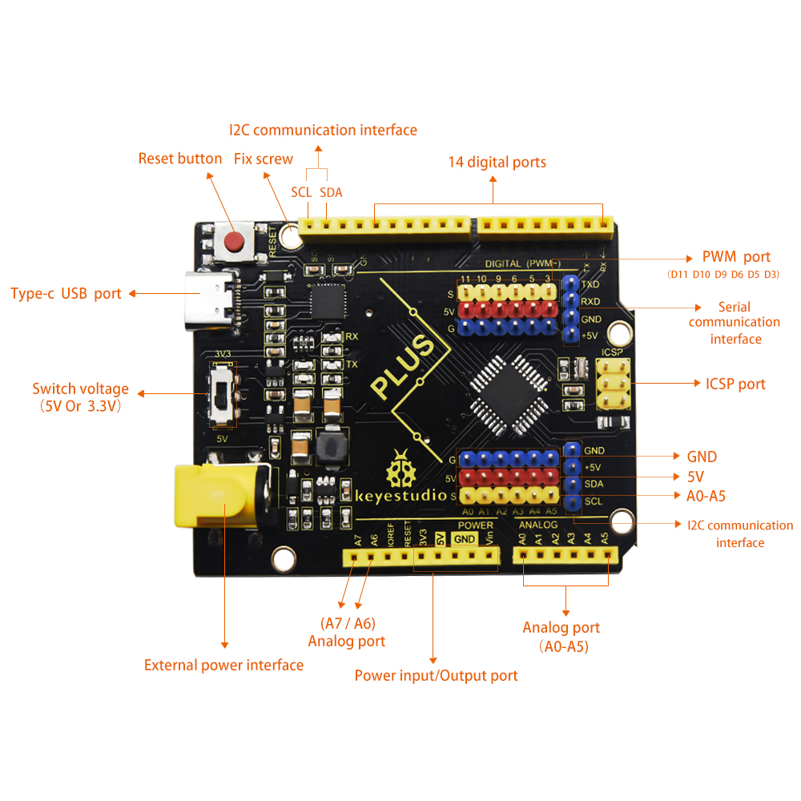

.. _Special-Function-Interface:

Special Function Interface
~~~~~~~~~~~~~~~~~~~~~~~~~~

Serial communication interface: D0 for RX, D1 for TX

PWM interface (pulse width modulation): D3 D5 D6 D9 D10 D11

External Interrupt Interface: D2 (Interrupt 0) and D3 (Interrupt 1)

SPI communication port: D10 for SS, D11 for MOSI, D12 for MISO, D13 for
SCK

IIC communication port: A4 for SDA, A5 for SCL

--------------

.. _Reference-Links:

Reference Links
---------------

Website：

https://www.keyestudio.com/

Wiki Homepage：

https://docs.keyestudio.com/

Official Website of Arduino：

https://www.arduino.cc/

--------------

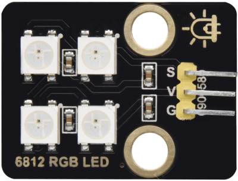
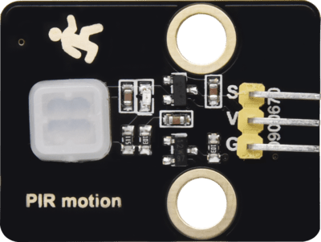
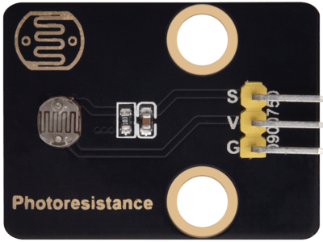
.. |KS6033| image:: media/KS6033.png
.. |LCD1602| image:: media/LCD1602.png
.. |KS6068| image:: media/KS6068.png
.. |KS0049| image:: media/KS0049.png
.. |KS0048| image:: media/KS0048.png
.. |KS6062| image:: media/KS6062.png
.. |KS6011| image:: media/KS6011.png
.. |KS6032| image:: media/KS6032.png
.. |KS0486| image:: media/KS0486.png
.. |box1| image:: media/box1.png
.. |box2| image:: media/box2.jpg
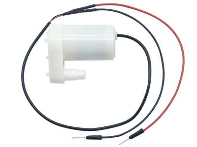
.. |hose| image:: media/hose.png
.. |battery| image:: media/battery.png
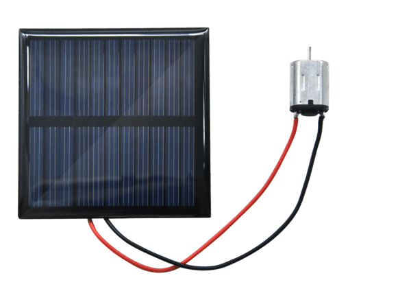
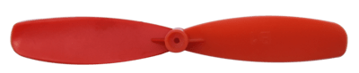
.. |USB| image:: media/USB.png
.. |1pin_10120010| image:: media/1pin_10120010.png
.. |Wire| image:: media/Wire.png
.. |Wire30cm| image:: media/Wire30cm.png
.. |3pin| image:: media/3pin.png
.. |4pin| image:: media/4pin.png
.. |d2| image:: media/d2.png

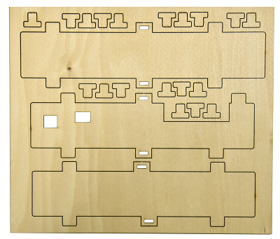
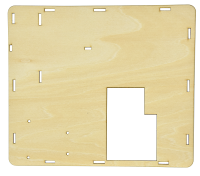
.. |d5| image:: media/d5.png
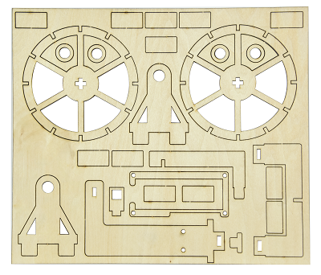
.. |y| image:: media/y.png
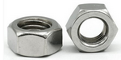
.. |M3| image:: media/M3.png
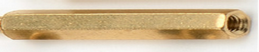
.. |screwdriver| image:: media/screwdriver.png
.. |screwdriver2| image:: media/screwdriver2.png
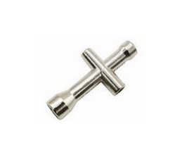

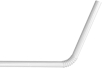
